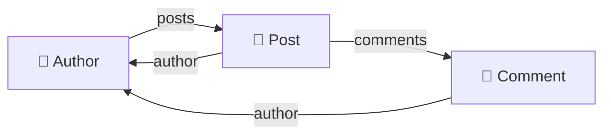

# GraphQL

> **Phase:** APIs & Communication Deep Dives → **Topic:** 6 of 15 → **Read time:** ~55 minutes

---

## Before You Begin

**This document stands alone.** It assumes you have read nothing else — not the foundation series, not the topics before it. It builds GraphQL from zero: what the schema actually is, how a query runs, where the data comes from, and every capability and cost that follows. If you've heard GraphQL is "REST but you pick the fields," this is written to replace that picture with a working one.

Two consequences of that choice:

- **Terms get defined where they're used** — schema, type, field, resolver, the N+1 problem, batching, subscription. Skim what you know.
- **Neighbouring topics are named, not taught.** When to choose GraphQL over REST is a comparison of its own; the persistent-connection transport that subscriptions ride on, and general authentication and rate limiting, each belong to their own topics. This document is about how GraphQL itself works.

GraphQL appears in the **Top 30 Must-Know Concepts** foundation series. This is the deep-dive on its machinery.

Here is the question the document answers:

> **A GraphQL query looks like you're just listing the fields you want. What is actually happening on the server to turn that list into data — and why do the hard parts (performance, caching, safety) all show up at once?**

Here's the trap it disarms. GraphQL is usually first met as *syntax* — a curly-brace query where you name fields, apparently "REST where you choose the response." Learn the syntax and you feel done. But the syntax is the easy ten percent. The actual subject is what the server does with that query: it is walking a **graph**, node by node, along a path the client drew — and schema design, the resolver model, the notorious performance traps, and the caching and safety problems are all consequences of that one fact. Miss it and GraphQL is a bag of disconnected features and gotchas; see it and they're one idea.

> **The mindset shift:** stop reading a GraphQL query as *a list of fields you want* and start reading it as **a path through a graph that the server walks one node at a time.** The schema defines a graph — types are nodes, fields are edges. A query is a traversal the client specifies. A resolver is how the server steps across a single edge. Once you hold that, everything else falls out of it: the N+1 problem is a naive traversal, batching is a smarter one, cost limits bound the traversal, caching remembers visited nodes, mutations are traversals that write, and subscriptions are traversals that re-run. The graph isn't a metaphor in the name — it's the execution model.

---

## Table of Contents

1. [GraphQL Is a Graph You Can Query](#1-graphql-is-a-graph-you-can-query)
2. [The Schema — Defining the Graph](#2-the-schema--defining-the-graph)
3. [Resolvers — Walking the Graph](#3-resolvers--walking-the-graph)
4. [The N+1 Problem — Naive Traversal](#4-the-n1-problem--naive-traversal)
5. [Mutations — Traversals That Change State](#5-mutations--traversals-that-change-state)
6. [Subscriptions — Traversals That Re-Run on Events](#6-subscriptions--traversals-that-re-run-on-events)
7. [Caching Without Free HTTP Caching](#7-caching-without-free-http-caching)
8. [Cost, Depth, and Keeping the Graph Safe](#8-cost-depth-and-keeping-the-graph-safe)
9. [GraphQL Across Many Teams — A Survey](#9-graphql-across-many-teams--a-survey)
10. [Putting It All Together — Building a Small GraphQL API](#10-putting-it-all-together--building-a-small-graphql-api)
11. [Final Recap](#11-final-recap)

---

## 1. GraphQL Is a Graph You Can Query

The name is the whole idea, and it's usually skipped over. GraphQL is not "a query language for JSON" or "REST with field selection" — it is a way of exposing your data *as a graph* and letting clients traverse it. Everything else in this document is a consequence of taking that literally.

### The Data Is a Graph

Think about how real data connects. An author *has* posts. A post *has* an author and *has* comments. A comment *has* an author, who *has* posts. Draw that out and you don't get a list of tables — you get a **graph**: things (nodes) joined by relationships (edges).



GraphQL's premise is to expose that graph directly. The server declares what nodes exist and how they're connected (that declaration is the *schema*, §2), and then a client can enter at some point and walk the connections it cares about.

### A Query Is a Path Through the Graph

Given a graph, a **query** is simply a description of *which path to walk and which fields to collect along the way*:

```
{
  author(id: 1) {          ← enter at this node
    name                   ← collect a field here
    posts {                ← walk the "posts" edge
      title                ← collect a field on each post
      comments {           ← walk the "comments" edge
        text               ← collect a field on each comment
      }
    }
  }
}
```

Read that as a route: *start at author 1, take their name, walk to their posts, take each title, walk to each post's comments, take each text.* The response comes back in exactly the shape of the path, because the path *is* the shape. The client drew a route through the graph and got back precisely what sat along it — nothing more, nothing less.

That's the single endpoint people mention: there's one way in (`POST /graphql`), and the query inside decides where you go. Unlike a set of fixed addresses each returning a fixed shape, there's one entrance to a graph the client then navigates.

### Why This Framing Explains Everything Downstream

Holding "query = graph traversal" makes the rest of the document a series of consequences rather than a list of features:

- **Resolvers** (§3) are *how the server walks a single edge* — the code that, standing on one node, produces the next.
- **The N+1 problem** (§4) is *naive traversal* — walking to each sibling node with a separate fetch.
- **Batching** (§4) is *smarter traversal* — walking a whole level of siblings in one fetch.
- **Cost limits** (§8) *bound the traversal* — because a client can draw an enormous path.
- **Caching** (§7) *remembers visited nodes* so the next traversal can skip re-fetching them.
- **Mutations** (§5) are *traversals that change a node* before reading back.
- **Subscriptions** (§6) are *traversals that re-run when a node changes.*

Every one of those is the same idea seen from a different angle. That's why this document leads with the graph: learn it once, and the "features" stop being separate things to memorize.

> 💡 **Key Insight**
>
> GraphQL exposes your data as a **graph** — types are nodes, fields are edges — and a query is a **path the client walks through it**, collecting fields along the route, so the response matches the path by construction. This isn't wordplay on the name; it's the literal execution model, and it's the key that turns every later topic (resolvers, N+1, batching, caching, cost, mutations, subscriptions) into a consequence of *how a traversal runs* rather than an unrelated feature to learn on its own.

### Quick Recap — GraphQL Is a Graph

- GraphQL exposes data as a **graph**: types are **nodes**, the fields that link them are **edges** — the way real data actually connects.
- A **query is a path** through that graph, collecting fields along the route; the response matches the path's shape by construction.
- There's **one entrance** (`POST /graphql`) and the query decides the route — versus fixed addresses each returning a fixed shape.
- "Query = traversal" is the **execution model**, and every later piece (resolvers, N+1, batching, caching, mutations, subscriptions) is a consequence of it.
