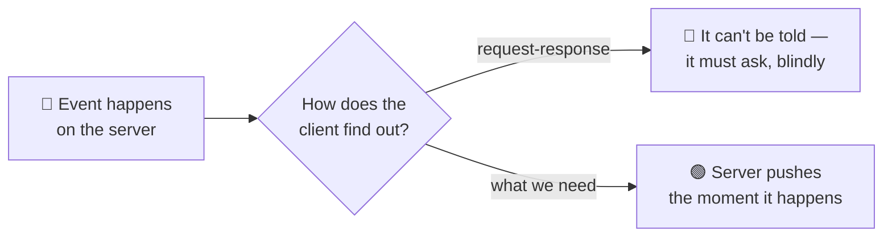

# WebSockets

> **Phase:** APIs & Communication Deep Dives → **Topic:** 7 of 15 → **Read time:** ~50 minutes

---

## Before You Begin

**This document stands alone.** It assumes you have read nothing else — not the foundation series, not the topics before it. It builds WebSockets from zero: why ordinary web requests can't do what real-time needs, how a WebSocket connection is created and kept open, and — the part that matters most — what it costs to hold one open for every connected client at once.

Two consequences of that choice:

- **Terms get defined where they're used** — the upgrade handshake, frames, full-duplex, ping/pong, sticky routing, backplane. Skim what you know.
- **Neighbouring topics are named, not taught.** This document is about the *mechanism* — how a WebSocket works and what it costs. The full comparison against lighter alternatives (long polling, server-sent events) is its own topic, and the catalogue of *which real-time features* to build on WebSockets is another. Where this doc reaches them, it points rather than teaches.

WebSockets appear in the **Top 30 Must-Know Concepts** foundation series. This is the deep-dive on how they actually work.

Here is the question the document answers:

> **The web is built on request-response: the client asks, the server answers, done. So how does a server *push* — send you a message you didn't ask for, the instant it happens — and why is the mechanism that allows it so much more expensive to run than an ordinary API?**

Here's the trap it disarms. WebSockets get filed as "the real-time upgrade" — a switch you flip to make an app live, a faster kind of API. That framing hides the actual subject. A WebSocket is not a faster request; it's a *different kind of connection* with a different cost model, and the moment you open one you have stepped out of the world HTTP quietly did everything for you — stateless servers, free caching, trivial load balancing, clean error codes — and into a world where every one of those becomes your problem. The messaging is the easy part. The **connection** is the subject.

> **The mindset shift:** stop thinking of a WebSocket as *a channel you send messages over* and start thinking of it as **a long-lived, stateful relationship the server must hold open for every client simultaneously.** An HTTP server forgets you the instant it answers; a WebSocket server *remembers* you, in memory, for as long as you're connected — and it's doing that for every other connected client too. That statefulness, not the two-way messaging, is what makes WebSockets powerful and what makes everything about running them hard. Learn to see the held-open connection as the cost, and the rest of this document is its consequences.

---

## Table of Contents

1. [Why Request-Response Hits a Wall](#1-why-request-response-hits-a-wall)
2. [The Upgrade — Becoming a WebSocket](#2-the-upgrade--becoming-a-websocket)
3. [Frames — How the Open Pipe Carries Messages](#3-frames--how-the-open-pipe-carries-messages)
4. [Full-Duplex — Both Sides Speak at Once](#4-full-duplex--both-sides-speak-at-once)
5. [The Connection Is State the Server Holds](#5-the-connection-is-state-the-server-holds)
6. [What You Gave Up Leaving HTTP](#6-what-you-gave-up-leaving-http)
7. [Keeping It Alive — Ping, Pong, Timeout, Reconnect](#7-keeping-it-alive--ping-pong-timeout-reconnect)
8. [Scaling Stateful Connections](#8-scaling-stateful-connections)
9. [When Not to Reach for One](#9-when-not-to-reach-for-one)
10. [Putting It All Together — A Live Collaboration Feature](#10-putting-it-all-together--a-live-collaboration-feature)
11. [Final Recap](#11-final-recap)

---

## 1. Why Request-Response Hits a Wall

To see why WebSockets exist, you have to see exactly where the ordinary web can't go — and it's a wall built into the shape of how the web works, not a limitation anyone can tune away.

### The Web Is Client-Initiated and One-Shot

Almost everything on the web runs on one pattern: the **client** opens a connection, sends a request, the **server** sends one response, and the exchange is over. Two properties of that pattern matter here, and both are load-bearing:

- **The client always speaks first.** The server cannot start a conversation. It has no way to say anything until it's been asked.
- **One request, one response, done.** After the answer, the exchange is finished. The server has no standing way to reach that client again.

For fetching a page or submitting a form, this is perfect. But it means the server is structurally *mute* — it can only ever answer, never volunteer. And a whole class of features needs the opposite.

### The Features That Need the Server to Speak First

Think about what a server often knows before the client does: a new chat message arrived, a stock price ticked, another user moved their cursor, a game opponent made a move. In every case the *server* holds fresh information and the client needs it **now** — but the client has no idea it should ask, because it doesn't know anything changed. That's precisely what request-response cannot express: the update exists on the server, and the shape of the web gives the server no way to deliver it.

### The Fake Fix and Why It's a Wall, Not a Door

The workaround within request-response is **polling**: the client asks over and over — "anything new? anything new?" — on a timer, hoping to catch updates soon after they happen. It technically works, and it's genuinely all you can do with plain request-response, but it's a wall dressed as a door:

- **It's wasteful.** The overwhelming majority of polls return "nothing new," each one a full request-response round trip spent to learn nothing.
- **It's laggy.** An update waits, on average, half the polling interval before the client even asks for it. Poll every 10 seconds and news is up to 10 seconds stale.
- **It scales badly.** Ten thousand clients polling every few seconds is a relentless flood of mostly-empty requests, and making it *less* laggy (poll more often) makes the flood worse.

There are lighter variations on this idea, and a full comparison of them is a topic of its own; the point here is only that *all* of them are working around the same wall — the server still can't actually initiate. Polling doesn't give the server a voice; it just has the client ask more frantically.

### What's Actually Needed

Strip it down and the requirement is simple to state and impossible for request-response to meet: **a connection that stays open, that either side can send over at any time.** Not "the client asks faster" — a channel where the server can speak the instant it has something, without being asked, and the client can too. That connection is a WebSocket, and the rest of this document is how it's built and what holding it open costs.

> 💡 **Key Insight**
>
> The web's defining pattern — client speaks first, one request, one response, done — makes the server structurally **mute**: it can only answer, never volunteer. That's fine until a feature needs the server to deliver news the instant it happens, which request-response simply cannot express. Polling is the only workaround available within it, and it's a wall dressed as a door — wasteful, laggy, and worse the more you lean on it. What's actually needed is a *held-open connection either side can send over*, and that need is the entire reason WebSockets exist.

### Quick Recap — Why Request-Response Hits a Wall

- The web is **client-initiated and one-shot**: the server can only answer when asked and can't reach a client afterward — it's structurally **mute**.
- Real-time features invert this: the **server** holds fresh news and the client needs it *now* but doesn't know to ask — exactly what request-response can't express.
- **Polling** is the only workaround within request-response, and it's wasteful, laggy, and scales badly — a wall dressed as a door.
- The real requirement is a **held-open connection either side can send over at any time** — which is what a WebSocket provides.
