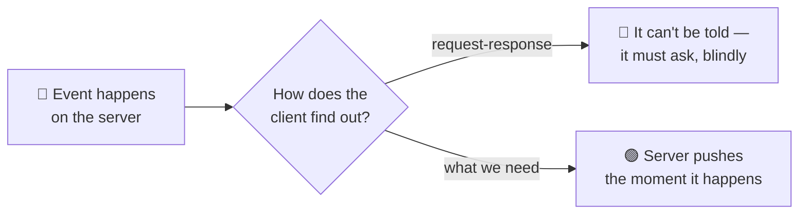
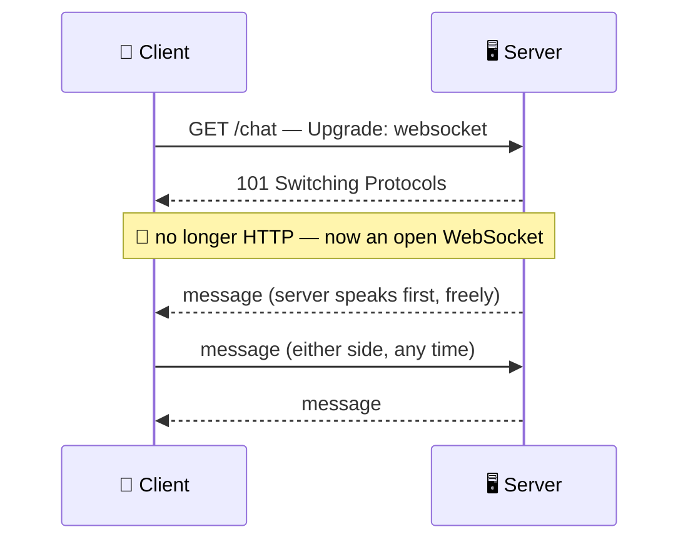

# WebSockets

> **Phase:** APIs & Communication Deep Dives → **Topic:** 7 of 15 → **Read time:** ~50 minutes

---

## Before You Begin

**This document stands alone.** It assumes you have read nothing else — not the foundation series, not the topics before it. It builds WebSockets from zero: why ordinary web requests can't do what real-time needs, how a WebSocket connection is created and kept open, and — the part that matters most — what it costs to hold one open for every connected client at once.

Two consequences of that choice:

- **Terms get defined where they're used** — the upgrade handshake, frames, full-duplex, ping/pong, sticky routing, backplane. Skim what you know.
- **Neighbouring topics are named, not taught.** This document is about the *mechanism* — how a WebSocket works and what it costs. The full comparison against lighter alternatives (long polling, server-sent events) is its own topic, and the catalogue of *which real-time features* to build on WebSockets is another. Where this doc reaches them, it points rather than teaches.

WebSockets appear in the **Top 30 Must-Know Concepts** foundation series. This is the deep-dive on how they actually work.

Here is the question the document answers:

> **The web is built on request-response: the client asks, the server answers, done. So how does a server *push* — send you a message you didn't ask for, the instant it happens — and why is the mechanism that allows it so much more expensive to run than an ordinary API?**

Here's the trap it disarms. WebSockets get filed as "the real-time upgrade" — a switch you flip to make an app live, a faster kind of API. That framing hides the actual subject. A WebSocket is not a faster request; it's a *different kind of connection* with a different cost model, and the moment you open one you have stepped out of the world HTTP quietly did everything for you — stateless servers, free caching, trivial load balancing, clean error codes — and into a world where every one of those becomes your problem. The messaging is the easy part. The **connection** is the subject.

> **The mindset shift:** stop thinking of a WebSocket as *a channel you send messages over* and start thinking of it as **a long-lived, stateful relationship the server must hold open for every client simultaneously.** An HTTP server forgets you the instant it answers; a WebSocket server *remembers* you, in memory, for as long as you're connected — and it's doing that for every other connected client too. That statefulness, not the two-way messaging, is what makes WebSockets powerful and what makes everything about running them hard. Learn to see the held-open connection as the cost, and the rest of this document is its consequences.

---

## Table of Contents

1. [Why Request-Response Hits a Wall](#1-why-request-response-hits-a-wall)
2. [The Upgrade — Becoming a WebSocket](#2-the-upgrade--becoming-a-websocket)
3. [Frames — How the Open Pipe Carries Messages](#3-frames--how-the-open-pipe-carries-messages)
4. [Full-Duplex — Both Sides Speak at Once](#4-full-duplex--both-sides-speak-at-once)
5. [The Connection Is State the Server Holds](#5-the-connection-is-state-the-server-holds)
6. [What You Gave Up Leaving HTTP](#6-what-you-gave-up-leaving-http)
7. [Keeping It Alive — Ping, Pong, Timeout, Reconnect](#7-keeping-it-alive--ping-pong-timeout-reconnect)
8. [Scaling Stateful Connections](#8-scaling-stateful-connections)
9. [When Not to Reach for One](#9-when-not-to-reach-for-one)
10. [Putting It All Together — A Live Collaboration Feature](#10-putting-it-all-together--a-live-collaboration-feature)
11. [Final Recap](#11-final-recap)

---

## 1. Why Request-Response Hits a Wall

To see why WebSockets exist, you have to see exactly where the ordinary web can't go — and it's a wall built into the shape of how the web works, not a limitation anyone can tune away.

### The Web Is Client-Initiated and One-Shot

Almost everything on the web runs on one pattern: the **client** opens a connection, sends a request, the **server** sends one response, and the exchange is over. Two properties of that pattern matter here, and both are load-bearing:

- **The client always speaks first.** The server cannot start a conversation. It has no way to say anything until it's been asked.
- **One request, one response, done.** After the answer, the exchange is finished. The server has no standing way to reach that client again.

For fetching a page or submitting a form, this is perfect. But it means the server is structurally *mute* — it can only ever answer, never volunteer. And a whole class of features needs the opposite.

### The Features That Need the Server to Speak First

Think about what a server often knows before the client does: a new chat message arrived, a stock price ticked, another user moved their cursor, a game opponent made a move. In every case the *server* holds fresh information and the client needs it **now** — but the client has no idea it should ask, because it doesn't know anything changed. That's precisely what request-response cannot express: the update exists on the server, and the shape of the web gives the server no way to deliver it.



### The Fake Fix and Why It's a Wall, Not a Door

The workaround within request-response is **polling**: the client asks over and over — "anything new? anything new?" — on a timer, hoping to catch updates soon after they happen. It technically works, and it's genuinely all you can do with plain request-response, but it's a wall dressed as a door:

- **It's wasteful.** The overwhelming majority of polls return "nothing new," each one a full request-response round trip spent to learn nothing.
- **It's laggy.** An update waits, on average, half the polling interval before the client even asks for it. Poll every 10 seconds and news is up to 10 seconds stale.
- **It scales badly.** Ten thousand clients polling every few seconds is a relentless flood of mostly-empty requests, and making it *less* laggy (poll more often) makes the flood worse.

There are lighter variations on this idea, and a full comparison of them is a topic of its own; the point here is only that *all* of them are working around the same wall — the server still can't actually initiate. Polling doesn't give the server a voice; it just has the client ask more frantically.

### What's Actually Needed

Strip it down and the requirement is simple to state and impossible for request-response to meet: **a connection that stays open, that either side can send over at any time.** Not "the client asks faster" — a channel where the server can speak the instant it has something, without being asked, and the client can too. That connection is a WebSocket, and the rest of this document is how it's built and what holding it open costs.

> 💡 **Key Insight**
>
> The web's defining pattern — client speaks first, one request, one response, done — makes the server structurally **mute**: it can only answer, never volunteer. That's fine until a feature needs the server to deliver news the instant it happens, which request-response simply cannot express. Polling is the only workaround available within it, and it's a wall dressed as a door — wasteful, laggy, and worse the more you lean on it. What's actually needed is a *held-open connection either side can send over*, and that need is the entire reason WebSockets exist.

### Quick Recap — Why Request-Response Hits a Wall

- The web is **client-initiated and one-shot**: the server can only answer when asked and can't reach a client afterward — it's structurally **mute**.
- Real-time features invert this: the **server** holds fresh news and the client needs it *now* but doesn't know to ask — exactly what request-response can't express.
- **Polling** is the only workaround within request-response, and it's wasteful, laggy, and scales badly — a wall dressed as a door.
- The real requirement is a **held-open connection either side can send over at any time** — which is what a WebSocket provides.

---

## 2. The Upgrade — Becoming a WebSocket

A WebSocket doesn't get its own separate way of connecting. It begins life as an ordinary web request and then *transforms* — and understanding that transformation, called the **upgrade**, is understanding both how WebSockets sneak onto the existing web and the exact moment they stop being part of it.

### It Starts as a Normal HTTP Request

The client opens a WebSocket by making a regular HTTP `GET` request with a few special headers that say "I don't want a normal response — I want to switch this connection to the WebSocket protocol":

```
GET /chat HTTP/1.1
Host: example.com
Upgrade: websocket
Connection: Upgrade
Sec-WebSocket-Key: dGhlIHNhbXBsZSBub25jZQ==
Sec-WebSocket-Version: 13
```

The `Upgrade: websocket` header is the request to switch protocols. If the server agrees, it doesn't send back the usual `200 OK` with a body — it sends a special status that means "agreed, we're switching":

```
HTTP/1.1 101 Switching Protocols
Upgrade: websocket
Connection: Upgrade
Sec-WebSocket-Accept: s3pPLMBiTxaQ9kYGzzhZRbK+xOo=
```

That **`101 Switching Protocols`** is the pivot. Before it, this was an HTTP request-response like any other. After it, the same underlying connection is no longer speaking HTTP at all — it's a WebSocket, an open two-way pipe, and it will stay that way until one side closes it. (The `Sec-WebSocket-Key`/`Accept` pair is a handshake detail confirming both sides genuinely intend a WebSocket, not a confused proxy; the underlying connection it runs on is a held-open TCP connection, whose own mechanics belong to the transport layer.)



### Why Begin as HTTP at All?

It would seem simpler to invent a brand-new kind of connection. Starting as HTTP is a deliberate, pragmatic choice, and the reasons are all about fitting into a web that already exists:

- **It uses the same ports.** WebSockets run over the same ports as web traffic (80, and 443 when encrypted), so they pass through firewalls and networks that only allow web traffic — no new ports to open.
- **It passes through existing infrastructure.** Proxies, load balancers, and TLS all already understand an HTTP request; beginning as one lets a WebSocket traverse the machinery already in place (mostly — some intermediaries need to explicitly understand the upgrade, which §8 touches).
- **It reuses encryption.** A secure WebSocket rides the same TLS as HTTPS, established during the same initial exchange, so there's no separate security mechanism to build.

In short: the upgrade is how a fundamentally *non*-HTTP connection gets to travel the roads built for HTTP. It disguises itself as a web request just long enough to get through, then drops the disguise.

### After the Upgrade, It's a Different World

This is the sentence to carry into the rest of the document: **once the `101` is sent, the connection is no longer HTTP, and none of HTTP's conveniences apply to it anymore.** There are no more requests, no more status codes, no more headers per message, no more statelessness. What's left is a raw, open, two-way channel — powerful, and stripped of everything HTTP was quietly giving you. The following sections are what that channel can do (§3–§4) and, more consequentially, what it costs (§5 onward).

> 💡 **Key Insight**
>
> A WebSocket **begins as an ordinary HTTP `GET`** carrying an `Upgrade: websocket` header, and the server's **`101 Switching Protocols`** is the exact pivot where the connection stops being HTTP and becomes an open two-way pipe. It starts as HTTP on purpose — to reuse the web's ports, infrastructure, and encryption rather than needing its own — but that's a disguise for getting through, not what it is. The instant the upgrade completes, every HTTP convenience is gone, and the connection is a raw channel whose cost the rest of this document is about.

### Quick Recap — The Upgrade

- A WebSocket starts as a normal HTTP `GET` with an **`Upgrade: websocket`** header — a request to switch this connection's protocol.
- The server's **`101 Switching Protocols`** is the pivot: after it, the same connection is **no longer HTTP** but an open two-way pipe.
- It begins as HTTP **on purpose** — to reuse existing **ports, proxies/load balancers, and TLS** instead of needing its own — a disguise for traversing the existing web.
- Once upgraded, **none of HTTP's conveniences apply** anymore; what remains is a raw channel, and the rest of the document is its capabilities and costs.

---

## 3. Frames — How the Open Pipe Carries Messages

Once the upgrade (§2) completes, the connection needs a way to carry data — and it's deliberately nothing like HTTP's model. HTTP wraps every message in a fresh set of headers; a WebSocket carries data as lightweight **frames**, and that difference is a large part of why WebSockets are efficient for chatty real-time traffic.

### A Frame Is a Small, Self-Delimiting Chunk

After the handshake, everything sent over a WebSocket is a **frame**: a small wrapper around a piece of data with just a few bytes of overhead saying what kind of frame it is, how big it is, and whether it's the end of a message. That's essentially all the bookkeeping — no headers, no method, no URL, no status code.

Contrast the overhead directly. An HTTP message re-sends a full set of headers *every time* — often hundreds of bytes of `Host`, `User-Agent`, cookies, content type, and so on, on every single request, even a tiny one. A WebSocket frame adds only a handful of bytes of framing around the payload:

```
HTTP message:   [ ~hundreds of bytes of headers ][ "hi" ]     ← every message
WebSocket frame: [ ~2-6 bytes of framing ][ "hi" ]            ← every message
```

For a chat app sending thousands of two-word messages, that difference between hundreds of bytes of overhead and a handful is the difference between a channel that's practical for high-frequency small messages and one that isn't. Frames are what make a WebSocket cheap *per message* once the connection is paid for.

### Text, Binary, and Message Boundaries

Frames come in a few kinds. **Data frames** carry the actual payload and are marked as either **text** (UTF-8 — JSON, plain strings) or **binary** (raw bytes — images, compact encodings, binary protocols). Unlike a text-only channel, a WebSocket carries either natively, so an application can send whichever suits its data.

A single logical message can also be split across multiple frames (a large payload streamed in pieces), with a bit on each frame marking whether the message continues or ends. The application still receives one whole message; the framing handles reassembly. This matters because it means a WebSocket can stream a large message without blocking the connection, and small messages stay small.

### Control Frames Keep the Connection Healthy

Not every frame carries application data. A few **control frames** manage the connection itself, and two matter enough to name now because later sections depend on them:

| Control frame | Purpose |
|---|---|
| **Ping / Pong** | A liveness check — one side sends a ping, the other must answer pong, proving the connection is still alive (§7) |
| **Close** | A clean shutdown — either side can send it to end the connection politely, rather than just vanishing |

These exist precisely because the connection is long-lived: an HTTP request is too short to need a heartbeat or a graceful-close protocol, but a connection meant to stay open for hours needs both. §7 builds on ping/pong and close to keep connections healthy over time.

### No Request-Response Pairing

The subtle but important thing about frames: **they are not paired.** An HTTP response answers a specific request — they come matched. WebSocket frames are just messages flowing in each direction, with no built-in notion of "this frame is the answer to that one." If your application needs to correlate a reply with a request (ask a question, get *its* answer), you have to build that yourself — put an id in the message and match it in your own code. The channel gives you a stream of messages, not a conversation of matched pairs. That freedom is the point (§4), and it's also work HTTP did for you that you now own.

> 💡 **Key Insight**
>
> Once open, a WebSocket carries data as **frames** — a few bytes of framing around a payload — not as HTTP messages with full headers each time, which is what makes it cheap for high-frequency small messages once the connection exists. Frames carry text or binary, can split a large message into pieces, and include **control frames** (ping/pong, close) to manage a connection too long-lived to go unmonitored. And crucially they are **unpaired**: the channel is a stream of one-way messages, so any request-reply correlation is yours to build — the flip side of the freedom the next section is about.

### Quick Recap — Frames

- After the upgrade, data moves as **frames** — a few bytes of framing around a payload — versus HTTP's full headers on every message, making WebSockets cheap per message.
- Frames carry **text or binary** natively, and a large message can be **split across frames** and reassembled without blocking small ones.
- **Control frames** — ping/pong (liveness, §7) and close (graceful shutdown) — manage a connection too long-lived to leave unmonitored.
- Frames are **unpaired**: unlike HTTP's request/response matching, correlating a reply to a request is **your** job (put an id in the message).
