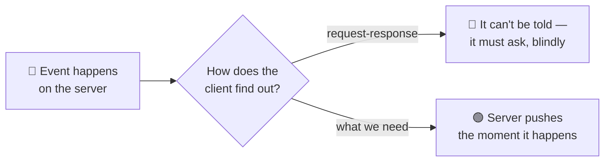
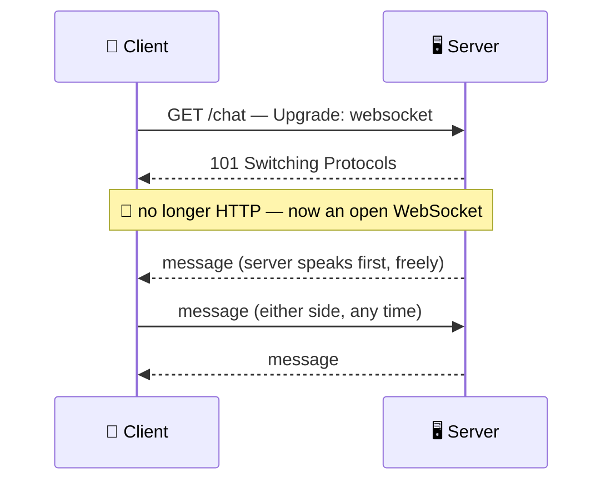
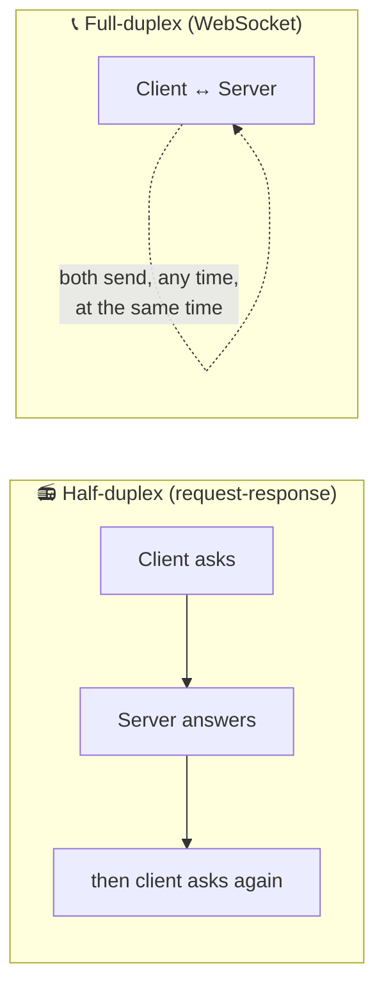
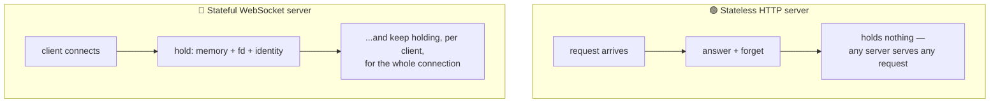
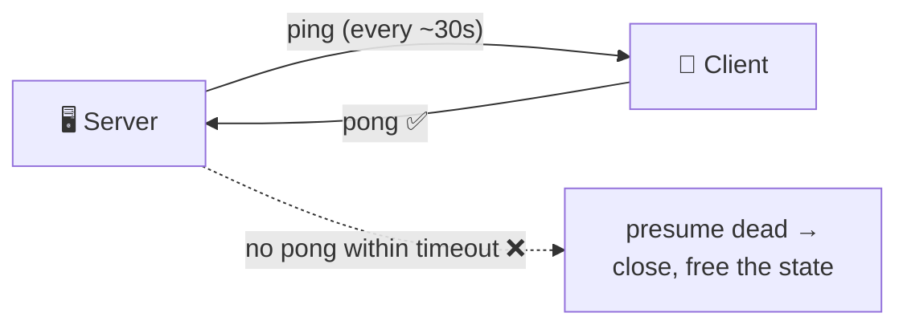
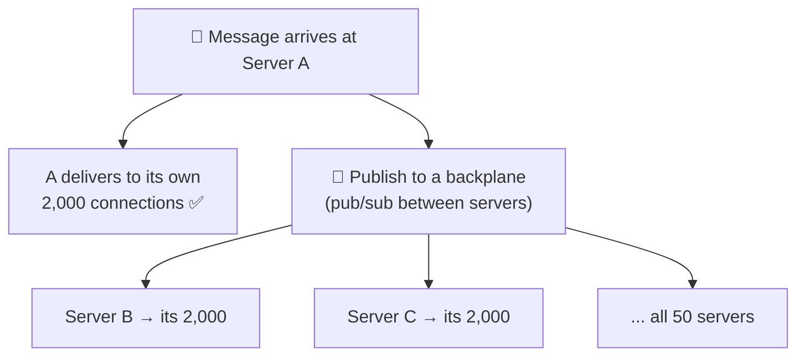

# WebSockets

> **Phase:** APIs & Communication Deep Dives → **Topic:** 7 of 15 → **Read time:** ~50 minutes

---

## Before You Begin

**This document stands alone.** It assumes you have read nothing else — not the foundation series, not the topics before it. It builds WebSockets from zero: why ordinary web requests can't do what real-time needs, how a WebSocket connection is created and kept open, and — the part that matters most — what it costs to hold one open for every connected client at once.

Two consequences of that choice:

- **Terms get defined where they're used** — the upgrade handshake, frames, full-duplex, ping/pong, sticky routing, backplane. Skim what you know.
- **Neighbouring topics are named, not taught.** This document is about the *mechanism* — how a WebSocket works and what it costs. The full comparison against lighter alternatives (long polling, server-sent events) is its own topic, and the catalogue of *which real-time features* to build on WebSockets is another. Where this doc reaches them, it points rather than teaches.

WebSockets appear in the **Top 30 Must-Know Concepts** foundation series. This is the deep-dive on how they actually work.

Here is the question the document answers:

> **The web is built on request-response: the client asks, the server answers, done. So how does a server *push* — send you a message you didn't ask for, the instant it happens — and why is the mechanism that allows it so much more expensive to run than an ordinary API?**

Here's the trap it disarms. WebSockets get filed as "the real-time upgrade" — a switch you flip to make an app live, a faster kind of API. That framing hides the actual subject. A WebSocket is not a faster request; it's a *different kind of connection* with a different cost model, and the moment you open one you have stepped out of the world HTTP quietly did everything for you — stateless servers, free caching, trivial load balancing, clean error codes — and into a world where every one of those becomes your problem. The messaging is the easy part. The **connection** is the subject.

> **The mindset shift:** stop thinking of a WebSocket as *a channel you send messages over* and start thinking of it as **a long-lived, stateful relationship the server must hold open for every client simultaneously.** An HTTP server forgets you the instant it answers; a WebSocket server *remembers* you, in memory, for as long as you're connected — and it's doing that for every other connected client too. That statefulness, not the two-way messaging, is what makes WebSockets powerful and what makes everything about running them hard. Learn to see the held-open connection as the cost, and the rest of this document is its consequences.

---

## Table of Contents

1. [Why Request-Response Hits a Wall](#1-why-request-response-hits-a-wall)
2. [The Upgrade — Becoming a WebSocket](#2-the-upgrade--becoming-a-websocket)
3. [Frames — How the Open Pipe Carries Messages](#3-frames--how-the-open-pipe-carries-messages)
4. [Full-Duplex — Both Sides Speak at Once](#4-full-duplex--both-sides-speak-at-once)
5. [The Connection Is State the Server Holds](#5-the-connection-is-state-the-server-holds)
6. [What You Gave Up Leaving HTTP](#6-what-you-gave-up-leaving-http)
7. [Keeping It Alive — Ping, Pong, Timeout, Reconnect](#7-keeping-it-alive--ping-pong-timeout-reconnect)
8. [Scaling Stateful Connections](#8-scaling-stateful-connections)
9. [When Not to Reach for One](#9-when-not-to-reach-for-one)
10. [Putting It All Together — A Live Collaboration Feature](#10-putting-it-all-together--a-live-collaboration-feature)
11. [Final Recap](#11-final-recap)

---

## 1. Why Request-Response Hits a Wall

To see why WebSockets exist, you have to see exactly where the ordinary web can't go — and it's a wall built into the shape of how the web works, not a limitation anyone can tune away.

### The Web Is Client-Initiated and One-Shot

Almost everything on the web runs on one pattern: the **client** opens a connection, sends a request, the **server** sends one response, and the exchange is over. Two properties of that pattern matter here, and both are load-bearing:

- **The client always speaks first.** The server cannot start a conversation. It has no way to say anything until it's been asked.
- **One request, one response, done.** After the answer, the exchange is finished. The server has no standing way to reach that client again.

For fetching a page or submitting a form, this is perfect. But it means the server is structurally *mute* — it can only ever answer, never volunteer. And a whole class of features needs the opposite.

### The Features That Need the Server to Speak First

Think about what a server often knows before the client does: a new chat message arrived, a stock price ticked, another user moved their cursor, a game opponent made a move. In every case the *server* holds fresh information and the client needs it **now** — but the client has no idea it should ask, because it doesn't know anything changed. That's precisely what request-response cannot express: the update exists on the server, and the shape of the web gives the server no way to deliver it.



### The Fake Fix and Why It's a Wall, Not a Door

The workaround within request-response is **polling**: the client asks over and over — "anything new? anything new?" — on a timer, hoping to catch updates soon after they happen. It technically works, and it's genuinely all you can do with plain request-response, but it's a wall dressed as a door:

- **It's wasteful.** The overwhelming majority of polls return "nothing new," each one a full request-response round trip spent to learn nothing.
- **It's laggy.** An update waits, on average, half the polling interval before the client even asks for it. Poll every 10 seconds and news is up to 10 seconds stale.
- **It scales badly.** Ten thousand clients polling every few seconds is a relentless flood of mostly-empty requests, and making it *less* laggy (poll more often) makes the flood worse.

There are lighter variations on this idea, and a full comparison of them is a topic of its own; the point here is only that *all* of them are working around the same wall — the server still can't actually initiate. Polling doesn't give the server a voice; it just has the client ask more frantically.

### What's Actually Needed

Strip it down and the requirement is simple to state and impossible for request-response to meet: **a connection that stays open, that either side can send over at any time.** Not "the client asks faster" — a channel where the server can speak the instant it has something, without being asked, and the client can too. That connection is a WebSocket, and the rest of this document is how it's built and what holding it open costs.

> 💡 **Key Insight**
>
> The web's defining pattern — client speaks first, one request, one response, done — makes the server structurally **mute**: it can only answer, never volunteer. That's fine until a feature needs the server to deliver news the instant it happens, which request-response simply cannot express. Polling is the only workaround available within it, and it's a wall dressed as a door — wasteful, laggy, and worse the more you lean on it. What's actually needed is a *held-open connection either side can send over*, and that need is the entire reason WebSockets exist.

### Quick Recap — Why Request-Response Hits a Wall

- The web is **client-initiated and one-shot**: the server can only answer when asked and can't reach a client afterward — it's structurally **mute**.
- Real-time features invert this: the **server** holds fresh news and the client needs it *now* but doesn't know to ask — exactly what request-response can't express.
- **Polling** is the only workaround within request-response, and it's wasteful, laggy, and scales badly — a wall dressed as a door.
- The real requirement is a **held-open connection either side can send over at any time** — which is what a WebSocket provides.

---

## 2. The Upgrade — Becoming a WebSocket

A WebSocket doesn't get its own separate way of connecting. It begins life as an ordinary web request and then *transforms* — and understanding that transformation, called the **upgrade**, is understanding both how WebSockets sneak onto the existing web and the exact moment they stop being part of it.

### It Starts as a Normal HTTP Request

The client opens a WebSocket by making a regular HTTP `GET` request with a few special headers that say "I don't want a normal response — I want to switch this connection to the WebSocket protocol":

```
GET /chat HTTP/1.1
Host: example.com
Upgrade: websocket
Connection: Upgrade
Sec-WebSocket-Key: dGhlIHNhbXBsZSBub25jZQ==
Sec-WebSocket-Version: 13
```

The `Upgrade: websocket` header is the request to switch protocols. If the server agrees, it doesn't send back the usual `200 OK` with a body — it sends a special status that means "agreed, we're switching":

```
HTTP/1.1 101 Switching Protocols
Upgrade: websocket
Connection: Upgrade
Sec-WebSocket-Accept: s3pPLMBiTxaQ9kYGzzhZRbK+xOo=
```

That **`101 Switching Protocols`** is the pivot. Before it, this was an HTTP request-response like any other. After it, the same underlying connection is no longer speaking HTTP at all — it's a WebSocket, an open two-way pipe, and it will stay that way until one side closes it. (The `Sec-WebSocket-Key`/`Accept` pair is a handshake detail confirming both sides genuinely intend a WebSocket, not a confused proxy; the underlying connection it runs on is a held-open TCP connection, whose own mechanics belong to the transport layer.)



### Why Begin as HTTP at All?

It would seem simpler to invent a brand-new kind of connection. Starting as HTTP is a deliberate, pragmatic choice, and the reasons are all about fitting into a web that already exists:

- **It uses the same ports.** WebSockets run over the same ports as web traffic (80, and 443 when encrypted), so they pass through firewalls and networks that only allow web traffic — no new ports to open.
- **It passes through existing infrastructure.** Proxies, load balancers, and TLS all already understand an HTTP request; beginning as one lets a WebSocket traverse the machinery already in place (mostly — some intermediaries need to explicitly understand the upgrade, which §8 touches).
- **It reuses encryption.** A secure WebSocket rides the same TLS as HTTPS, established during the same initial exchange, so there's no separate security mechanism to build.

In short: the upgrade is how a fundamentally *non*-HTTP connection gets to travel the roads built for HTTP. It disguises itself as a web request just long enough to get through, then drops the disguise.

### After the Upgrade, It's a Different World

This is the sentence to carry into the rest of the document: **once the `101` is sent, the connection is no longer HTTP, and none of HTTP's conveniences apply to it anymore.** There are no more requests, no more status codes, no more headers per message, no more statelessness. What's left is a raw, open, two-way channel — powerful, and stripped of everything HTTP was quietly giving you. The following sections are what that channel can do (§3–§4) and, more consequentially, what it costs (§5 onward).

> 💡 **Key Insight**
>
> A WebSocket **begins as an ordinary HTTP `GET`** carrying an `Upgrade: websocket` header, and the server's **`101 Switching Protocols`** is the exact pivot where the connection stops being HTTP and becomes an open two-way pipe. It starts as HTTP on purpose — to reuse the web's ports, infrastructure, and encryption rather than needing its own — but that's a disguise for getting through, not what it is. The instant the upgrade completes, every HTTP convenience is gone, and the connection is a raw channel whose cost the rest of this document is about.

### Quick Recap — The Upgrade

- A WebSocket starts as a normal HTTP `GET` with an **`Upgrade: websocket`** header — a request to switch this connection's protocol.
- The server's **`101 Switching Protocols`** is the pivot: after it, the same connection is **no longer HTTP** but an open two-way pipe.
- It begins as HTTP **on purpose** — to reuse existing **ports, proxies/load balancers, and TLS** instead of needing its own — a disguise for traversing the existing web.
- Once upgraded, **none of HTTP's conveniences apply** anymore; what remains is a raw channel, and the rest of the document is its capabilities and costs.

---

## 3. Frames — How the Open Pipe Carries Messages

Once the upgrade (§2) completes, the connection needs a way to carry data — and it's deliberately nothing like HTTP's model. HTTP wraps every message in a fresh set of headers; a WebSocket carries data as lightweight **frames**, and that difference is a large part of why WebSockets are efficient for chatty real-time traffic.

### A Frame Is a Small, Self-Delimiting Chunk

After the handshake, everything sent over a WebSocket is a **frame**: a small wrapper around a piece of data with just a few bytes of overhead saying what kind of frame it is, how big it is, and whether it's the end of a message. That's essentially all the bookkeeping — no headers, no method, no URL, no status code.

Contrast the overhead directly. An HTTP message re-sends a full set of headers *every time* — often hundreds of bytes of `Host`, `User-Agent`, cookies, content type, and so on, on every single request, even a tiny one. A WebSocket frame adds only a handful of bytes of framing around the payload:

```
HTTP message:   [ ~hundreds of bytes of headers ][ "hi" ]     ← every message
WebSocket frame: [ ~2-6 bytes of framing ][ "hi" ]            ← every message
```

For a chat app sending thousands of two-word messages, that difference between hundreds of bytes of overhead and a handful is the difference between a channel that's practical for high-frequency small messages and one that isn't. Frames are what make a WebSocket cheap *per message* once the connection is paid for.

### Text, Binary, and Message Boundaries

Frames come in a few kinds. **Data frames** carry the actual payload and are marked as either **text** (UTF-8 — JSON, plain strings) or **binary** (raw bytes — images, compact encodings, binary protocols). Unlike a text-only channel, a WebSocket carries either natively, so an application can send whichever suits its data.

A single logical message can also be split across multiple frames (a large payload streamed in pieces), with a bit on each frame marking whether the message continues or ends. The application still receives one whole message; the framing handles reassembly. This matters because it means a WebSocket can stream a large message without blocking the connection, and small messages stay small.

### Control Frames Keep the Connection Healthy

Not every frame carries application data. A few **control frames** manage the connection itself, and two matter enough to name now because later sections depend on them:

| Control frame | Purpose |
|---|---|
| **Ping / Pong** | A liveness check — one side sends a ping, the other must answer pong, proving the connection is still alive (§7) |
| **Close** | A clean shutdown — either side can send it to end the connection politely, rather than just vanishing |

These exist precisely because the connection is long-lived: an HTTP request is too short to need a heartbeat or a graceful-close protocol, but a connection meant to stay open for hours needs both. §7 builds on ping/pong and close to keep connections healthy over time.

### No Request-Response Pairing

The subtle but important thing about frames: **they are not paired.** An HTTP response answers a specific request — they come matched. WebSocket frames are just messages flowing in each direction, with no built-in notion of "this frame is the answer to that one." If your application needs to correlate a reply with a request (ask a question, get *its* answer), you have to build that yourself — put an id in the message and match it in your own code. The channel gives you a stream of messages, not a conversation of matched pairs. That freedom is the point (§4), and it's also work HTTP did for you that you now own.

> 💡 **Key Insight**
>
> Once open, a WebSocket carries data as **frames** — a few bytes of framing around a payload — not as HTTP messages with full headers each time, which is what makes it cheap for high-frequency small messages once the connection exists. Frames carry text or binary, can split a large message into pieces, and include **control frames** (ping/pong, close) to manage a connection too long-lived to go unmonitored. And crucially they are **unpaired**: the channel is a stream of one-way messages, so any request-reply correlation is yours to build — the flip side of the freedom the next section is about.

### Quick Recap — Frames

- After the upgrade, data moves as **frames** — a few bytes of framing around a payload — versus HTTP's full headers on every message, making WebSockets cheap per message.
- Frames carry **text or binary** natively, and a large message can be **split across frames** and reassembled without blocking small ones.
- **Control frames** — ping/pong (liveness, §7) and close (graceful shutdown) — manage a connection too long-lived to leave unmonitored.
- Frames are **unpaired**: unlike HTTP's request/response matching, correlating a reply to a request is **your** job (put an id in the message).

---

## 4. Full-Duplex — Both Sides Speak at Once

The frames of §3 flow in both directions, and there's no rule about whose turn it is. That property has a name — **full-duplex** — and it's the capability that request-response fundamentally lacks. It's why WebSockets exist, and it quietly changes how you have to write the code on both ends.

### Half-Duplex vs Full-Duplex

Request-response is **half-duplex** in spirit: one side talks, then the other, strictly taking turns. The client asks; only then does the server answer; the client cannot be receiving while it's still asking. It's a walkie-talkie — one party at a time, and someone has to have started.

A WebSocket is **full-duplex**: both ends can send *simultaneously and independently*, neither waiting for the other. It's a phone call — both people can talk at once, and either can start speaking at any moment without being prompted. The server can push a message the instant an event occurs while the client is, in the same moment, sending something of its own.



### This Is the Whole Point

Everything §1 said was missing, full-duplex provides. The server can finally **speak first** — deliver news the instant it has it, no poll, no wait. And because it's *full*-duplex rather than just server-push, the client keeps its own voice too: it can send at any time as well. That two-way, either-side-initiates freedom is exactly the connection §1 concluded was needed, and it's what makes genuinely interactive real-time possible — chat where messages arrive as typed, collaboration where every participant's actions flow to all the others live, a game where both sides act continuously.

### The New Burden It Puts on Your Code

Full-duplex is liberating and it moves work onto you, because the tidy structure request-response imposed is gone. In request-response, inbound data only ever arrives as *the answer to something you asked* — you always know what a message is a response to, because you just sent the request. Over a full-duplex channel, a message can arrive **at any time, unsolicited, meaning anything**, and your code has to be ready for it constantly:

- You need a **message handler always listening**, not a request-then-await-response flow — the connection can hand you a message mid-anything.
- You have to **interpret each message yourself**, because it isn't paired to a request that would have told you what it is (§3). Is this frame a chat message, a typing indicator, a presence update? Your protocol has to say, and your code has to dispatch on it.
- You must handle **interleaving**: your own outbound messages and the server's inbound ones are happening at once, and shared state they both touch needs care.

This is real design work that request-response simply did for you by structure. The channel handed you freedom and, with it, the responsibility to impose your own order on a stream that has none built in.

> 💡 **Key Insight**
>
> **Full-duplex** — both ends sending at once, neither waiting a turn — is the capability request-response lacks and the entire reason WebSockets exist: it's what finally lets the server *speak first*. But it removes the structure request-response gave for free. Inbound messages now arrive unsolicited, at any time, meaning anything, so your code must always be listening and must interpret and dispatch each message itself. The phone-call freedom is real, and so is the new duty to bring your own order to a channel that imposes none.

### Quick Recap — Full-Duplex

- Request-response is **half-duplex** (strict turns, client starts); a WebSocket is **full-duplex** — both ends send simultaneously and independently, either can start.
- Full-duplex is **the whole point**: it lets the server *speak first* (what §1 needed) while the client keeps its own voice — true interactive real-time.
- It shifts work onto your code: messages arrive **unsolicited, any time, meaning anything**, so you need an always-listening handler that **interprets and dispatches** each one.
- The structure request-response gave for free (inbound = the answer to your request) is gone — **imposing order on the stream is now your job**.

---

## 5. The Connection Is State the Server Holds

This is the center of the whole document. Everything up to here described what a WebSocket *can do*; this section is about what it *is* from the server's side — and that one fact reshapes everything that follows.

### An HTTP Server Forgets You Instantly

Start with the thing a WebSocket gives up. An HTTP server is **stateless**: it receives a request, answers it, and retains nothing about you afterward. The next request — even a millisecond later — arrives as if from a stranger, carrying everything needed to handle it. The server holds no memory of any particular client between requests.

That amnesia is not a limitation; it's the property that makes the web easy to scale. Because the server remembers no one, *any* server can handle *any* request. You can run a hundred identical servers behind a distributor, and it doesn't matter which one a given request lands on — they're interchangeable, because none of them is holding anything the others lack.

### A WebSocket Server Remembers You — Continuously

A WebSocket inverts this completely. An open connection is, by definition, **the server remembering you** — holding your connection open, in its memory, for as long as you're connected. And it's not one client; it's *every* connected client at once. Each open WebSocket is a standing claim on the server's resources:

- **Memory** — buffers and state for the connection, per client.
- **A file descriptor** — the operating system's handle on the open connection; there's a finite supply of them per machine.
- **Identity** — *this* connection belongs to *this* client on *this* server, and the server must keep track of which is which to route messages correctly.

Multiply that by the number of connected clients and hold it continuously, for hours. An HTTP server's cost scales with requests *in flight right now*; a WebSocket server's cost scales with clients *currently connected*, whether they're actively sending or sitting idle. Ten thousand idle-but-connected clients are ten thousand live claims on the server, doing nothing and costing the whole time.



### This Client Belongs to This Server

The consequence that matters most: with HTTP, a client belongs to *no particular server* — the fleet is interchangeable. With a WebSocket, the connection is a live thing held in one specific server's memory, so **this client is now bound to this server** for the life of the connection. The connection *is* the binding. You cannot casually move it to another box, because the state — the open connection itself — lives on the one that accepted it.

That single fact is where the difficulty comes from. Statelessness was what made the web's scaling, caching, load-balancing, and deploys easy, and a WebSocket trades it away. The next sections are the bill: §6 is everything that stops working because the server is now stateful, §7 is the upkeep a held-open connection needs, and §8 is how the "this client belongs to this server" binding fights against scaling.

> 💡 **Key Insight**
>
> An HTTP server is **stateless** — it forgets you the instant it answers, which is precisely what lets any server handle any request and makes the web easy to scale. A WebSocket is the opposite: an open connection *is* the server **remembering you**, holding memory, a file descriptor, and your identity — for every connected client, continuously, idle or not. And it **binds that client to that one server** for the connection's life. That traded-away statelessness, not the two-way messaging, is the true cost of a WebSocket, and every hard thing in the rest of this document flows from it.

### Quick Recap — The Connection Is State

- An **HTTP server is stateless** — answers and forgets — which is exactly what makes any server able to handle any request, and the web easy to scale.
- A **WebSocket is server-held state**: each open connection costs **memory, a file descriptor, and identity**, per client, held continuously — even idle clients cost.
- Cost scales with **clients currently connected**, not requests in flight — a fundamentally different, heavier model.
- The connection **binds a client to one specific server** for its life, and that lost statelessness (not the messaging) is the source of every difficulty ahead (§6–§8).

---

## 6. What You Gave Up Leaving HTTP

§5 established the trade: a WebSocket is stateful where HTTP was stateless. This section is the reckoning — the specific conveniences HTTP was quietly providing that simply stop existing the moment you upgrade. None of these is a WebSocket "bug"; each is a direct consequence of leaving the request-response, stateless world behind, and together they're why "just add a WebSocket" is a bigger decision than it looks.

### The Four Things That Stop Working

| HTTP gave you, for free | Over a WebSocket |
|---|---|
| **Caching** — reads are addressable `GET`s the whole web caches | Gone — a frame isn't an addressable resource; nothing between client and server can cache it |
| **Stateless load balancing** — any server serves any request | Gone — the connection is pinned to one server (§5), so balancers must keep the client there |
| **The request-response error model** — every call ends in a status code | Gone — a dropped frame or dead connection isn't a `500`; there's no per-message verdict |
| **Simple auth** — credentials ride along on every request's headers | Gone — after the upgrade there are no per-message headers to carry them |

Each deserves a moment, because each is a place where a habit from HTTP quietly breaks.

**No caching.** HTTP reads cache for free because each is a `GET` at a stable URL that the browser, proxies, and content networks all know how to store. A WebSocket frame is not a request for a named resource — it's a message on a pipe — so there is nothing for any cache to key on or store. Every piece of data crosses the wire live, every time. For real-time data that's often fine (you *want* it live), but the free performance layer HTTP handed you is simply not there.

**No stateless load balancing.** This is the sharpest one, and §8 develops it. Because the connection lives in one server's memory (§5), a load balancer can't freely spread a client's traffic across the fleet the way it does with stateless HTTP requests — the client has to keep reaching *the specific server holding its connection*. The balancer's job changes from "spray requests anywhere" to "pin this client here," which is a harder, more fragile arrangement.

**No request-response error model.** With HTTP, failure is legible: every request ends in a status code that says what happened, and retry logic, monitoring, and clients all branch on it. A WebSocket has no such per-message verdict. A frame you sent might never arrive and you won't get a `4xx`/`5xx` back — you'll find out (if at all) because the *connection* eventually shows as dead, which is a coarser, later, and separate signal (§7). "Did that message get through?" becomes a question you must answer yourself, not one the protocol answers for you.

**Auth is different.** HTTP carries credentials in headers on *every* request, so each request re-proves who you are. After a WebSocket upgrade there are no more per-message headers — the messages are bare frames. So authentication has to happen differently: typically established during the initial upgrade request (which *is* still HTTP and can carry headers), and then trusted for the life of the connection. That shift — authenticate once at connect time rather than per message — has real consequences the security material addresses; here it's enough to see that the familiar per-request auth simply isn't available.

### The Pattern Behind All Four

Read the list again and notice they're one thing wearing four faces. Caching, stateless balancing, legible errors, and per-request auth were all **gifts of statelessness and the request-response shape** — the web's infrastructure could help you precisely because every interaction was a self-contained, addressable, one-shot request. Take that away for a held-open stateful pipe (§5) and the infrastructure has nothing to grip. You didn't lose four unrelated features; you lost the *one property* they all depended on, and got a raw two-way channel in exchange.

> ⚠️ **Opening a WebSocket silently opts you out of everything HTTP was doing for you.** Caching, stateless load balancing, status-code error handling, and per-request auth all vanish at once — not because WebSockets are broken, but because all four were gifts of the stateless request-response shape you just left. This is why a WebSocket is never merely "a faster API": it's a trade of the entire web-infrastructure support system for a raw channel, and you take back ownership of every problem that support system was quietly solving. Reach for one when the real-time capability is worth re-solving all of that yourself.

### Quick Recap — What You Gave Up

- Leaving HTTP for a WebSocket removes four conveniences **at once**: free **caching**, **stateless load balancing**, the **status-code error model**, and **per-request auth**.
- Each is a direct consequence of §5's statefulness — a frame isn't an addressable, cacheable, individually-answered, header-carrying request.
- The sharpest loss is **stateless load balancing** (the connection is pinned to one server, §8); the subtlest is **error handling** (no per-message verdict, only a later dead-connection signal, §7).
- All four were **gifts of statelessness** — you lost one property, not four features, and took back ownership of every problem it was solving.

---

## 7. Keeping It Alive — Ping, Pong, Timeout, Reconnect

An HTTP request is over in milliseconds, so it never needs maintenance. A WebSocket is meant to stay open for minutes or hours, and over that span the network *will* interfere — so a held-open connection needs active upkeep that request-response never did. This is ongoing work the moment you adopt WebSockets, and skipping it produces connections that look alive and aren't.

### The Silent-Death Problem

The core hazard: a WebSocket can **die without telling anyone.** A laptop closes its lid, a phone loses signal, a network device between the two sides quietly drops the connection from its table — and neither end necessarily gets a clean "close." Each side still *thinks* the connection is open. The server keeps holding the state (§5) for a client that's gone; the client waits for messages that will never come. Nothing errored; the connection just silently stopped being real.

Because a WebSocket carries no request-response verdicts (§6), there's no natural signal that this has happened. You have to go looking for it.

### Ping/Pong — Proving the Connection Is Alive

The mechanism is the **ping/pong** control frames (§3). One side (usually the server) periodically sends a **ping**; a healthy peer must answer with a **pong**. If the pong doesn't come within a timeout, the connection is presumed dead and cleaned up:



This is a **heartbeat**, and it serves both directions: it lets the server detect and drop dead connections (reclaiming the memory and file descriptor they were holding, §5), and it keeps the connection *visibly active* so intermediaries that time out idle connections don't cull it. The interval is a trade — too frequent wastes traffic on a connection that's mostly idle, too infrequent means dead connections linger, holding state and delaying detection. A period on the order of tens of seconds is typical.

### Idle Timeouts Work Against You

There's a related hazard from the infrastructure the connection passes through. Load balancers and proxies often **close connections they consider idle** — if no bytes flow for some period, they reclaim the connection, assuming it's abandoned. A WebSocket that's legitimately quiet (a chat where no one's typing) can be silently severed by an intermediary just for being calm. The heartbeat doubles as the fix: regular ping/pong traffic keeps the connection non-idle from the infrastructure's point of view, so it isn't culled for the crime of waiting. This is a real, common cause of "my WebSocket keeps disconnecting" — an idle timeout somewhere in the path, solved by keeping the line warm.

### Reconnection Is the Client's Job — and a Hazard

Here's the fact to design around: **a held-open connection will eventually drop.** Networks change, servers restart for deploys, laptops sleep. It's not an edge case; over enough time and enough clients it's a certainty. So the client must be built to **detect the drop and reconnect** — and, crucially, to *re-establish whatever state the connection represented*: re-authenticate, re-subscribe to whatever it was listening to, and reconcile anything it missed while disconnected. The connection dropping isn't just a network event; it can mean lost application state that has to be rebuilt.

And reconnection has a dangerous failure mode at scale. If a server restarts and drops ten thousand connections at once, all ten thousand clients try to reconnect **at the same instant** — a **reconnection storm** (a thundering herd) that can overwhelm the servers just as they come back, knocking them down again. The defense is for clients to reconnect after a *randomized, increasing* delay rather than immediately and in lockstep, spreading the reconnection load over time instead of concentrating it.

> ⚠️ **A WebSocket needs active upkeep an HTTP request never did, because it can die silently and it will eventually drop.** Without heartbeats, dead connections linger — holding server state for clients that are gone — and legitimately-idle connections get culled by intermediaries' idle timeouts. Without careful reconnection, a mass disconnect becomes a **reconnection storm** that re-downs the servers as they recover. The upkeep — ping/pong to prove liveness and keep the line warm, and randomized-backoff reconnection that also rebuilds state — is not optional polish; it's the baseline cost of holding a connection open over real networks.

### Quick Recap — Keeping It Alive

- A WebSocket can **die silently** — no clean close — leaving the server holding state for a gone client and the client awaiting messages that never come; nothing errors.
- **Ping/pong heartbeats** detect dead connections (freeing their state) and keep the line **visibly active** so intermediaries' idle timeouts don't cull a quiet-but-healthy connection.
- **Reconnection is the client's job**: a held-open connection *will* drop, and the client must reconnect *and* rebuild state (re-auth, re-subscribe, reconcile).
- Mass disconnects cause **reconnection storms** (thundering herd); the fix is **randomized, increasing backoff** so clients don't all return at once.

---

## 8. Scaling Stateful Connections

Scaling stateless HTTP is close to a solved problem: add more identical servers behind a balancer and capacity grows almost linearly, because any server serves any request. Scaling WebSockets is genuinely harder, and every difficulty traces back to §5 — the connection is state pinned to one server. This section is that binding fighting against the way we normally scale.

### Connection Count Is the Ceiling

The first shift is *what* limits you. A stateless server's limit is roughly requests-per-second — how much work it can churn through. A WebSocket server's limit is **concurrent connections** — how many it can *hold open at once*, whether or not they're busy. Each connection consumes memory and a file descriptor (§5) for its entire life, so a single machine tops out at some number of simultaneous connections determined by those resources, not by message throughput.

That changes the scaling question from "how much traffic?" to "how many connected clients?" A service with a million users who each hold an idle-but-open connection needs enough servers to *hold a million connections*, even if almost no messages are flowing. Idle connections aren't free capacity; they're the capacity being consumed.

### The Load Balancer Can't Spread Freely

With stateless HTTP, a load balancer sends each request to whichever server is least busy — total freedom, because the servers are interchangeable. With WebSockets, that freedom is gone: once a client's connection lives on server A (§5), *all* of that client's traffic must keep reaching **server A specifically**, because that's where its connection state is. The balancer can distribute the *initial* connections across servers, but after that each client is stuck to its server for the connection's life.

This is **sticky** routing — the balancer must pin a client to one backend rather than spreading it — and it's more fragile than stateless balancing: if server A dies, it doesn't just lose in-flight requests, it drops *every connection it was holding*, and all those clients must reconnect (§7) and be re-pinned elsewhere. The interchangeable-fleet property that made HTTP scaling easy is exactly what a WebSocket can't have.

### The Fan-Out Problem — and the Backplane

Here's the hardest consequence, and it's not obvious until you hit it. Suppose 100,000 users are in one chat, spread across 50 servers because no single server can hold them all (connection ceiling, above). Someone sends a message. It must reach all 100,000 — but any given server only holds the ~2,000 connections that happen to live *on it*. The server that received the message can deliver it to its own 2,000 clients directly, but it has no connection to the other 98,000; they're on the other 49 servers.



So the servers need a way to talk *to each other*: a **backplane** — a shared publish/subscribe channel that every WebSocket server connects to. When a server receives a message that others' clients need, it publishes it to the backplane; every server subscribed picks it up and forwards it to its own local connections. The backplane is what stitches the sharded connections back into one logical room. It's essential for any multi-server real-time feature, it's real infrastructure to run, and it becomes its own scaling concern (the backplane itself must handle the cross-server message volume). The deeper mechanics of pub/sub between services belong to a later phase; the point here is *why* WebSockets force you to need one — the connections are scattered, and something has to bridge them.

### Why This Is All One Problem

Step back: connection ceilings, sticky routing, and the fan-out/backplane need are three faces of the single fact from §5 — **the connection is state bound to one server.** Stateless HTTP has none of these because there's no binding: any server serves any request, so you scale by adding boxes and nothing else changes. A WebSocket's binding is what makes it real-time-capable and what makes it fight every stateless scaling technique. That's the trade in its final form: you bought the ability to push, and you pay for it in a scaling model that's fundamentally harder than the one you left.

> 💡 **Key Insight**
>
> WebSockets scale hard because §5's binding — *this connection lives on this server* — breaks the interchangeable-fleet property stateless HTTP scales on. It shows up as three linked problems: the ceiling is **concurrent connections held**, not throughput; the balancer must **pin clients** (sticky) rather than spread them freely; and delivering a message to clients scattered across servers needs a **backplane** (pub/sub between servers) to bridge them. All three are one fact wearing three faces, and together they're why "add more servers" — trivial for HTTP — is a real engineering problem for WebSockets.

### Quick Recap — Scaling Stateful Connections

- The limit is **concurrent connections held**, not requests/second — idle-but-open connections consume capacity for their whole life, so scale tracks connected clients.
- Load balancing must be **sticky** — a client is bound to the server holding its connection (§5) — which is more fragile than stateless spreading, and a dead server drops every connection it held.
- Delivering a message to clients spread across many servers needs a **backplane** (pub/sub between servers), because each server only holds its own local connections.
- All three are the **same fact** from §5 — the connection is state bound to one server — which is why WebSocket scaling is fundamentally harder than stateless HTTP.
