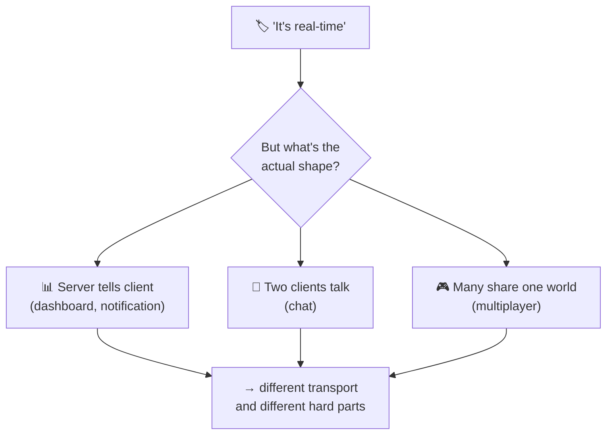

# WebSocket Use Cases

> **Phase:** APIs & Communication Deep Dives → **Topic:** 8 of 15 → **Read time:** ~48 minutes

---

## Before You Begin

**This document builds directly on Topic 07 — WebSockets, and assumes you've read it.** Where every other topic in this phase stands alone, this one is deliberately *coupled*: Topic 07 already taught how a WebSocket works and — more importantly — what it costs to hold one open (the connection is server-held state; every open connection is memory, a file descriptor, and identity the server keeps for every client at once; scaling needs sticky routing and a backplane). This document does **not** re-teach any of that. It builds the layer above it: *given that you understand the mechanism and its cost, which features should actually use a WebSocket — and which of the many features called "real-time" should not.*

Two consequences of that choice:

- **The mechanism is recalled, not re-explained.** When this doc says "the backplane" or "the connection is state," it's leaning on what Topic 07 established, in one clause, and moving on. If a term feels unfamiliar, it's taught there.
- **Neighbouring tools are named, not taught.** The full head-to-head against lighter alternatives (long polling, server-sent events) is its own topic; webhooks and WebRTC are their own topics too. Where this doc reaches them, it points rather than teaches.

WebSockets appear in the **Top 30 Must-Know Concepts** foundation series. Topic 07 was the deep-dive on the mechanism; this is the deep-dive on *where it belongs*.

Here is the question the document answers:

> **"Real-time" is one of the most overloaded words in engineering — a chat, a live dashboard, a multiplayer game, and a push notification are all called real-time, yet they want completely different things. So when a feature is described as real-time, how do you tell whether it genuinely needs a WebSocket, something lighter, or something else entirely — and how do you know what will actually be hard to build?**

Here's the trap it disarms. The word "real-time" acts like a switch: someone says it, and the reflex is *"real-time means WebSockets."* That reflex is wrong far more often than it's right. Most features labelled real-time are *one-way server push* — a dashboard updating, a notification arriving, a feed refreshing — and for those a WebSocket is overkill that buys you Topic 07's entire statefulness bill for a capability (the client talking back) you never use. The features that genuinely need a WebSocket are a minority, and telling them apart isn't about the feature's *name* — it's about its underlying shape.

> **The mindset shift:** stop classifying a feature by its **label** — "chat", "dashboard", "notifications", "live tracking" — and start classifying it by its **communication pattern**: *who sends messages, to how many recipients, and how often.* Two features with different labels can be the same pattern, and two features with the same label can be different patterns. Once you name the pattern, two things fall out at once — **which transport fits** (often not a WebSocket) and **what will actually be hard** (ordering, delivery, reconnection, presence — problems that recur across features rather than being invented fresh for each). The label tells you what a feature is called; the pattern tells you how to build it.

---

## Table of Contents

1. [What "Real-Time" Actually Means](#1-what-real-time-actually-means)
2. [The Two Questions That Classify Any Feature](#2-the-two-questions-that-classify-any-feature)
3. [Pattern A — One-Way Server Push](#3-pattern-a--one-way-server-push)
4. [Pattern B — Two-Way Conversation](#4-pattern-b--two-way-conversation)
5. [Pattern C — Shared State Across Many](#5-pattern-c--shared-state-across-many)
6. [Presence — The Sub-Pattern Hiding in All of Them](#6-presence--the-sub-pattern-hiding-in-all-of-them)
7. [The Hard Parts Are Shared, Not Per-Feature](#7-the-hard-parts-are-shared-not-per-feature)
8. [When Real-Time Isn't a WebSocket](#8-when-real-time-isnt-a-websocket)
9. [A Practical Way to Choose](#9-a-practical-way-to-choose)
10. [Putting It All Together — A Delivery-Tracking App](#10-putting-it-all-together--a-delivery-tracking-app)
11. [Final Recap](#11-final-recap)

---

## 1. What "Real-Time" Actually Means

Before you can decide which features need a WebSocket, you have to notice that "real-time" isn't one thing. It's a word we paste onto a dozen unrelated behaviours, and the pasting is exactly what causes the wrong tool to get picked.

### One Word, Four Different Features

Consider four features a product might describe, all with the same adjective:

- A **live dashboard** whose numbers update as data arrives.
- A **chat** where two people type back and forth.
- A **multiplayer game** where a dozen players' actions affect a shared world.
- A **push notification** that pops up the instant something happens.

They're all "real-time," and they feel similar — things happen *now*, without the user hitting refresh. But look at how information actually moves in each and they could hardly be more different. The dashboard and the notification are the *server* telling the client something; the client has nothing to say back. The chat is two clients genuinely talking to each other. The game is many clients all affecting one shared thing that all of them see. Same adjective, three completely different shapes of communication — and shape, not adjective, is what determines how you build it.

### "Real-Time" Is About *Freshness*, Not *Transport*

Here's the confusion the word creates. "Real-time" is a statement about a **requirement**: the user should learn about a change close to when it happens, not minutes later. That's a property of the *experience*. It says nothing about the *mechanism* that delivers it. A dashboard that refreshes every two seconds feels real-time to a human and might be served perfectly by the client simply asking again on a timer. A stock ticker that must reflect a price within milliseconds is also real-time, but with a latency budget a thousand times tighter. Both are "real-time"; they need utterly different machinery.

So "is this real-time?" is the wrong first question — almost everything a user-facing product does today is real-time in the loose sense. The useful questions are about the *shape and urgency* of the information flow, and those are what the next section makes precise.

### Use Case Is Not Transport

The mistake this whole document exists to prevent is collapsing the *use case* ("we're building chat") into a *transport* decision ("so we need WebSockets") in a single reflex, skipping the step in between. That step is identifying the communication pattern. A "chat" between a user and an automated assistant that replies once per message is barely two-way and may not need a persistent connection at all; a "dashboard" that lets an operator click to control a live system *is* two-way and might. The label pointed you at the wrong answer both times. Only the pattern — who sends, to whom, how often, how urgently — points you at the right one.

> 💡 **Key Insight**
>
> "Real-time" is a requirement about **freshness** — the user should learn of a change close to when it happens — and it says nothing about the **transport** that delivers it. The word is pasted onto features with completely different communication shapes: server-tells-client, client-talks-to-client, many-share-one-world. Because the shapes differ, the right mechanism differs, so "is it real-time?" is the wrong first question — nearly everything is, loosely. The question that pays is *what shape is the information flow*, and answering it, not the label, is what selects the tool.

### Quick Recap — What "Real-Time" Actually Means

- **"Real-time" is one word for many unlike features** — a dashboard, a chat, a game, and a notification are all called real-time but move information in completely different shapes.
- It describes a **freshness requirement** (learn of a change close to when it happens), not a **transport** — it doesn't tell you *how* to deliver it.
- Because nearly every modern feature is real-time in the loose sense, **"is it real-time?" is the wrong first question**; the useful question is the *shape and urgency* of the flow.
- The error to avoid is jumping from **use case straight to transport** ("chat, so WebSockets"), skipping the step — identifying the pattern — that actually decides the tool.

---
