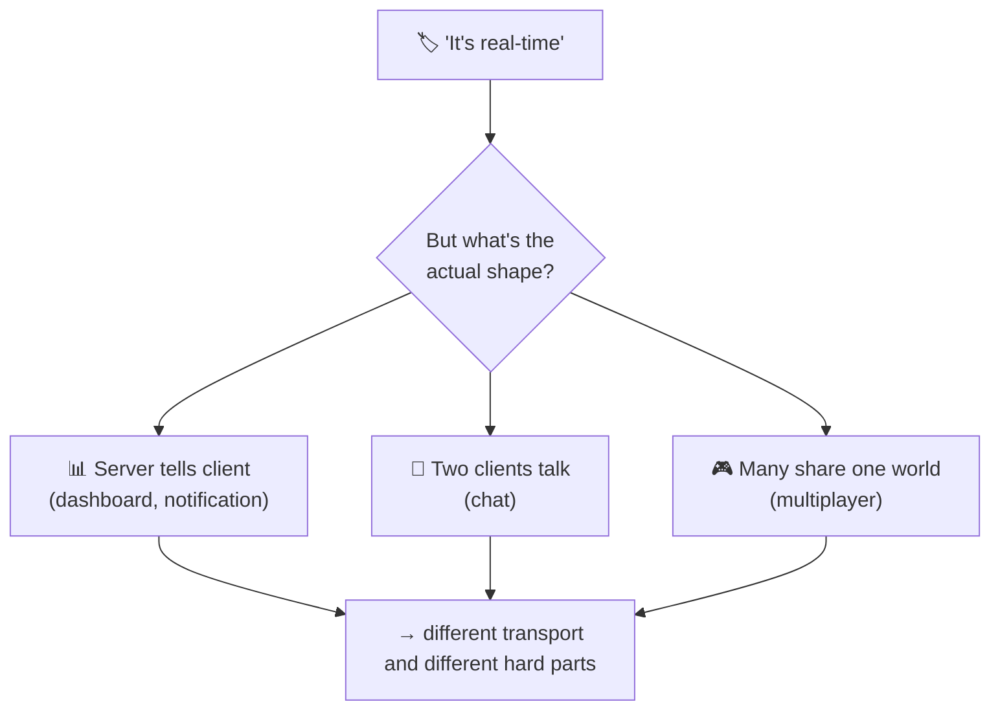
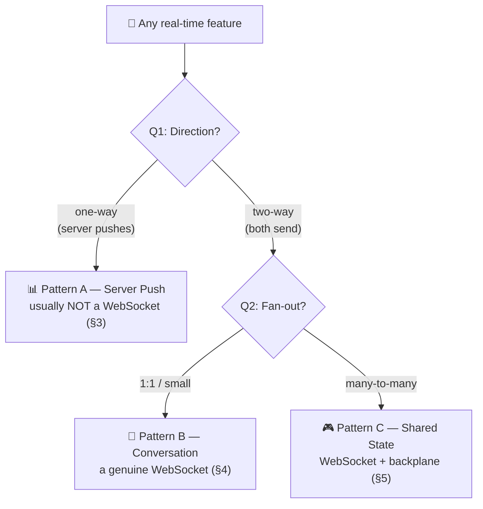
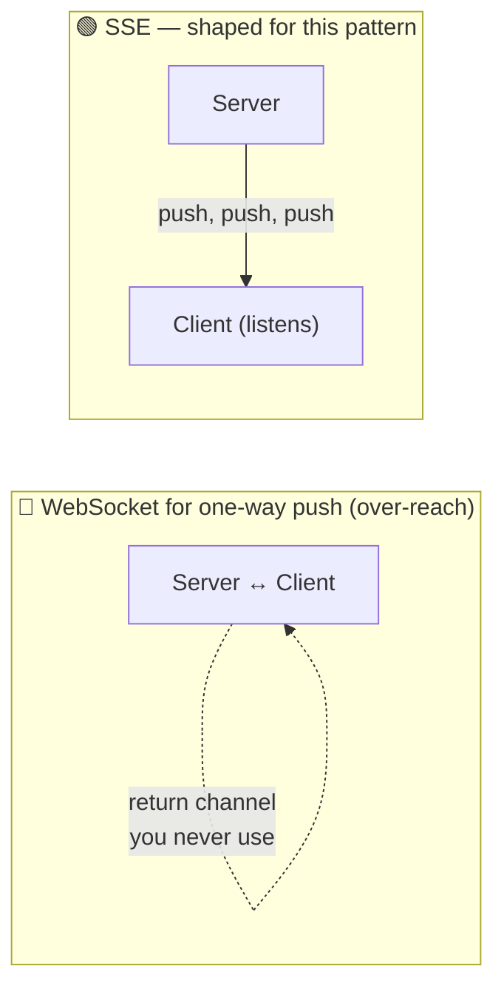
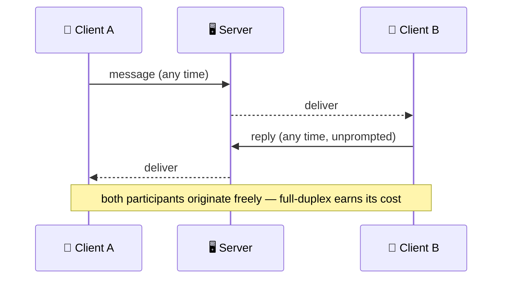
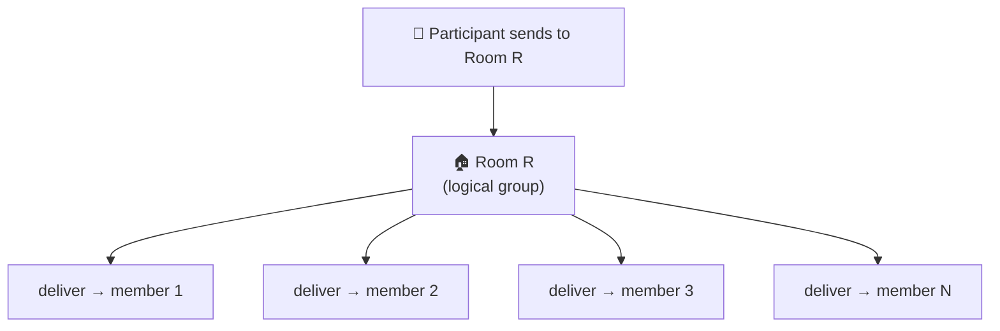
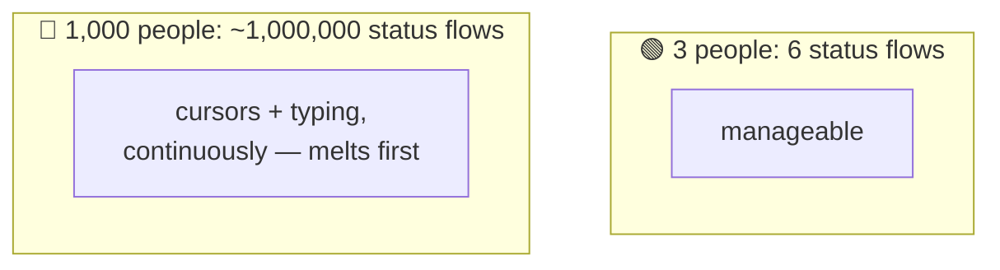
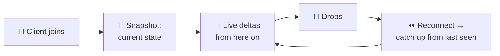

# WebSocket Use Cases

> **Phase:** APIs & Communication Deep Dives → **Topic:** 8 of 15 → **Read time:** ~48 minutes

---

## Before You Begin

**This document builds directly on Topic 07 — WebSockets, and assumes you've read it.** Where every other topic in this phase stands alone, this one is deliberately *coupled*: Topic 07 already taught how a WebSocket works and — more importantly — what it costs to hold one open (the connection is server-held state; every open connection is memory, a file descriptor, and identity the server keeps for every client at once; scaling needs sticky routing and a backplane). This document does **not** re-teach any of that. It builds the layer above it: *given that you understand the mechanism and its cost, which features should actually use a WebSocket — and which of the many features called "real-time" should not.*

Two consequences of that choice:

- **The mechanism is recalled, not re-explained.** When this doc says "the backplane" or "the connection is state," it's leaning on what Topic 07 established, in one clause, and moving on. If a term feels unfamiliar, it's taught there.
- **Neighbouring tools are named, not taught.** The full head-to-head against lighter alternatives (long polling, server-sent events) is its own topic; webhooks and WebRTC are their own topics too. Where this doc reaches them, it points rather than teaches.

WebSockets appear in the **Top 30 Must-Know Concepts** foundation series. Topic 07 was the deep-dive on the mechanism; this is the deep-dive on *where it belongs*.

Here is the question the document answers:

> **"Real-time" is one of the most overloaded words in engineering — a chat, a live dashboard, a multiplayer game, and a push notification are all called real-time, yet they want completely different things. So when a feature is described as real-time, how do you tell whether it genuinely needs a WebSocket, something lighter, or something else entirely — and how do you know what will actually be hard to build?**

Here's the trap it disarms. The word "real-time" acts like a switch: someone says it, and the reflex is *"real-time means WebSockets."* That reflex is wrong far more often than it's right. Most features labelled real-time are *one-way server push* — a dashboard updating, a notification arriving, a feed refreshing — and for those a WebSocket is overkill that buys you Topic 07's entire statefulness bill for a capability (the client talking back) you never use. The features that genuinely need a WebSocket are a minority, and telling them apart isn't about the feature's *name* — it's about its underlying shape.

> **The mindset shift:** stop classifying a feature by its **label** — "chat", "dashboard", "notifications", "live tracking" — and start classifying it by its **communication pattern**: *who sends messages, to how many recipients, and how often.* Two features with different labels can be the same pattern, and two features with the same label can be different patterns. Once you name the pattern, two things fall out at once — **which transport fits** (often not a WebSocket) and **what will actually be hard** (ordering, delivery, reconnection, presence — problems that recur across features rather than being invented fresh for each). The label tells you what a feature is called; the pattern tells you how to build it.

---

## Table of Contents

1. [What "Real-Time" Actually Means](#1-what-real-time-actually-means)
2. [The Two Questions That Classify Any Feature](#2-the-two-questions-that-classify-any-feature)
3. [Pattern A — One-Way Server Push](#3-pattern-a--one-way-server-push)
4. [Pattern B — Two-Way Conversation](#4-pattern-b--two-way-conversation)
5. [Pattern C — Shared State Across Many](#5-pattern-c--shared-state-across-many)
6. [Presence — The Sub-Pattern Hiding in All of Them](#6-presence--the-sub-pattern-hiding-in-all-of-them)
7. [The Hard Parts Are Shared, Not Per-Feature](#7-the-hard-parts-are-shared-not-per-feature)
8. [When Real-Time Isn't a WebSocket](#8-when-real-time-isnt-a-websocket)
9. [A Practical Way to Choose](#9-a-practical-way-to-choose)
10. [Putting It All Together — A Delivery-Tracking App](#10-putting-it-all-together--a-delivery-tracking-app)
11. [Final Recap](#11-final-recap)

---

## 1. What "Real-Time" Actually Means

Before you can decide which features need a WebSocket, you have to notice that "real-time" isn't one thing. It's a word we paste onto a dozen unrelated behaviours, and the pasting is exactly what causes the wrong tool to get picked.

### One Word, Four Different Features

Consider four features a product might describe, all with the same adjective:

- A **live dashboard** whose numbers update as data arrives.
- A **chat** where two people type back and forth.
- A **multiplayer game** where a dozen players' actions affect a shared world.
- A **push notification** that pops up the instant something happens.

They're all "real-time," and they feel similar — things happen *now*, without the user hitting refresh. But look at how information actually moves in each and they could hardly be more different. The dashboard and the notification are the *server* telling the client something; the client has nothing to say back. The chat is two clients genuinely talking to each other. The game is many clients all affecting one shared thing that all of them see. Same adjective, three completely different shapes of communication — and shape, not adjective, is what determines how you build it.

### "Real-Time" Is About *Freshness*, Not *Transport*

Here's the confusion the word creates. "Real-time" is a statement about a **requirement**: the user should learn about a change close to when it happens, not minutes later. That's a property of the *experience*. It says nothing about the *mechanism* that delivers it. A dashboard that refreshes every two seconds feels real-time to a human and might be served perfectly by the client simply asking again on a timer. A stock ticker that must reflect a price within milliseconds is also real-time, but with a latency budget a thousand times tighter. Both are "real-time"; they need utterly different machinery.

So "is this real-time?" is the wrong first question — almost everything a user-facing product does today is real-time in the loose sense. The useful questions are about the *shape and urgency* of the information flow, and those are what the next section makes precise.

### Use Case Is Not Transport

The mistake this whole document exists to prevent is collapsing the *use case* ("we're building chat") into a *transport* decision ("so we need WebSockets") in a single reflex, skipping the step in between. That step is identifying the communication pattern. A "chat" between a user and an automated assistant that replies once per message is barely two-way and may not need a persistent connection at all; a "dashboard" that lets an operator click to control a live system *is* two-way and might. The label pointed you at the wrong answer both times. Only the pattern — who sends, to whom, how often, how urgently — points you at the right one.

> 💡 **Key Insight**
>
> "Real-time" is a requirement about **freshness** — the user should learn of a change close to when it happens — and it says nothing about the **transport** that delivers it. The word is pasted onto features with completely different communication shapes: server-tells-client, client-talks-to-client, many-share-one-world. Because the shapes differ, the right mechanism differs, so "is it real-time?" is the wrong first question — nearly everything is, loosely. The question that pays is *what shape is the information flow*, and answering it, not the label, is what selects the tool.

### Quick Recap — What "Real-Time" Actually Means

- **"Real-time" is one word for many unlike features** — a dashboard, a chat, a game, and a notification are all called real-time but move information in completely different shapes.
- It describes a **freshness requirement** (learn of a change close to when it happens), not a **transport** — it doesn't tell you *how* to deliver it.
- Because nearly every modern feature is real-time in the loose sense, **"is it real-time?" is the wrong first question**; the useful question is the *shape and urgency* of the flow.
- The error to avoid is jumping from **use case straight to transport** ("chat, so WebSockets"), skipping the step — identifying the pattern — that actually decides the tool.

---

## 2. The Two Questions That Classify Any Feature

If the shape of the flow is what matters, you need a reliable way to find it. It turns out two questions are enough to place almost any real-time feature, and once placed, its transport and its hard parts are largely determined. This section is the tool the rest of the document uses.

### Question 1 — Which Direction Does Information Flow?

The first and most decisive question: **does only the server send, or do both sides send?**

- **One-way (server → client).** The server has news; the client receives it and does not send anything back over the same channel (beyond the acknowledgements the transport handles for you). A dashboard, a notification, a live feed, a progress bar — the client is a *listener*. It might occasionally make an ordinary separate request, but the real-time flow is one-directional.
- **Two-way (both send).** Both ends originate messages, independently and continuously, over the same connection. A chat, a collaborative editor, a game — the client is a *participant*, not just a listener.

This one question does most of the work, because two-way is precisely the capability a WebSocket exists to provide and nothing lighter does (Topic 07 called this full-duplex, and named it the whole reason WebSockets exist). If the honest answer is "only the server sends," you are very likely *not* looking at a WebSocket, no matter what the feature is called — a point §3 and §8 develop.

### Question 2 — How Many Recipients Does a Message Reach?

The second question shapes the *difficulty*: **when a message is sent, how many others need to see it?** This is called **fan-out** — the number of recipients a single message must be delivered to.

- **1:1** — a message goes to exactly one other party. A direct message; a support chat between one user and one agent.
- **One-to-many (broadcast)** — one sender, many receivers. A live score pushed to everyone watching a match; a courier's location shown to everyone tracking that order.
- **Many-to-many** — many senders, many receivers, all sharing one logical space. Every player in a game sends actions and receives everyone else's; every editor in a shared document does the same.

Fan-out barely affects a one-way 1:1 feature but dominates a many-to-many one: the number of message *deliveries* grows with the size of the group, not the number of *sends*, and that is where the operational pain (and Topic 07's backplane) lives.

### The Two Questions Form a Map

Put the two questions on two axes and the real-time landscape organizes itself. Direction chooses the *transport family*; fan-out chooses *how hard the delivery is*. The named patterns in §3–§5 are just the populated cells of this map.

Notice what the map does: it turns "is this real-time?" (unanswerable, everything is) into two concrete questions with concrete answers, and those answers point at a pattern. The rest of the document walks the three patterns in turn, then the sub-pattern (presence) that rides inside them, then the hard parts they share.

> 💡 **Key Insight**
>
> Two questions classify almost any real-time feature. **Direction** (one-way server push vs two-way) is the decisive one — two-way is the capability only a WebSocket provides, so a one-way answer usually means you don't need one. **Fan-out** (1:1, one-to-many, many-to-many) sets the *difficulty*, because deliveries grow with group size, not with sends. Together they form a map whose cells are the named patterns, and reading a feature onto the map — rather than reading its label — is what selects both the transport and the hard part.

### Quick Recap — The Two Questions

- **Question 1 (direction):** does only the server send, or do both sides? Two-way is exactly what a WebSocket provides and nothing lighter does — so a one-way answer usually means *not* a WebSocket.
- **Question 2 (fan-out):** how many recipients must one message reach — 1:1, one-to-many, or many-to-many? This sets the *difficulty*, since deliveries scale with group size.
- The two axes form a **map** whose populated cells are the three patterns: one-way push (§3), two-way conversation (§4), and many-to-many shared state (§5).
- Reading a feature onto the map — **not** reading its label — is what points you at the right transport and warns you where the pain will be.

---

## 3. Pattern A — One-Way Server Push

The first and by far the most common pattern: the server has something to say, the client needs to hear it promptly, and the client has nothing to send back over that channel. This is where most features that get called "real-time" actually live — and the crucial, counterintuitive point of this section is that **most of them don't need a WebSocket.**

### What Lives Here

Run the everyday "real-time" features through Question 1 (§2) and a striking number come back *one-way*:

- A **live dashboard** — metrics, charts, counts updating as data arrives. The viewer watches; they don't type back into the stream.
- **Notifications** — "your order shipped," "someone mentioned you." Pure server-to-client.
- A **live feed or timeline** that grows as new items appear.
- A **price ticker or live score** — numbers changing on their own.
- A **progress indicator** for a long-running job — the server reports 10%, 40%, done.
- **Live location** shown on a map — a courier's dot moving, delivered to everyone tracking it.

Every one of these is the server pushing news to a listening client. The client's only "sends" are ordinary, occasional, separate requests (loading the page, clicking something) — not a continuous return stream. On the §2 map, they sit squarely in the one-way column.

### Why a WebSocket Is Usually the Wrong Tool Here

Topic 07 was emphatic about what a WebSocket costs: the connection is state the server holds for every client, which forfeits stateless scaling, free caching, the request-response error model, and simple load balancing. You pay that entire bill for one capability — *the client being able to talk back at any instant*. In a one-way feature, **the client never talks back.** So you'd be paying the full price of full-duplex to use exactly half of it. That's the definition of over-reach.

There is a tool shaped exactly for this case: **server-sent events (SSE)** — a one-way, server-to-client stream that runs over ordinary HTTP and stays open so the server can push whenever it likes. Because it's still HTTP, it keeps much of what Topic 07 showed a WebSocket throws away: it's simpler to run, plays nicely with existing HTTP infrastructure, and reconnection is largely handled for you. It does one thing — server pushes to client — and that one thing is this entire pattern.

The full head-to-head — SSE versus long polling versus WebSockets, with all the tradeoffs — is a topic of its own and isn't repeated here. The point for *this* document is narrower: **one-way push is a pattern with its own right tool, and that tool usually isn't a WebSocket.**

### When One-Way Push *Does* Justify a WebSocket

Rarely, but honestly, a one-way feature still ends up on a WebSocket — and it's worth knowing the legitimate reasons so you can tell them from rationalization:

- **You already have a WebSocket open for something else.** If the same client already holds a WebSocket for a genuinely two-way feature, pushing a one-way stream down the *existing* connection can be simpler than standing up a second SSE channel beside it. The cost is already paid; reuse is fair.
- **A constraint rules SSE out.** Some environments or intermediaries handle SSE poorly, or a binary payload fits WebSocket frames better than SSE's text-oriented stream. These are real, specific reasons — not "it's real-time, so WebSockets."

The test is simple: if the *only* reason you're reaching for a WebSocket on a one-way feature is the word "real-time," stop — you want SSE. If there's a concrete, nameable reason, it can be legitimate.

> ⚠️ **Most features called "real-time" are one-way server push, and reaching for a WebSocket for them is the single most common over-reach in this area.** You pay Topic 07's entire statefulness bill — lost caching, sticky routing, held connections per client — to buy a return channel the feature never uses. One-way push has a tool built for exactly its shape: server-sent events, which pushes over ordinary HTTP and keeps most of what a WebSocket discards. Reach past it to a WebSocket only for a concrete, nameable reason — an existing connection to reuse, or a real constraint — never for the word alone.

### Quick Recap — One-Way Server Push

- The most common "real-time" pattern: the **server pushes**, the client **listens** and sends nothing back over the channel — dashboards, notifications, feeds, tickers, progress, live location.
- A WebSocket here is **over-reach** — you pay the full statefulness bill (Topic 07) for a two-way capability the feature never uses.
- **Server-sent events (SSE)** is built for this exact shape: one-way server-to-client push over ordinary HTTP, keeping much of what a WebSocket throws away.
- A one-way feature justifies a WebSocket only for a **concrete reason** (an already-open connection to reuse, or a real constraint), never for the label "real-time" alone.

---

## 4. Pattern B — Two-Way Conversation

Now the pattern a WebSocket was actually built for: both sides genuinely send, continuously, and the exchange is a back-and-forth rather than a broadcast. Here the return channel you'd waste in §3 is the whole point, and the statefulness cost buys something real.

### What Lives Here

The defining trait is that the client is a **participant**, not a listener — it originates messages as freely as the server does:

- **Chat between people** — a direct message thread, a support conversation between a user and an agent. Each side types when they have something to say; neither waits its turn.
- **Live collaboration between a few** — two or three people editing a document, where each person's edits flow out and everyone else's flow in, simultaneously.
- **Interactive control** — an operator adjusting a live system and seeing its response stream back in the same session; a remote-control-style surface where commands go up and telemetry comes down at once.

What unites them is that both directions carry *frequent, independent* traffic. Not "the client occasionally acknowledges" — genuinely both parties initiating, often, at unpredictable moments. That is full-duplex (Topic 07's term for both ends sending at once without taking turns), and it's exactly what nothing lighter than a WebSocket provides.

### Why This Genuinely Needs a WebSocket

Recall Topic 07's discipline: a WebSocket is justified when **both sides send frequently *and* latency genuinely matters** — both conditions, together. Pattern B is the case where both hold by construction. Trying to serve it without a persistent bidirectional connection forces you into ugly workarounds: the client would have to *poll* to discover the other side's messages (laggy and wasteful, as §1 noted for any push), while separately POSTing its own — two clumsy half-channels stapled together to fake the one two-way channel a WebSocket gives natively. The moment a feature is truly conversational, the WebSocket stops being over-reach and becomes the honest, simplest fit.

### The Fan-Out Is Still Small — and That Matters

Pattern B is two-way, but on the §2 map it sits at *low* fan-out: 1:1, or a small group. A support chat is one user and one agent. A direct message is two people. Even a small collaborative session is a handful. This keeps it the *manageable* WebSocket case: each message goes to one or a few recipients, so the delivery problem stays small even though the connection is stateful. The server holds a connection per participant (Topic 07's cost, unavoidable here), but it isn't yet wrestling with fanning one message out to thousands — that's Pattern C, and it's a different order of difficulty. Recognizing that a feature is two-way *but low-fan-out* tells you it's a real WebSocket case that will nonetheless stay tractable.

> 💡 **Key Insight**
>
> Two-way conversation is the pattern a WebSocket exists for: both parties send frequently and independently, so the full-duplex return channel you'd waste on one-way push (§3) is the entire point, and Topic 07's two conditions — both sides send *and* latency matters — hold by construction. Faking it without a persistent bidirectional connection means poll-for-inbound plus POST-for-outbound, two half-channels stapled into a bad imitation of one. And because the fan-out stays low (1:1 or a small group), it's the *tractable* WebSocket case — genuinely stateful, but not yet fighting the many-recipient delivery problem of Pattern C.

### Quick Recap — Two-Way Conversation

- The pattern a WebSocket is **built for**: both sides send frequently and independently — chat between people, support, small-group collaboration, interactive control.
- Here the return channel is the **whole point**, so the statefulness cost is justified — Topic 07's two conditions (both send *and* latency matters) both hold.
- Faking it without a persistent bidirectional connection means **polling for inbound plus POSTing outbound** — two half-channels imitating the one a WebSocket gives natively.
- Fan-out stays **low** (1:1 or small group), which keeps this the **tractable** WebSocket case — stateful, but not yet the many-recipient delivery problem of Pattern C.

---

## 5. Pattern C — Shared State Across Many

The third pattern keeps Pattern B's two-way flow but cranks the fan-out all the way up: many participants, all sending, all needing to see one another's messages, all sharing a single logical space. This is the most powerful thing WebSockets enable and, by a wide margin, the most expensive — and the expense comes almost entirely from the fan-out, not the two-wayness.

### What Lives Here

- **Multiplayer games** — every player's action affects a shared world, and every other player must see it, fast.
- **Large collaborative documents and whiteboards** — dozens of people editing or drawing on one surface, each change visible to all.
- **Live auctions or trading floors** — every bid must reach every participant, because a stale view means acting on wrong information.
- **Big group chats and live-event rooms** — hundreds or thousands in one conversation, each message fanning out to the whole room.

The common shape: there is a *shared thing* — a game world, a document, an auction, a room — and a message from any participant must reach all the others who share it. This is the many-to-many corner of the §2 map.

### The Room Is the Core Abstraction

You cannot reason about many-to-many delivery one connection at a time. The abstraction that makes it tractable is the **room**: a named logical group of participants, where a message sent "to the room" is delivered to everyone currently in it. A game match is a room; a document's editors are a room; each live-event channel is a room. The application stops thinking "send this to connections X, Y, Z" and starts thinking "publish this to room R" — and the infrastructure handles turning that into individual deliveries.

Rooms also bound the problem. A message doesn't fan out to *all* users, only to the room it belongs to, so the cost scales with room size, not total user count. Designing the right room granularity — one big room versus many small ones — is often the difference between a feature that scales and one that doesn't.

### Why the Backplane Becomes Non-Negotiable Here

This is where Topic 07's hardest lesson comes due. A single server can only hold so many connections, so a large room's members are inevitably spread across many servers. But a server can only directly deliver to the connections it *itself* holds — it has no line to a participant connected to a different server. So a message arriving at one server must somehow reach every *other* server holding a member of that room.

That bridge is the **backplane** — the pub/sub channel between servers that Topic 07 introduced. A server that receives a room message publishes it to the backplane; every server holding members of that room picks it up and delivers to its own local connections. In Patterns A and B you might avoid a backplane (one-way push and small conversations can sometimes be pinned to a single server); in Pattern C, with a room spread across the fleet, **the backplane is not optional** — it is the only thing that makes the room one logical space instead of many disconnected fragments. This document doesn't re-teach how the backplane works (Topic 07 did); it names *why this pattern forces you to have one*.

### The Cost Is Fan-Out, and It Grows Fast

The trap in Pattern C is underestimating deliveries. A room of *N* people where everyone sends produces, per message, up to *N* deliveries — and if all *N* are active, the total delivery volume scales with *N* senders times *N* recipients. A cozy 10-person room is ~100 deliveries per round of activity; a 1,000-person room is ~1,000,000. The *sends* grew 100×; the *work* grew 10,000×. This quadratic blow-up is why large shared-state features need deliberate design — capping room sizes, sharding big rooms, thinning or batching updates — rather than just "opening more connections."

> ⚠️ **Pattern C is the most powerful use of WebSockets and the one that punishes naïveté hardest — and the cost is fan-out, not two-wayness.** A message from any participant must reach all the others, so deliveries scale with room size, and in a fully active room with the *many-to-many* shape they scale with the *square* of it: a 1,000-person room is a million deliveries per round, not a thousand. The **room** abstraction bounds the blast radius, and Topic 07's **backplane** becomes mandatory the moment a room outgrows one server. Reach for this pattern only when the feature is genuinely a shared live space — and design the room granularity before the traffic, not after.

### Quick Recap — Shared State Across Many

- Pattern C keeps two-way flow but at **many-to-many** fan-out: many participants sharing one logical space — multiplayer, big collaborative docs, auctions, large rooms.
- The **room** is the core abstraction — a named group a message is published to — which bounds delivery to room size rather than total users.
- Topic 07's **backplane** (pub/sub between servers) is **non-optional** here, because a large room's members are spread across servers and each server only reaches its own connections.
- The dominant cost is **fan-out**, which grows quadratically in a fully active room (N senders × N recipients) — so room granularity must be designed deliberately, not left to grow.

---

## 6. Presence — The Sub-Pattern Hiding in All of Them

There's one feature that isn't a pattern of its own so much as a passenger riding inside the others, and it deserves its own section because it's the thing that most often melts first. It's **presence** — the little signals that tell participants about each other's *status*: who's online, who's typing, who's in the room, where their cursor is.

### It's Everywhere Once You Look

Presence shows up wherever people share a space:

- The **green dot** next to a contact — online or away.
- The **"Alex is typing…"** indicator in a chat.
- The list of **who's currently in** a document, a call, or a game lobby.
- The **live cursors** of other editors moving around a shared document.

None of these is the *main* feature — nobody builds an app to show typing indicators. They ride along inside chat (Pattern B) and collaboration and multiplayer (Pattern C) as ambient awareness. And precisely because they feel like garnish, they get added late and casually — which is how they become the thing that falls over.

### Why It's Deceptively Expensive

Presence looks trivial and behaves brutally, for two reasons.

First, it's **high-frequency and many-to-many by nature.** A typing indicator can fire on every few keystrokes; a live cursor updates continuously as the mouse moves. And everyone in the space needs to see everyone else's status — which is the same quadratic fan-out as Pattern C, except the messages are constant rather than occasional. A room of *N* people each broadcasting cursor movements to the other *N* is an *N×N* storm of tiny updates, flowing the entire time the room is open, not just when someone deliberately acts.

Second, it's **ephemeral state that still has to be maintained.** Unlike a chat message (send once, done), presence is a *current condition* the server must track and keep correct: who is online *right now*. That means it's entangled with the connection lifecycle Topic 07 detailed — when a connection drops, that user's presence must flip to offline, which depends on the heartbeats and dead-connection detection from Topic 07 actually working. A silently-dead connection shows a ghost: a user who "looks online" but left ten minutes ago.

### Taming It

Because presence is the quadratic-fan-out problem at high frequency, it's usually the first place a real-time feature needs deliberate thinning. The common moves — named here, not detailed — are to **throttle** updates (send cursor position a few times a second, not on every pixel), **batch** many small status changes into one message, and **scope** presence to what's actually visible (you don't need every cursor in a 1,000-person document, only those near you). The lesson for classification: when a feature includes presence, budget for it as a first-class cost, not a free add-on — it often dwarfs the main feature's traffic.

> 💡 **Key Insight**
>
> Presence — online status, typing indicators, live cursors, who's-here lists — is never the headline feature, so it gets added casually, and then it melts first. Two reasons: it's **high-frequency many-to-many** (everyone's constant status flowing to everyone else is the same quadratic fan-out as Pattern C, but continuous), and it's **ephemeral state tied to the connection lifecycle** — keeping "who's online" correct depends on Topic 07's dead-connection detection, or you show ghosts. Treat presence as a first-class cost to be throttled, batched, and scoped — not a garnish.

### Quick Recap — Presence

- **Presence** — online status, typing, who's-here, live cursors — is a sub-pattern that rides inside chat (§4) and collaboration/multiplayer (§5), never the headline feature.
- It's **deceptively expensive**: high-frequency and many-to-many, so everyone's constant status to everyone else is the same **quadratic fan-out** as Pattern C, but flowing continuously.
- It's **ephemeral state tied to the connection lifecycle** — keeping "who's online" honest depends on Topic 07's heartbeats and dead-connection detection, or you show ghosts.
- Tame it by **throttling, batching, and scoping** updates, and budget for it as a **first-class cost** — it often dwarfs the main feature's traffic.

---

## 7. The Hard Parts Are Shared, Not Per-Feature

Here is the real payoff of classifying by pattern rather than by label. Once you see that chat, collaboration, and multiplayer are all the same few patterns underneath, you also see that their *hard parts are the same* — the difficult problems recur across features rather than being invented fresh for each. Build them once, as infrastructure, and every real-time feature you ship inherits the solution. Treat each feature as a snowflake and you'll solve the same four problems four times, badly.

### Ordering — Messages Can Arrive Out of Sequence

Over a single connection, frames arrive in the order sent. But real features involve *many* connections, servers, and a backplane (§5), and once messages take different paths, the order they arrive in may not match the order they happened. Two edits to the same document, two moves in a game, two chat messages — if they land out of order, the shared state diverges between participants. So real-time systems need a way to establish *what happened when*: sequence numbers, logical timestamps, or server-assigned ordering. This is a genuinely deep problem — the ordering and consistency machinery of distributed systems is its own phase — but the point here is that **it's the same problem for every pattern**, not a chat problem or a game problem.

### Delivery — A Message Can Simply Be Lost

Topic 07 made this stark: a WebSocket has no per-message receipt. You send a frame; there's no `200 OK` telling you it arrived, and if the connection dies mid-flight the message can vanish with no error. For a live cursor, losing one update is harmless — the next one corrects it. For a chat message or a game action, a silent loss is a bug the user sees. So features that can't tolerate loss need **delivery guarantees** built on top: the receiver acknowledges messages, the sender retries unacknowledged ones, and — because a retry can duplicate — receivers must handle the same message arriving twice. "At-least-once delivery plus handling duplicates" is a recurring shape, and again it's shared across every pattern that carries messages that matter.

### Reconnection Catch-Up — What Did I Miss?

Topic 07 established that a connection *will* drop and the client must reconnect. This section adds the part that's specific to use cases: **reconnecting isn't enough — the client has to recover what it missed while it was gone.** A chat client that reconnects must fetch the messages sent during the gap. A collaborative editor must reconcile edits it never received. A dashboard must jump to current values, not resume from stale ones. This usually means every message carries a position (a sequence number or timestamp), the client remembers the last one it saw, and on reconnect it asks "give me everything after *this*." Without catch-up, a two-second network blip leaves the user permanently missing whatever happened during it.

### Initial State Sync — Joining Mid-Stream

The mirror image of catch-up, and the one most often forgotten. When a client *first* joins, it needs the **current state**, not just the stream of future changes. A player joining a game needs the world as it is now; an editor opening a document needs its current contents; someone entering a chat needs the recent history. A real-time stream delivers *deltas* — what changed — but a newcomer has nothing for the deltas to apply to. So every real-time feature needs a way to hand a joiner a **snapshot** of current state, after which the live stream of deltas keeps them current. Snapshot-then-stream is the universal shape for joining any shared real-time thing.

### One Set of Machinery, Every Feature

Read the four together and the lesson is structural: ordering, delivery, catch-up, and initial-state-sync are **not features of chat or of games** — they're properties of *carrying meaningful messages over an unreliable, distributed, resumable connection*, which every pattern does. This is exactly why classifying by pattern pays: it reveals that the expensive engineering is shared, so it should be built once as a real-time *platform* and reused, rather than reinvented per surface. Teams that miss this ship three chat-shaped features each with its own subtly-broken reconnection logic.

> 💡 **Key Insight**
>
> The genuinely hard parts of real-time — **ordering** (messages take different paths and arrive out of sequence), **delivery** (no per-message receipt, so meaningful messages need acks-and-retries plus dedup), **reconnection catch-up** (recover what you missed, not just reconnect), and **initial state sync** (a joiner needs a snapshot before deltas mean anything) — are not per-feature problems. They're properties of carrying important messages over an unreliable, distributed, resumable connection, which every pattern does. Build them once as a shared platform; reinvent them per feature and you'll ship the same bugs repeatedly.

### Quick Recap — The Hard Parts Are Shared

- **Ordering:** across many connections, servers, and a backplane, messages can arrive out of sequence, so shared state needs sequence numbers or server-assigned order — the same problem for every pattern.
- **Delivery:** a WebSocket has no per-message receipt (Topic 07), so messages that matter need **acknowledge-and-retry plus duplicate handling** on top.
- **Reconnection catch-up:** reconnecting isn't enough — the client must recover what it **missed** during the gap, usually by tracking the last position it saw.
- **Initial state sync:** a joiner needs a **snapshot** of current state before the live delta stream means anything — snapshot-then-stream is universal, and all four are shared infrastructure, not per-feature work.

---
