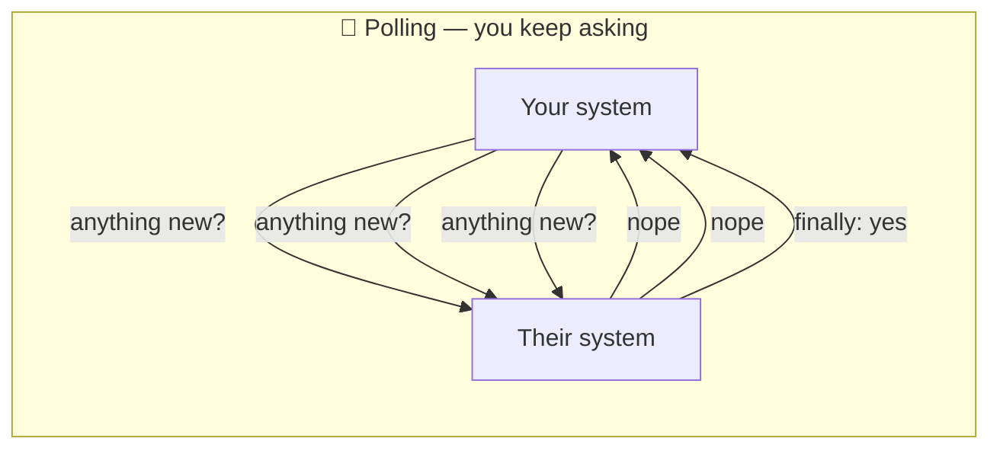
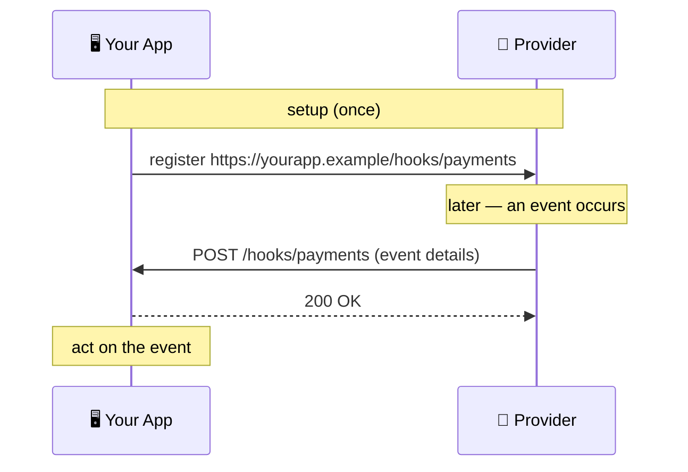
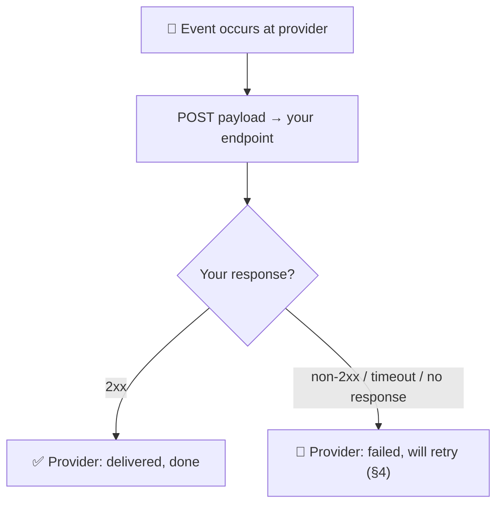
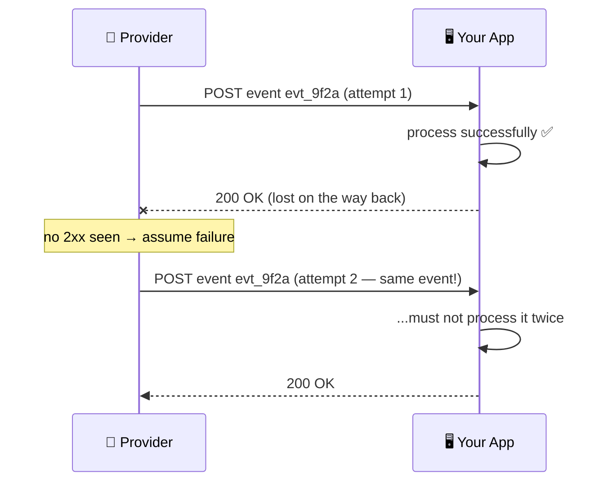
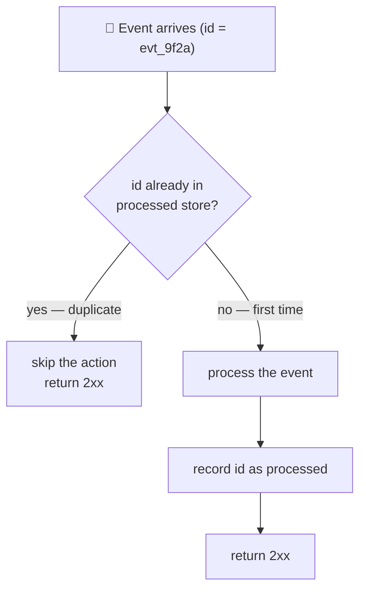
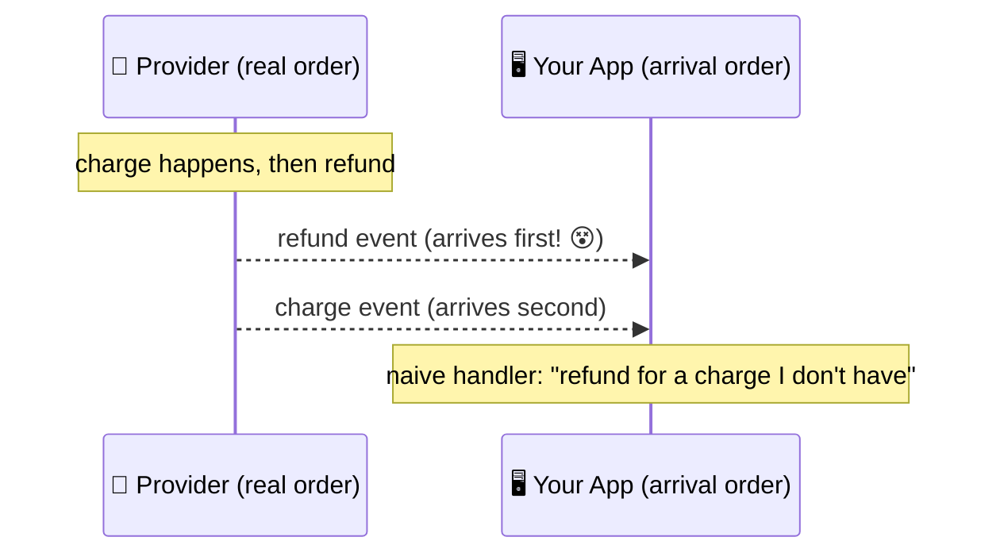
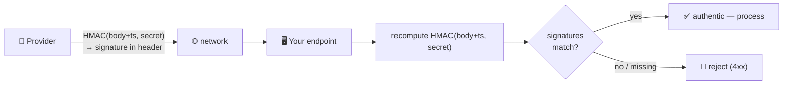
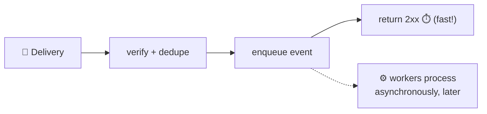
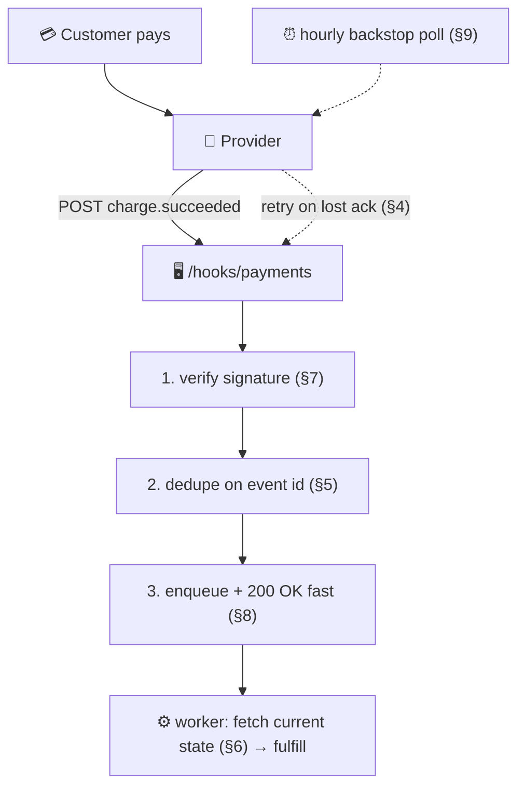

# Webhooks

> **Phase:** APIs & Communication Deep Dives → **Topic:** 9 of 15 → **Read time:** ~48 minutes

---

## Before You Begin

**This document stands alone.** It assumes you have read nothing else — not the foundation series, not the topics before it. It builds webhooks from zero: why one system needs to know about events in another it doesn't control, how a webhook inverts an ordinary API call so the *other* side calls *you*, and — the part that matters most — everything you have to get right to receive one you can actually trust.

Two consequences of that choice:

- **Terms get defined where they're used** — webhook, registration, event payload, at-least-once delivery, idempotency, signature verification, replay protection. Skim what you know.
- **Neighbouring topics are named, not taught.** Where webhooks touch other tools — the WebSockets and server-sent events that push to *browsers*, the message queues that carry events between systems you own, the idempotency and rate-limiting techniques that get their own deep treatment — this document points at them rather than teaching them.

Webhooks appear in the **Top 30 Must-Know Concepts** foundation series. This is the deep-dive on how they actually work — and, more to the point, on what it takes to receive them correctly.

Here is the question the document answers:

> **Your system needs to know the instant something happens inside another system you don't own and can't see into — a payment clears, a file finishes processing, an order ships. You can't hold a connection open to it and you can't sensibly ask it "anything new?" a thousand times a second. So how does the other system *tell* you — and why is receiving that message correctly so much harder than it first looks?**

Here's the trap it disarms. A webhook looks trivial: the other service sends you an HTTP POST, you read the body, done. That framing is what produces broken integrations. *Sending* a webhook is trivial; *receiving one you can trust* is the whole subject — because the call crosses the boundary between two independently-failing systems over a network that drops things, and neither side controls the other. That boundary means the same event will sometimes arrive twice, sometimes out of order, sometimes long after it happened, and sometimes it isn't the real sender at all but someone forging calls to your public URL. A receiver that treats a webhook as "just a POST" silently double-charges customers, acts on refunds it hasn't received the charge for, and loses events every time it restarts.

> **The mindset shift:** stop thinking of a webhook as *a message the provider sends you* and start thinking of it as **a public endpoint you now operate, that another system calls on its own schedule, over an unreliable network.** The moment you see that you are running a little server for someone else's events — not receiving a tidy message — every hard part stops being a surprise and becomes obvious: of course it retries (the network fails), of course events duplicate (retries do that), of course they arrive out of order (independent deliveries race), of course you must verify the caller (your URL is public), and of course you must stay up and fast (the caller won't wait). The POST is the easy part. The endpoint is the project.

---

## Table of Contents

1. [The Problem — Knowing Without Asking](#1-the-problem--knowing-without-asking)
2. [The Inversion — You Become the Server](#2-the-inversion--you-become-the-server)
3. [Anatomy of a Delivery](#3-anatomy-of-a-delivery)
4. [At-Least-Once — Retries and the Duplicates They Cause](#4-at-least-once--retries-and-the-duplicates-they-cause)
5. [Idempotency — Processing the Same Event Twice Safely](#5-idempotency--processing-the-same-event-twice-safely)
6. [Ordering — Events Can Arrive Out of Sequence](#6-ordering--events-can-arrive-out-of-sequence)
7. [Trust — Verifying the Call Really Came From the Provider](#7-trust--verifying-the-call-really-came-from-the-provider)
8. [The Endpoint Is Your Responsibility Now](#8-the-endpoint-is-your-responsibility-now)
9. [When Webhooks Fit — and When They Don't](#9-when-webhooks-fit--and-when-they-dont)
10. [Putting It All Together — A Payment-Provider Integration](#10-putting-it-all-together--a-payment-provider-integration)
11. [Final Recap](#11-final-recap)

---

## 1. The Problem — Knowing Without Asking

Webhooks exist to solve one specific, common problem, and the cleanest way to understand them is to feel that problem first — to see exactly why the ordinary way of getting data breaks down.

### The Ordinary Way: You Ask, They Answer

Almost all communication between systems follows one pattern: *you* make a request, the other system sends a response, done. Your code calls another service's API, gets back the data, moves on. This works beautifully when **you** are the one who knows *when* the data is needed — you want a user's profile, so you ask for it right then.

But flip the situation. Suppose the thing you care about happens inside a system you don't own — a payment settles at an external payments service, a video finishes transcoding on a processing service, an order is fulfilled by a logistics partner. *They* know the moment it happens. *You* don't, and you have no way to know, because it happened on the far side of a boundary you can't see across. The ask-and-answer pattern assumes the asker knows when to ask — and here, the asker is exactly the party in the dark.

### The Only Workaround: Ask Over and Over

Within ask-and-answer, there's exactly one way to cope: **poll.** Ask repeatedly, on a timer — "did the payment clear yet? did it clear yet? how about now?" — hoping to catch the event shortly after it happens. It technically works, and for a long time it was all anyone could do, but it's a bad fit dressed as a solution:

- **It's wasteful.** The overwhelming majority of polls come back "nothing new." Every one is a full round trip — a request, a response, work on both sides — spent to learn that nothing changed.
- **It's laggy.** An event waits, on average, half your polling interval before you even ask about it. Poll once a minute and you learn about a payment up to a minute late.
- **It scales badly.** Tightening the lag means polling more often, which multiplies the wasted requests; and every integration you add polls too, so the load grows with both frequency and number of partners. The external service, meanwhile, is answering a flood of "nope" responses it gains nothing from.



### What's Actually Needed: Let Them Tell You

Strip the problem to its core and the requirement is simple: **the party that knows about the event should be the one to speak.** Instead of you asking a hundred times and hearing "no" ninety-nine, the other system should reach out *once*, exactly when the event happens, and tell you. No wasted asks, no lag, no flood — one message at the one moment it matters.

That inversion — *they* contact *you* when something happens, rather than you repeatedly contacting them — is the whole idea of a webhook. (When the party that needs telling is a *browser* rather than a backend, different tools apply — a held-open connection like a WebSocket, or a one-way server-sent stream — because a browser can't be called back at a fixed address. Webhooks are the answer for the far more common case where both parties are servers, which the next section makes precise.)

> 💡 **Key Insight**
>
> The ask-and-answer pattern that underlies most system-to-system communication assumes the asker knows *when* to ask — and it collapses precisely when the event you care about happens inside a system you don't control, because then you're the party in the dark. The only workaround within ask-and-answer is to **poll**: ask over and over, which is wasteful (mostly "nothing new"), laggy (you learn late), and scales badly (tightening the lag multiplies the load). What's actually needed is to invert who speaks — let the system that *knows* about the event reach out once, the instant it happens. That inversion is the entire idea of a webhook.

### Quick Recap — Knowing Without Asking

- Ordinary system-to-system communication is **ask-and-answer** — you request, they respond — which works only when *you* know when the data is needed.
- It breaks when the event happens inside **a system you don't control**: they know instantly, you have no way to know, because it's across a boundary you can't see.
- The only workaround within ask-and-answer is to **poll** — ask repeatedly — which is wasteful, laggy, and scales badly for both sides.
- The real fix is to **invert who speaks**: let the system that knows about the event reach out once, when it happens — the entire idea behind a webhook.

---

## 2. The Inversion — You Become the Server

The idea from §1 — let the other system speak — becomes concrete through one mechanical move: you turn your own application into something the other system can call. That move is the heart of what a webhook is, and it reframes your role in a way that explains everything difficult later.

### The Mechanism, Start to Finish

A **webhook** is a registered HTTP callback: a URL you give another system in advance, which it calls when a specified event happens. The whole arrangement is three steps:

1. **You register a URL.** Ahead of time, you tell the other system (the **provider** — the system where events happen): "here is a URL of mine; call it when these events occur." That URL is your **webhook endpoint** — an ordinary address in your application, like `https://yourapp.example/hooks/payments`.
2. **The event happens.** Later, something occurs inside the provider — a payment settles, a job completes. The provider looks up who asked to be told about that event, and finds your registered URL.
3. **The provider calls you.** The provider makes an **HTTP POST request to your endpoint**, with the details of the event in the request body. Your application receives it exactly as it would receive any other incoming request, reads the body, and acts.

That's it. There is no new protocol and no special connection — a webhook is a plain HTTP request, the same kind of request your own app makes to others all day. What's different is the *direction*.

### The Roles Have Flipped

In an ordinary API call, your app is the **client** (it initiates the request) and the other system is the **server** (it receives and responds). A webhook turns that around completely:

| | Ordinary API call | Webhook delivery |
|---|---|---|
| Who initiates | **You** call them | **They** call you |
| Who is the client | You | The provider |
| Who is the server | The provider | **You** |
| Who needs a public address | The provider | **You** |
| When it happens | When *you* need data | When *their* event occurs |

The single most important line in that table is the last-but-one: **you now need a publicly reachable address, because you are now the server.** In an ordinary integration, only the provider had to run an always-available, callable endpoint; you just made outbound calls. With a webhook, that obligation lands on you. This is why webhooks are sometimes called a "reverse API" — the callee and caller swap seats.



### Why This Is Inherently Server-to-Server

The inversion has a hard consequence: a webhook can only target something that has a **stable, public address to be called at.** A backend server has one — a domain and a URL that exists whether or not anyone is currently looking. That's why webhooks are the natural fit for one backend notifying another.

A browser tab, by contrast, has *no* such address. It isn't a server; nothing on the public internet can initiate a call to it. So "notify a user's browser the instant something happens" is a fundamentally different problem, solved by the browser holding a connection open to a server (a WebSocket) or subscribing to a one-way server stream — approaches with their own topic. The dividing line is clean and worth remembering: **if the thing to be notified is a server with a public URL, a webhook fits; if it's a browser, it doesn't.**

> 💡 **Key Insight**
>
> A webhook is nothing exotic — it's an ordinary HTTP POST — but it **inverts direction**: instead of you calling the provider, you register a URL and the provider calls *you* when an event happens. That flip makes **you the server**, which is the fact everything else in this document follows from: you now run a publicly reachable, always-available endpoint that another system invokes on its own schedule. And because it requires a public address to call, a webhook is inherently **server-to-server** — a browser, which has no such address, needs a different mechanism entirely.

### Quick Recap — The Inversion

- A **webhook** is a registered HTTP callback: you give a provider a URL in advance, and it makes an **HTTP POST to that URL** when a specified event happens.
- It **inverts the roles** of an ordinary API call — the provider becomes the client, and **you become the server**, receiving the call instead of making it.
- The key consequence is that **you now need a public, always-available endpoint**, an obligation an ordinary outbound integration never placed on you — hence "reverse API."
- Because it requires a callable public address, a webhook is inherently **server-to-server**; notifying a browser (which has no such address) is a different problem with different tools.

---

## 3. Anatomy of a Delivery

Now that the shape is clear — the provider POSTs to your endpoint — it's worth looking at exactly what arrives and exactly what you send back, because the details of a single **delivery** (one attempt to hand you one event) are where the contract between the two systems lives.

### What Arrives: The Event Payload

The body of the POST is the **event payload** — a description of what happened, almost always as JSON. A few fields recur across essentially every webhook system because the receiver genuinely needs them:

```
POST /hooks/payments HTTP/1.1
Host: yourapp.example
Content-Type: application/json
Webhook-Id: evt_9f2a7c1b4e
Webhook-Timestamp: 1717430400
Webhook-Signature: v1,k8sf2h4Jd9...

{
  "id": "evt_9f2a7c1b4e",
  "type": "charge.succeeded",
  "created": 1717430400,
  "data": {
    "charge_id": "chg_51xQ",
    "amount": 4200,
    "currency": "usd"
  }
}
```

Four parts of that are load-bearing, and each maps to a problem a later section solves:

- **A unique event id** (`id`) — a value that identifies *this specific event*, stable across redeliveries of it. It's the key you'll use to recognize a duplicate (§4–§5).
- **An event type** (`type`) — what happened, so your handler can dispatch (a succeeded charge is handled differently from a refund).
- **A timestamp** (`created`) — when the event actually happened, which lets you reason about ordering and staleness (§6).
- **The data** — the details of the event itself, enough to act on (or enough to know what to go fetch).

Alongside the body, **headers** carry delivery metadata — commonly a delivery/event id and, critically, a **signature** used to prove the call is authentic (§7).

### What You Send Back: The Status Code Is the Whole Reply

Here is the part newcomers underestimate. The provider doesn't want data back from you — it wants one thing: **did you receive this?** And you answer with the **HTTP status code** of your response, nothing more:

- A **2xx** status (commonly `200 OK`) means **"received."** The provider marks the delivery successful and moves on.
- **Anything else** — a `4xx`, a `5xx`, a timeout, a connection refused — means **"not received,"** and the provider will **try again later** (§4).

That's the entire reply protocol, and it has a sharp implication: your status code is a *promise*. Returning `2xx` tells the provider "you can forget this event; I've got it." If you return `2xx` before you've actually safely handled the event and then crash, the provider believes it's delivered and won't resend — the event is lost. Conversely, if you do the work but fail to return `2xx` in time, the provider assumes failure and sends it again. The status code isn't a formality; it's the hinge the whole delivery guarantee turns on.



### Registration Decides What You Get

The deliveries only happen because of the setup step from §2: **registration** (also called subscribing). When you register, you typically specify two things — the **URL** to call, and *which* event types you want (you rarely want all of them; a payments integration might subscribe to charges and refunds but ignore dozens of other event types the provider emits). Registration is usually done once, through the provider's dashboard or an API, and it's also where you obtain the shared secret used for signatures (§7). Get registration right and the right events start flowing to the right endpoint; that's the setup the rest of the mechanism assumes.

> 💡 **Key Insight**
>
> A webhook delivery is a POST whose **body is the event payload** — carrying a unique **event id**, a **type**, a **timestamp**, and the **data** — and whose **reply is nothing but a status code**: a **2xx means "received, forget it,"** and anything else (including a timeout) means "failed, I'll retry." That makes your status code a *promise* the provider acts on, and mis-timing it either loses events (2xx before you're safe) or duplicates them (work done but no 2xx). Which events arrive at all is set once, at **registration**, where you choose the URL and subscribe to specific event types.

### Quick Recap — Anatomy of a Delivery

- The POST body is the **event payload** (usually JSON) carrying a unique **event id**, an event **type**, a **timestamp**, and the **data** to act on — each tied to a later problem.
- Your reply is **just the HTTP status code**: a **2xx** means "received," and anything else (or a timeout) means "failed, will be retried."
- The status code is therefore a **promise** — return it too early and you can lose an event; fail to return it in time and the event is resent.
- **Registration** (done once) sets which **URL** is called and which **event types** you receive, and is where the signature secret (§7) is obtained.

---

## 4. At-Least-Once — Retries and the Duplicates They Cause

The status-code contract from §3 sets up the first genuinely hard part of receiving webhooks, and it's a consequence the provider *cannot* avoid: because the network and your endpoint can fail, the provider must retry — and retrying, unavoidably, means the same event can reach you more than once.

### The Provider Must Retry, or Events Vanish

Put yourself on the provider's side. It sends you a POST and… gets a timeout. What happened? It cannot tell the difference between these cases:

- Your endpoint was down and never received it.
- Your endpoint received it, processed it, but its `2xx` got lost on the way back.
- Your endpoint is just slow and is still working.

From the provider's view all three look identical: no `2xx` arrived. If it gives up, and the truth was "your endpoint was momentarily down," the event is **lost forever** — a payment notification that never came. For events that matter, silent loss is unacceptable, so the provider does the only safe thing: it **retries**, resending the event until it finally gets a `2xx` (or until it exhausts a retry schedule and gives up much later — §8).

Retries are spaced out with **exponential backoff** — wait a little, retry; wait longer, retry; longer still — rather than hammering a struggling endpoint. A typical schedule might attempt redelivery after roughly 5 seconds, then 30 seconds, then 5 minutes, an hour, and several hours — on the order of 10 to 20 attempts spread across two or three days before the provider finally gives up, giving a down endpoint plenty of time to recover.

### Retrying Guarantees Duplicates

Now the unavoidable consequence. Consider the middle case above: your endpoint **received the event, processed it successfully, and then its `2xx` response was lost** — a dropped connection on the way back. You did everything right. But the provider never saw the `2xx`, so by its rules the delivery failed, and it retries. **The same event arrives at your endpoint a second time.**

There is no way to design this away. As long as the acknowledgement can be lost — and over a real network it always can — the sender must choose between two imperfect guarantees:

- **At-most-once:** never retry, so never duplicate — but *lose* events whenever an ack is missed. Unacceptable for anything important.
- **At-least-once:** retry until acknowledged, so never lose — but *duplicate* whenever an ack is lost.

Webhook providers universally choose **at-least-once**, because losing a payment event is far worse than delivering it twice. "Exactly-once" delivery — the thing everyone actually wants — is not achievable over an unreliable network; it can only be *simulated*, and only by the receiver (§5).



### The Burden This Places on You

The lesson is stark and it lands entirely on the receiver: **you must assume every event may arrive more than once, and design so that a duplicate does no harm.** This is not an edge case to handle if you have time; over enough deliveries it is a certainty. A receiver that assumes each event arrives exactly once will, sooner or later, process a payment twice, send two shipping notifications, or credit an account twice — the classic, expensive webhook bug. The fix is idempotency, and it's important enough to be its own section.

> ⚠️ **At-least-once delivery is not a provider quirk you can opt out of — it is the only safe choice over an unreliable network, and it guarantees duplicates.** Because an acknowledgement can be lost *after* you've already processed an event, the provider that retries to avoid *losing* events will inevitably *resend* some, and the same event will reach you twice. Exactly-once delivery is impossible on the wire; it can only be reconstructed by the receiver. So treat "this event may arrive again" as a certainty, not a possibility — a receiver that assumes otherwise will eventually double-charge someone.

### Quick Recap — At-Least-Once

- The provider **cannot distinguish** "you never got it," "your ack was lost," and "you're slow" — all look like no `2xx` — so to avoid losing events it must **retry**, with exponential backoff.
- Retrying means an event whose `2xx` was **lost after successful processing** gets **resent** — the same event arrives twice, unavoidably.
- Over an unreliable network the choice is **at-most-once** (may lose) or **at-least-once** (may duplicate); providers choose **at-least-once**, because losing important events is worse.
- **Exactly-once delivery is impossible on the wire** — so the receiver must assume every event may arrive again and make duplicates harmless (§5).

---

## 5. Idempotency — Processing the Same Event Twice Safely

Section 4 proved that duplicates are inevitable. This section is the receiver's answer to them, and it's the single most important thing to get right when building a webhook handler. The property you need has a name — **idempotency** — and the good news is that achieving it for webhooks is concrete and mechanical.

### What Idempotency Means

An operation is **idempotent** if performing it more than once has the same effect as performing it once. "Set the account balance to $50" is idempotent — run it ten times, the balance is $50. "Add $50 to the account balance" is *not* — run it ten times and you've added $500. The distinction is the whole game for webhooks: since the same event may be delivered repeatedly (§4), your handling of it must land in the idempotent category, so that a redelivery changes nothing.

The trap is that many real actions are naturally *non*-idempotent: charging a card, shipping an order, sending an email, crediting a wallet. Each is an "add," not a "set" — do it twice and the customer is charged twice, gets two packages, two emails. Left alone, a webhook handler that performs one of these actions is a double-execution bug waiting for the first lost acknowledgement.

### The Mechanism: Deduplicate on the Event Id

You don't make the *action* idempotent so much as make the *handling* idempotent, and the tool is the unique **event id** from §3 (the value stable across all redeliveries of the same event). The pattern is short:

1. When an event arrives, look up its id in a store of **already-processed event ids**.
2. If you've seen it before, it's a duplicate — **do nothing** (well, return `2xx` so the provider stops retrying) and skip the action.
3. If you haven't, **process it and record its id** as processed, so any future redelivery is recognized.



Done carefully, this turns an at-least-once *stream* into exactly-once *effects* — the delivery still happens many times, but the meaningful action happens exactly once. That's the "exactly-once" everyone wanted, reconstructed where it's actually achievable: in the receiver, not on the wire.

### The Detail That Bites: Make the Check and the Work Atomic

There's a subtle race that separates a handler that *mostly* works from one that's correct. If two copies of the same event arrive at nearly the same moment (a retry landing while the first attempt is still processing), both can check the store, both see "not processed," and both proceed — a duplicate slips through the very guard meant to stop it. The fix is to make "record this id" collide with itself: rely on the store rejecting a second insert of the same id (a uniqueness constraint), so exactly one of the racing handlers wins the right to process and the other is turned away. The principle to carry: the check-and-record must be **atomic**, or the dedup has a hole. The general machinery of idempotency keys and safe retries is a topic of its own; what webhooks require is exactly this — dedupe on the event id, atomically.

> 💡 **Key Insight**
>
> Because duplicates are guaranteed (§4), a correct webhook receiver must be **idempotent** — handling the same event twice must have the same effect as handling it once. Since the real actions are usually non-idempotent (charge, ship, email), you make the *handling* idempotent by **deduplicating on the unique event id**: record which ids you've processed, and skip any you've seen. That converts an at-least-once delivery stream into exactly-once *effects* — the exactly-once guarantee, rebuilt in the one place it's possible. The one non-negotiable detail is that the check-and-record must be **atomic**, or two racing redeliveries both slip through.

### Quick Recap — Idempotency

- **Idempotent** means doing an operation twice has the same effect as doing it once — the property a webhook handler needs, because duplicates are inevitable (§4).
- Real webhook actions (charge, ship, email) are usually **non-idempotent** by nature, so a naive handler double-executes on the first redelivery.
- The mechanism is to **deduplicate on the unique event id**: skip ids you've already processed, and record each new one — turning at-least-once delivery into **exactly-once effects**.
- The check-and-record must be **atomic** (e.g. a uniqueness constraint), or two near-simultaneous redeliveries both pass the guard; the deeper idempotency-key technique is its own topic.

---

## 6. Ordering — Events Can Arrive Out of Sequence

Duplicates aren't the only way the boundary between two systems distorts what you receive. The other is order: events do not necessarily reach you in the sequence they happened. This one surprises people because it violates a deep intuition — surely a refund can't arrive before the charge it refunds — but over independent deliveries, it can, and a handler that assumes otherwise breaks.

### Why Order Isn't Preserved

Several forces conspire to scramble sequence, all rooted in the fact that each delivery is an independent HTTP request racing across the network:

- **Retries reshuffle timing.** Suppose event A is sent, fails, and enters the backoff schedule (§4). Meanwhile event B, which happened *after* A, is sent and succeeds on the first try. B has now arrived and been processed while A is still waiting to be retried — so you see B before A, even though A happened first.
- **Concurrent delivery races.** Providers often dispatch deliveries in parallel for throughput, and two requests sent microseconds apart can arrive in either order depending on network paths and your own server's scheduling.
- **The network has no ordering guarantee.** Separate HTTP requests are exactly that — separate. Nothing about them promises that the one sent first arrives first.

The upshot: **webhook delivery generally does not guarantee order.** Some providers offer partial ordering guarantees for related events, but the safe default assumption — the one that keeps you correct everywhere — is that events can arrive in any order relative to one another.



### The Defenses

You don't fix ordering — you can't, it's a property of the transport — you design so that order doesn't matter, or matters less. Three techniques, in rough order of robustness:

- **Carry and check timestamps or sequence numbers.** Every event has a timestamp (§3). If you receive an event older than the state you already have, you can recognize it as stale and avoid overwriting newer data with it. This makes handlers *tolerant* of disorder.
- **Treat the webhook as a signal, not the source of truth.** The most robust pattern: when an event arrives, don't blindly apply the delta it carries — use it as a prompt to **fetch the current state** from the provider's API. If a "refund" arrives before you've recorded the "charge," fetching the charge's current state from the provider shows you the authoritative, up-to-date picture regardless of what order the notifications came in. The webhook tells you *something changed*; the fetch tells you *what's true now*.
- **Design handlers to be order-insensitive.** Where possible, make each event's handling depend only on the event and the current state, not on assumed prior events — the same mindset as idempotency (§5), applied to sequence.

The second technique is worth internalizing because it dissolves several problems at once: an authoritative re-fetch is naturally robust to disorder *and* to duplicates *and* to missed events, which is why "webhook as a trigger to reconcile" is a mature default for anything important.

> 💡 **Key Insight**
>
> Webhook deliveries are independent HTTP requests, so **order is not guaranteed** — retries and concurrent dispatch mean a later event (a refund) can arrive before an earlier one (its charge). You can't fix this on the transport; you design around it. The weakest defense is checking **timestamps** to reject stale data; the strongest is treating the webhook as a **signal to fetch current state** from the provider rather than trusting the delta it carries — a re-fetch is authoritative and so is naturally robust to disorder, duplicates, *and* gaps at once. Assume any order, and prefer reconciling over applying.

### Quick Recap — Ordering

- Because each delivery is an **independent HTTP request**, and retries and parallel dispatch reshuffle timing, **events can arrive out of order** — even a refund before its charge.
- The safe assumption is that **order is not guaranteed**; some providers offer partial guarantees, but designing for any order keeps you correct everywhere.
- Defenses range from **checking timestamps/sequence numbers** (reject stale data) to designing **order-insensitive handlers**.
- The strongest pattern is to treat the webhook as a **signal to fetch current state** from the provider — authoritative, and robust to disorder, duplicates, and gaps together.

---

## 7. Trust — Verifying the Call Really Came From the Provider

There's a consequence of §2 that's easy to forget and dangerous to ignore: because you became the server, your endpoint is a **public URL on the open internet.** Anything that can make an HTTP request can call it — including an attacker. So the payload arriving at your endpoint is, until proven otherwise, *untrusted input from a stranger*, and treating it as a genuine message from the provider is one of the most serious mistakes a webhook receiver can make.

### Your Endpoint Is Public, So Anyone Can Forge Calls

Imagine your handler acts on a `charge.succeeded` event by fulfilling an order. Your endpoint's URL isn't secret — it appears in requests, logs, browser history, config. An attacker who guesses or discovers it can simply POST their own `charge.succeeded` payload, with any amount and any order id they like, and if your handler trusts the body, it will fulfill orders for payments that never happened. The webhook's inversion that makes it powerful — a public endpoint others call — is exactly what makes it forgeable. **You cannot trust the payload just because it arrived.**

### The Mechanism: Signatures From a Shared Secret

The standard defense is for the provider to **sign** every delivery, so you can verify it genuinely came from them and wasn't altered in transit. The mechanism, at a working level:

1. At registration (§3), you and the provider share a **secret** — a random string only the two of you know.
2. For each delivery, the provider computes a **signature**: it runs the request body (usually combined with a timestamp) through a keyed hash function using the shared secret, producing a value that can only be generated by someone who knows the secret. This keyed hash is called an **HMAC**. The provider puts the signature in a header (the `Webhook-Signature` header from §3).
3. On receipt, **you recompute the same signature yourself** — same body, same timestamp, same secret, same function — and compare it to the one in the header. If they match, the call is authentic and unmodified: only someone with the secret could have produced that signature over that exact body. If they don't match (or the header is missing), you **reject the request** — a `4xx`, no processing.



The crucial property is that the secret **never travels with the request** — only the signature does, and the signature can't be reversed to recover the secret or forged without it. An attacker can copy your URL, but they can't produce a valid signature, so their forged calls fail verification.

### Replay Attacks and Why the Timestamp Is Signed

Signatures stop forgery, but there's a subtler attack: **replay.** Suppose an attacker captures one *genuine*, correctly-signed delivery (say, off a mis-configured proxy). Its signature is valid. Could they resend that exact request a thousand times to make you fulfill an order a thousand times? Idempotency (§5) blocks the *duplicate-event* version of this, but the defense built into signing is the **timestamp**: because the signature covers a timestamp, and you **reject deliveries whose timestamp is too old** (outside a tolerance window commonly set to about 5 minutes), a captured request quickly becomes unusable — its timestamp ages out and re-sending it fails verification. Signing the body proves *who and what*; signing the timestamp and enforcing freshness proves *when*, closing the replay window.

The deeper cryptography behind keyed hashes and secure comparison belongs to the security material; what every webhook receiver must do is concrete and non-negotiable: **verify the signature on every delivery before acting on it, and reject stale ones.**

> ⚠️ **A webhook endpoint is a public URL, so an unverified payload is untrusted input from a stranger — acting on it lets anyone forge events and, for a payments integration, conjure money.** The defense is to **verify a signature on every delivery**: the provider signs the body (plus a timestamp) with a **shared secret** using a keyed hash (HMAC), and you recompute and compare, rejecting any mismatch. Because the secret never travels — only the signature does — an attacker who knows your URL still can't forge valid calls. Sign-over-timestamp plus a freshness window additionally defeats **replay** of captured genuine calls. Never process a delivery you haven't authenticated.

### Quick Recap — Trust

- Your endpoint is a **public URL**, so anyone can POST forged events to it; an unverified payload is **untrusted input** and acting on it is a serious vulnerability.
- The defense is a **signature**: the provider signs each delivery's body (and timestamp) with a **shared secret** via a keyed hash (**HMAC**), and you **recompute and compare**, rejecting mismatches.
- The secret **never travels with the request** — only the signature does — so knowing your URL isn't enough to forge a valid call.
- Signing a **timestamp** and rejecting stale deliveries defeats **replay** of captured genuine calls; verify every delivery before acting, and reject old ones.

---

## 8. The Endpoint Is Your Responsibility Now

Every previous section has been a consequence of one fact from §2 — you became the server — and this section names the operational weight of that directly. You are running a **public, always-on endpoint that another system calls on its schedule, not yours.** That reframes webhook receiving from "write a handler" to "operate a service," and four responsibilities come with it.

### Respond Fast — Acknowledge First, Work Later

The provider is waiting for your `2xx`, and it won't wait long — providers enforce a short timeout, commonly in the range of 5 to 30 seconds and sometimes as tight as a couple of seconds, and treat a slow response as a failure to be retried (§4). If your handler does expensive work *before* responding — charging systems, sending emails, updating records — a slow moment can blow the timeout, and the provider retries an event you were *successfully processing*, creating duplicates and cascading load.

The fix is to split acknowledgement from processing: **verify the signature (§7), record the event, return `2xx` immediately — then do the real work asynchronously**, typically by placing the event on a queue that your own workers drain at their own pace. The webhook handler's only synchronous job is "safely accept and acknowledge"; everything else happens after. This keeps you well inside the timeout regardless of how heavy the actual processing is.



### Stay Available — Downtime Means Missed Calls

Because the provider calls *whenever* an event happens, your endpoint has to be up *whenever* that might be — which is always. If it's down, deliveries during the outage fail. Retries (§4) soften this greatly: a brief outage just means the provider redelivers once you're back, which is exactly why at-least-once is a blessing here. But retry schedules are finite — a provider that gives up after a day of failures will *drop* events if you're down longer. So availability still matters; retries buy you recovery time, not immunity.

### Absorb Bursts — Events Don't Arrive Evenly

Events happen on the world's schedule, so they cluster. A sale, a batch job on the provider's side, a viral moment — any of these can turn a trickle of deliveries into a spike of thousands in a short window. Your endpoint must not fall over under that burst (which would trigger mass retries, compounding the load — a feedback loop). The ack-fast-then-queue design above is also your burst defense: accepting quickly and buffering to a queue lets you absorb a spike at the door and process it steadily behind, rather than trying to do all the heavy work at arrival rate. (Deliberately shedding or throttling excess load is its own topic.)

### Observe and Recover — Log, Debug, Replay

Finally, because deliveries are asynchronous and invisible to your users, you need to be able to *see* them. Log every delivery — received, verified, processed, or failed — so that when something goes wrong (and across enough events, it will), you can answer "did that event arrive? did we process it?" Good providers keep a delivery log on their side too, and offer **manual replay** — the ability to re-send past events on demand — which is how you recover events lost to an outage longer than the retry window, or reprocess after fixing a handler bug. Events that repeatedly fail even your own processing should land in a **dead-letter** holding area for inspection rather than being silently dropped. Observability isn't polish here; it's how you close the loop on a channel you otherwise can't watch.

> 💡 **Key Insight**
>
> Receiving webhooks is **operating a service**, not writing a handler, because you run a public, always-on endpoint another system calls on its schedule. Four duties follow: **respond fast** (verify, record, `2xx` immediately, then process asynchronously off a queue — or a slow moment triggers duplicate-causing retries); **stay available** (downtime drops events once the finite retry window expires); **absorb bursts** (events cluster, and ack-fast-then-queue is the defense); and **observe and recover** (log every delivery and use replay/dead-letter, since the channel is invisible otherwise). Each is a direct cost of the inversion.

### Quick Recap — The Endpoint Is Your Responsibility

- **Respond fast:** providers time out in seconds, so verify, record, and return `2xx` immediately, then do the real work **asynchronously** (often via a queue) — or slow processing triggers duplicate-causing retries.
- **Stay available:** the provider calls anytime, so downtime means failed deliveries; retries buy recovery time but the finite retry window means long outages still **drop** events.
- **Absorb bursts:** events cluster into spikes, and ack-fast-then-queue lets you accept at the door and process steadily behind, avoiding a retry feedback loop.
- **Observe and recover:** log every delivery and rely on **manual replay** and **dead-letter** handling, because an asynchronous channel is invisible unless you make it visible.

---

## 9. When Webhooks Fit — and When They Don't

You now know the full cost of a webhook — the inversion, the duplicates, the ordering, the verification, the endpoint you must operate. As with any tool that carries real cost, the mature skill is knowing the shape it fits and, just as important, the shapes it doesn't, so you reach for it deliberately rather than by reflex.

### Where Webhooks Fit

Webhooks are the right answer when all of these hold:

- **Both parties are servers.** The receiver has a stable public address to be called at — the server-to-server requirement from §2.
- **The interaction is event-driven** — "tell me when X happens" — rather than "give me data when I ask." The provider knows about the event; you don't and can't easily poll for it.
- **Event volume is moderate.** Notifications happen occasionally-to-frequently, not as an unrelenting firehose — one HTTP request per event is a comfortable fit at these rates.

This describes an enormous share of real integrations: third-party services notifying your backend of things that happened in them — a payment settling, a document finishing processing, a shipment updating, a repository receiving a push. For all of these, a webhook replaces wasteful polling with a single call at the right moment, and the costs in §4–§8 are well worth paying.

### Where Webhooks Don't Fit

Three shapes are outside the target, each with a better-fitting tool:

| The shape | Why a webhook is wrong | The better fit |
|---|---|---|
| **Notifying a browser / end user** | A browser has no public address to be called at (§2) | A held-open connection (**WebSocket**) or a one-way server stream (**SSE**) |
| **Very high-frequency event streams** | One HTTP request *per event* is enormous overhead at firehose rates | A **streaming platform / message queue** built for high throughput |
| **Strict ordering or true exactly-once** | Webhooks are unordered and at-least-once by nature (§4, §6) | A **message broker** with ordering and stronger delivery guarantees, between systems you control |

The pattern behind the three: webhooks are for *moderate-rate, order-tolerant, server-to-server notifications across a trust boundary you don't control.* Push past any of those edges — a browser, a firehose, a strict-ordering requirement — and something purpose-built serves better. Notice too that the last two point at message queues and streaming, which are the natural choice **when you own both ends**; webhooks earn their place precisely because they work across a boundary between systems that *don't* share infrastructure.

### Webhooks and Polling Are Not Enemies

One more piece of judgment. Webhooks reduce polling, but they don't abolish it, and the strongest integrations use both. The reconcile pattern from §6 — treat a webhook as a *signal to fetch current state* — is webhooks and a request-response API working together. And a periodic poll as a **backstop** (once an hour, "did I miss anything?") is a sensible safety net against the events that webhooks legitimately lose to expired retry windows (§8). Webhooks make polling rare and cheap; they rarely make it entirely unnecessary for anything critical.

> 💡 **Key Insight**
>
> Webhooks fit **moderate-rate, event-driven, server-to-server** notifications across a boundary you don't control — an enormous class of real integrations, where they replace wasteful polling with one call at the right moment. They *don't* fit three shapes: notifying a **browser** (no public address → WebSocket/SSE), **firehose-rate** streams (one POST per event is too much → streaming/queues), and **strict-ordering or exactly-once** needs (→ a message broker, typically when you own both ends). And webhooks don't abolish polling — pairing them with an authoritative re-fetch and a periodic backstop poll is what makes an integration genuinely robust.

### Quick Recap — When Webhooks Fit

- Webhooks fit when **both parties are servers**, the interaction is **event-driven** ("tell me when X happens"), and event **volume is moderate** — a huge share of third-party integrations.
- They **don't fit browsers** (no public address → WebSocket/SSE), **firehose-rate streams** (one POST per event is too costly → streaming/queues), or **strict-ordering / exactly-once** needs (→ a message broker).
- The last two point at queues/streaming, which fit **when you own both ends**; webhooks earn their place by working across a boundary between systems that *don't* share infrastructure.
- Webhooks reduce but don't abolish **polling** — pairing them with an authoritative re-fetch (§6) and a periodic backstop poll is what makes a critical integration robust.

---

## 10. Putting It All Together — A Payment-Provider Integration

A team is adding payments to their app. They don't process cards themselves — they use an external **payment provider**, and the money moves on the provider's side, not theirs. Which means the single most important fact in their whole system — *did this customer actually pay?* — happens somewhere they can't see. This is the archetypal webhook problem, and building it correctly exercises every section of this document in order.

### Setup and the Happy Path

They register a webhook endpoint with the provider — `https://shop.example/hooks/payments` — and subscribe to the events they care about: `charge.succeeded`, `charge.refunded`, `charge.disputed` (§2, §3). At registration they receive a **shared secret** for verifying signatures.

A customer checks out. Moments later, the provider POSTs a `charge.succeeded` event to their endpoint. The handler does exactly what §7 and §8 prescribe, in order: **verify the signature** against the shared secret (reject if it fails), **check the event id** against the processed store (§5), **record it and enqueue** the fulfillment work, and **return `200 OK` immediately** (§8). A background worker then fulfills the order. On the happy path it's clean and fast — the customer's order is confirmed within a second of paying, no polling anywhere. Then reality tests each defense.

### Reality Test 1 — The Duplicate

One evening, a `charge.succeeded` is processed successfully, but the `200 OK` is lost to a network blip on the way back (§4). The provider, seeing no acknowledgement, retries — and the *same* charge event arrives again. Because the handler dedupes on the event id (§5), the second arrival is recognized as already-processed: it returns `200` and does nothing. **The customer is charged once and fulfilled once.** Without that check, they'd have shipped the order twice. The lost ack — invisible, unavoidable — was silently absorbed.

### Reality Test 2 — The Out-of-Order Refund

A customer pays and, within seconds, cancels for a refund. The provider emits `charge.succeeded` then `charge.refunded` — but the succeeded event hits a retry after a transient failure, so **the refund event arrives first** (§6). A naive handler would throw: "refund for a charge I've never seen." Theirs doesn't, because it treats each event as a *signal to fetch current state* (§6): on the refund event, it asks the provider's API for the charge's authoritative status, sees `refunded`, and records the order as refunded — correctly, regardless of arrival order. When the succeeded event arrives moments later, a fetch shows the same authoritative picture, and nothing breaks.

### Reality Test 3 — The Deploy Outage

The team ships a routine deploy, and their endpoint is down for ninety seconds. Three charge events fire during the window and fail to deliver. Two things save them (§4, §8): the provider **retries** on its backoff schedule, so the events redeliver automatically once the endpoint is back; and for belt-and-suspenders, a scheduled **backstop reconciliation** job (§9) sweeps recent charges from the provider's API once an hour and fills any gaps. No payment is lost to a routine deploy.



### What the Team Learned

The feature works, and it moves real money correctly — but the lesson isn't "webhooks are easy." It's where the work actually was:

> **Receiving the payment notification was one POST handler — an afternoon. Everything that made it *trustworthy* was the rest of the month: verifying every call because our URL is public and money is on the line; deduplicating because the provider must retry and retries duplicate; fetching authoritative state because a refund can beat its charge; acknowledging in milliseconds and working in the background so we don't time out and cause the very retries we fear; and a backstop poll for the events a deploy would otherwise lose. We didn't build a message receiver. We built a small, reliable, security-critical service for someone else's events — because that's what a webhook endpoint actually is.**

---

## 11. Final Recap

| The hard part | Why it happens | What the receiver must do |
|---|---|---|
| **You run a public server** | The webhook inverts the call — the provider calls you (§2) | Operate an always-on, reachable endpoint |
| **Duplicates** | At-least-once retries resend when an ack is lost (§4) | Be **idempotent** — dedupe on the event id (§5) |
| **Out-of-order events** | Independent deliveries and retries race (§6) | Check timestamps; **fetch current state** rather than trust the delta |
| **Forged calls** | Your URL is public, so anyone can POST (§7) | **Verify the signature** on every delivery; reject stale ones (replay) |
| **Slow responses cause retries** | Providers time out in seconds (§8) | Ack `2xx` fast; do the work **asynchronously** off a queue |
| **Missed events** | Downtime beyond the finite retry window (§8) | Rely on **replay**; add a periodic **backstop poll** (§9) |

### The One Thing to Remember

> **A webhook is trivial to send and hard to trust, because it crosses the boundary between two independently-failing systems that don't control each other — and everything difficult follows from one move: the call is inverted, so you become the server. You are no longer receiving a tidy message; you are operating a public, always-on endpoint that another system invokes on its own schedule over an unreliable network. Once you see it that way, every hard part is obvious rather than surprising: it will retry (the network fails), so events will duplicate (retries do that) and you must be idempotent; deliveries race, so events arrive out of order and you should fetch authoritative state instead of trusting the payload; your URL is public, so you must verify a signature before believing anything; and the provider won't wait, so you acknowledge in milliseconds and do the real work asynchronously. The POST is the easy afternoon. The trustworthy endpoint — idempotent, verified, order-tolerant, fast to ack, observable, and backstopped — is the project. Build the endpoint, not the handler.**

---

## What's Next

> **Topic 10 — gRPC**

This document, like the several before it, lived in the world of HTTP and JSON — human-readable text, flexible payloads, a request (or a callback) per interaction. That flexibility is exactly right for crossing boundaries between systems you don't control, where readability and universality matter more than raw speed. But turn inward, to the calls a system makes to *its own* services — thousands per second, between machines you own, where every millisecond and every byte counts — and those same conveniences become overhead.

That inward turn is the next topic. **gRPC**: a contract-first, binary protocol built not for public reach but for fast, strongly-typed calls between internal services — where you define the exact shape of every call ahead of time, serialize it compactly instead of as text, and stop paying for the flexibility you don't need. You've seen how systems talk across boundaries they don't control; next you'll see how they talk *within* one, when speed is the whole point.

---
