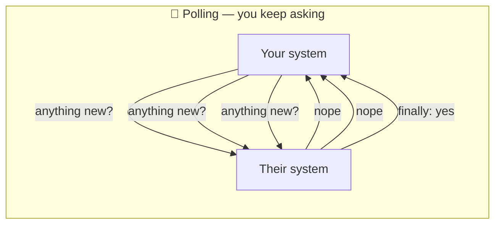
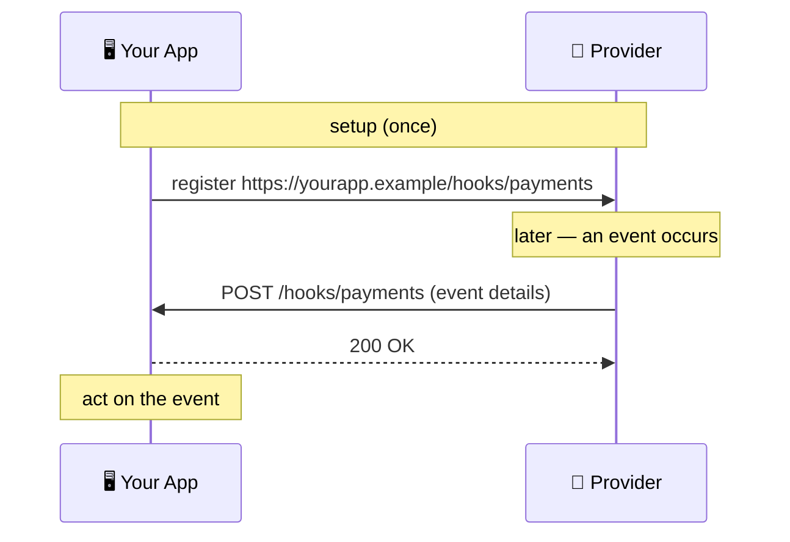
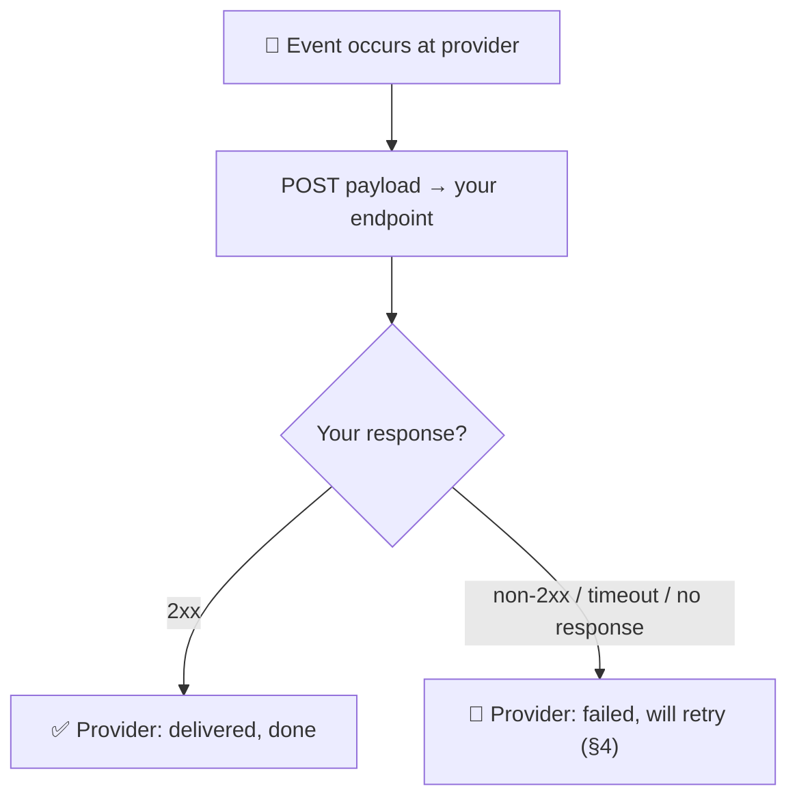
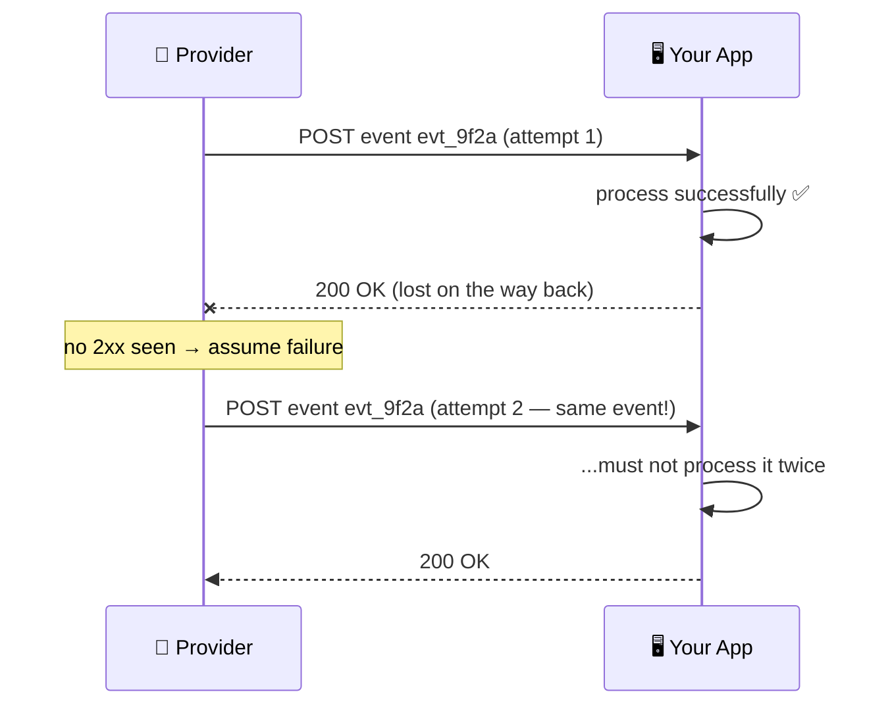

# Webhooks

> **Phase:** APIs & Communication Deep Dives → **Topic:** 9 of 15 → **Read time:** ~48 minutes

---

## Before You Begin

**This document stands alone.** It assumes you have read nothing else — not the foundation series, not the topics before it. It builds webhooks from zero: why one system needs to know about events in another it doesn't control, how a webhook inverts an ordinary API call so the *other* side calls *you*, and — the part that matters most — everything you have to get right to receive one you can actually trust.

Two consequences of that choice:

- **Terms get defined where they're used** — webhook, registration, event payload, at-least-once delivery, idempotency, signature verification, replay protection. Skim what you know.
- **Neighbouring topics are named, not taught.** Where webhooks touch other tools — the WebSockets and server-sent events that push to *browsers*, the message queues that carry events between systems you own, the idempotency and rate-limiting techniques that get their own deep treatment — this document points at them rather than teaching them.

Webhooks appear in the **Top 30 Must-Know Concepts** foundation series. This is the deep-dive on how they actually work — and, more to the point, on what it takes to receive them correctly.

Here is the question the document answers:

> **Your system needs to know the instant something happens inside another system you don't own and can't see into — a payment clears, a file finishes processing, an order ships. You can't hold a connection open to it and you can't sensibly ask it "anything new?" a thousand times a second. So how does the other system *tell* you — and why is receiving that message correctly so much harder than it first looks?**

Here's the trap it disarms. A webhook looks trivial: the other service sends you an HTTP POST, you read the body, done. That framing is what produces broken integrations. *Sending* a webhook is trivial; *receiving one you can trust* is the whole subject — because the call crosses the boundary between two independently-failing systems over a network that drops things, and neither side controls the other. That boundary means the same event will sometimes arrive twice, sometimes out of order, sometimes long after it happened, and sometimes it isn't the real sender at all but someone forging calls to your public URL. A receiver that treats a webhook as "just a POST" silently double-charges customers, acts on refunds it hasn't received the charge for, and loses events every time it restarts.

> **The mindset shift:** stop thinking of a webhook as *a message the provider sends you* and start thinking of it as **a public endpoint you now operate, that another system calls on its own schedule, over an unreliable network.** The moment you see that you are running a little server for someone else's events — not receiving a tidy message — every hard part stops being a surprise and becomes obvious: of course it retries (the network fails), of course events duplicate (retries do that), of course they arrive out of order (independent deliveries race), of course you must verify the caller (your URL is public), and of course you must stay up and fast (the caller won't wait). The POST is the easy part. The endpoint is the project.

---

## Table of Contents

1. [The Problem — Knowing Without Asking](#1-the-problem--knowing-without-asking)
2. [The Inversion — You Become the Server](#2-the-inversion--you-become-the-server)
3. [Anatomy of a Delivery](#3-anatomy-of-a-delivery)
4. [At-Least-Once — Retries and the Duplicates They Cause](#4-at-least-once--retries-and-the-duplicates-they-cause)
5. [Idempotency — Processing the Same Event Twice Safely](#5-idempotency--processing-the-same-event-twice-safely)
6. [Ordering — Events Can Arrive Out of Sequence](#6-ordering--events-can-arrive-out-of-sequence)
7. [Trust — Verifying the Call Really Came From the Provider](#7-trust--verifying-the-call-really-came-from-the-provider)
8. [The Endpoint Is Your Responsibility Now](#8-the-endpoint-is-your-responsibility-now)
9. [When Webhooks Fit — and When They Don't](#9-when-webhooks-fit--and-when-they-dont)
10. [Putting It All Together — A Payment-Provider Integration](#10-putting-it-all-together--a-payment-provider-integration)
11. [Final Recap](#11-final-recap)

---

## 1. The Problem — Knowing Without Asking

Webhooks exist to solve one specific, common problem, and the cleanest way to understand them is to feel that problem first — to see exactly why the ordinary way of getting data breaks down.

### The Ordinary Way: You Ask, They Answer

Almost all communication between systems follows one pattern: *you* make a request, the other system sends a response, done. Your code calls another service's API, gets back the data, moves on. This works beautifully when **you** are the one who knows *when* the data is needed — you want a user's profile, so you ask for it right then.

But flip the situation. Suppose the thing you care about happens inside a system you don't own — a payment settles at an external payments service, a video finishes transcoding on a processing service, an order is fulfilled by a logistics partner. *They* know the moment it happens. *You* don't, and you have no way to know, because it happened on the far side of a boundary you can't see across. The ask-and-answer pattern assumes the asker knows when to ask — and here, the asker is exactly the party in the dark.

### The Only Workaround: Ask Over and Over

Within ask-and-answer, there's exactly one way to cope: **poll.** Ask repeatedly, on a timer — "did the payment clear yet? did it clear yet? how about now?" — hoping to catch the event shortly after it happens. It technically works, and for a long time it was all anyone could do, but it's a bad fit dressed as a solution:

- **It's wasteful.** The overwhelming majority of polls come back "nothing new." Every one is a full round trip — a request, a response, work on both sides — spent to learn that nothing changed.
- **It's laggy.** An event waits, on average, half your polling interval before you even ask about it. Poll once a minute and you learn about a payment up to a minute late.
- **It scales badly.** Tightening the lag means polling more often, which multiplies the wasted requests; and every integration you add polls too, so the load grows with both frequency and number of partners. The external service, meanwhile, is answering a flood of "nope" responses it gains nothing from.



### What's Actually Needed: Let Them Tell You

Strip the problem to its core and the requirement is simple: **the party that knows about the event should be the one to speak.** Instead of you asking a hundred times and hearing "no" ninety-nine, the other system should reach out *once*, exactly when the event happens, and tell you. No wasted asks, no lag, no flood — one message at the one moment it matters.

That inversion — *they* contact *you* when something happens, rather than you repeatedly contacting them — is the whole idea of a webhook. (When the party that needs telling is a *browser* rather than a backend, different tools apply — a held-open connection like a WebSocket, or a one-way server-sent stream — because a browser can't be called back at a fixed address. Webhooks are the answer for the far more common case where both parties are servers, which the next section makes precise.)

> 💡 **Key Insight**
>
> The ask-and-answer pattern that underlies most system-to-system communication assumes the asker knows *when* to ask — and it collapses precisely when the event you care about happens inside a system you don't control, because then you're the party in the dark. The only workaround within ask-and-answer is to **poll**: ask over and over, which is wasteful (mostly "nothing new"), laggy (you learn late), and scales badly (tightening the lag multiplies the load). What's actually needed is to invert who speaks — let the system that *knows* about the event reach out once, the instant it happens. That inversion is the entire idea of a webhook.

### Quick Recap — Knowing Without Asking

- Ordinary system-to-system communication is **ask-and-answer** — you request, they respond — which works only when *you* know when the data is needed.
- It breaks when the event happens inside **a system you don't control**: they know instantly, you have no way to know, because it's across a boundary you can't see.
- The only workaround within ask-and-answer is to **poll** — ask repeatedly — which is wasteful, laggy, and scales badly for both sides.
- The real fix is to **invert who speaks**: let the system that knows about the event reach out once, when it happens — the entire idea behind a webhook.

---

## 2. The Inversion — You Become the Server

The idea from §1 — let the other system speak — becomes concrete through one mechanical move: you turn your own application into something the other system can call. That move is the heart of what a webhook is, and it reframes your role in a way that explains everything difficult later.

### The Mechanism, Start to Finish

A **webhook** is a registered HTTP callback: a URL you give another system in advance, which it calls when a specified event happens. The whole arrangement is three steps:

1. **You register a URL.** Ahead of time, you tell the other system (the **provider** — the system where events happen): "here is a URL of mine; call it when these events occur." That URL is your **webhook endpoint** — an ordinary address in your application, like `https://yourapp.example/hooks/payments`.
2. **The event happens.** Later, something occurs inside the provider — a payment settles, a job completes. The provider looks up who asked to be told about that event, and finds your registered URL.
3. **The provider calls you.** The provider makes an **HTTP POST request to your endpoint**, with the details of the event in the request body. Your application receives it exactly as it would receive any other incoming request, reads the body, and acts.

That's it. There is no new protocol and no special connection — a webhook is a plain HTTP request, the same kind of request your own app makes to others all day. What's different is the *direction*.

### The Roles Have Flipped

In an ordinary API call, your app is the **client** (it initiates the request) and the other system is the **server** (it receives and responds). A webhook turns that around completely:

| | Ordinary API call | Webhook delivery |
|---|---|---|
| Who initiates | **You** call them | **They** call you |
| Who is the client | You | The provider |
| Who is the server | The provider | **You** |
| Who needs a public address | The provider | **You** |
| When it happens | When *you* need data | When *their* event occurs |

The single most important line in that table is the last-but-one: **you now need a publicly reachable address, because you are now the server.** In an ordinary integration, only the provider had to run an always-available, callable endpoint; you just made outbound calls. With a webhook, that obligation lands on you. This is why webhooks are sometimes called a "reverse API" — the callee and caller swap seats.



### Why This Is Inherently Server-to-Server

The inversion has a hard consequence: a webhook can only target something that has a **stable, public address to be called at.** A backend server has one — a domain and a URL that exists whether or not anyone is currently looking. That's why webhooks are the natural fit for one backend notifying another.

A browser tab, by contrast, has *no* such address. It isn't a server; nothing on the public internet can initiate a call to it. So "notify a user's browser the instant something happens" is a fundamentally different problem, solved by the browser holding a connection open to a server (a WebSocket) or subscribing to a one-way server stream — approaches with their own topic. The dividing line is clean and worth remembering: **if the thing to be notified is a server with a public URL, a webhook fits; if it's a browser, it doesn't.**

> 💡 **Key Insight**
>
> A webhook is nothing exotic — it's an ordinary HTTP POST — but it **inverts direction**: instead of you calling the provider, you register a URL and the provider calls *you* when an event happens. That flip makes **you the server**, which is the fact everything else in this document follows from: you now run a publicly reachable, always-available endpoint that another system invokes on its own schedule. And because it requires a public address to call, a webhook is inherently **server-to-server** — a browser, which has no such address, needs a different mechanism entirely.

### Quick Recap — The Inversion

- A **webhook** is a registered HTTP callback: you give a provider a URL in advance, and it makes an **HTTP POST to that URL** when a specified event happens.
- It **inverts the roles** of an ordinary API call — the provider becomes the client, and **you become the server**, receiving the call instead of making it.
- The key consequence is that **you now need a public, always-available endpoint**, an obligation an ordinary outbound integration never placed on you — hence "reverse API."
- Because it requires a callable public address, a webhook is inherently **server-to-server**; notifying a browser (which has no such address) is a different problem with different tools.

---

## 3. Anatomy of a Delivery

Now that the shape is clear — the provider POSTs to your endpoint — it's worth looking at exactly what arrives and exactly what you send back, because the details of a single **delivery** (one attempt to hand you one event) are where the contract between the two systems lives.

### What Arrives: The Event Payload

The body of the POST is the **event payload** — a description of what happened, almost always as JSON. A few fields recur across essentially every webhook system because the receiver genuinely needs them:

```
POST /hooks/payments HTTP/1.1
Host: yourapp.example
Content-Type: application/json
Webhook-Id: evt_9f2a7c1b4e
Webhook-Timestamp: 1717430400
Webhook-Signature: v1,k8sf2h4Jd9...

{
  "id": "evt_9f2a7c1b4e",
  "type": "charge.succeeded",
  "created": 1717430400,
  "data": {
    "charge_id": "chg_51xQ",
    "amount": 4200,
    "currency": "usd"
  }
}
```

Four parts of that are load-bearing, and each maps to a problem a later section solves:

- **A unique event id** (`id`) — a value that identifies *this specific event*, stable across redeliveries of it. It's the key you'll use to recognize a duplicate (§4–§5).
- **An event type** (`type`) — what happened, so your handler can dispatch (a succeeded charge is handled differently from a refund).
- **A timestamp** (`created`) — when the event actually happened, which lets you reason about ordering and staleness (§6).
- **The data** — the details of the event itself, enough to act on (or enough to know what to go fetch).

Alongside the body, **headers** carry delivery metadata — commonly a delivery/event id and, critically, a **signature** used to prove the call is authentic (§7).

### What You Send Back: The Status Code Is the Whole Reply

Here is the part newcomers underestimate. The provider doesn't want data back from you — it wants one thing: **did you receive this?** And you answer with the **HTTP status code** of your response, nothing more:

- A **2xx** status (commonly `200 OK`) means **"received."** The provider marks the delivery successful and moves on.
- **Anything else** — a `4xx`, a `5xx`, a timeout, a connection refused — means **"not received,"** and the provider will **try again later** (§4).

That's the entire reply protocol, and it has a sharp implication: your status code is a *promise*. Returning `2xx` tells the provider "you can forget this event; I've got it." If you return `2xx` before you've actually safely handled the event and then crash, the provider believes it's delivered and won't resend — the event is lost. Conversely, if you do the work but fail to return `2xx` in time, the provider assumes failure and sends it again. The status code isn't a formality; it's the hinge the whole delivery guarantee turns on.



### Registration Decides What You Get

The deliveries only happen because of the setup step from §2: **registration** (also called subscribing). When you register, you typically specify two things — the **URL** to call, and *which* event types you want (you rarely want all of them; a payments integration might subscribe to charges and refunds but ignore dozens of other event types the provider emits). Registration is usually done once, through the provider's dashboard or an API, and it's also where you obtain the shared secret used for signatures (§7). Get registration right and the right events start flowing to the right endpoint; that's the setup the rest of the mechanism assumes.

> 💡 **Key Insight**
>
> A webhook delivery is a POST whose **body is the event payload** — carrying a unique **event id**, a **type**, a **timestamp**, and the **data** — and whose **reply is nothing but a status code**: a **2xx means "received, forget it,"** and anything else (including a timeout) means "failed, I'll retry." That makes your status code a *promise* the provider acts on, and mis-timing it either loses events (2xx before you're safe) or duplicates them (work done but no 2xx). Which events arrive at all is set once, at **registration**, where you choose the URL and subscribe to specific event types.

### Quick Recap — Anatomy of a Delivery

- The POST body is the **event payload** (usually JSON) carrying a unique **event id**, an event **type**, a **timestamp**, and the **data** to act on — each tied to a later problem.
- Your reply is **just the HTTP status code**: a **2xx** means "received," and anything else (or a timeout) means "failed, will be retried."
- The status code is therefore a **promise** — return it too early and you can lose an event; fail to return it in time and the event is resent.
- **Registration** (done once) sets which **URL** is called and which **event types** you receive, and is where the signature secret (§7) is obtained.

---

## 4. At-Least-Once — Retries and the Duplicates They Cause

The status-code contract from §3 sets up the first genuinely hard part of receiving webhooks, and it's a consequence the provider *cannot* avoid: because the network and your endpoint can fail, the provider must retry — and retrying, unavoidably, means the same event can reach you more than once.

### The Provider Must Retry, or Events Vanish

Put yourself on the provider's side. It sends you a POST and… gets a timeout. What happened? It cannot tell the difference between these cases:

- Your endpoint was down and never received it.
- Your endpoint received it, processed it, but its `2xx` got lost on the way back.
- Your endpoint is just slow and is still working.

From the provider's view all three look identical: no `2xx` arrived. If it gives up, and the truth was "your endpoint was momentarily down," the event is **lost forever** — a payment notification that never came. For events that matter, silent loss is unacceptable, so the provider does the only safe thing: it **retries**, resending the event until it finally gets a `2xx` (or until it exhausts a retry schedule and gives up much later — §8).

Retries are spaced out with **exponential backoff** — wait a little, retry; wait longer, retry; longer still — rather than hammering a struggling endpoint. A typical schedule stretches from seconds to hours across a handful of attempts over a day or more, giving a down endpoint time to recover.

### Retrying Guarantees Duplicates

Now the unavoidable consequence. Consider the middle case above: your endpoint **received the event, processed it successfully, and then its `2xx` response was lost** — a dropped connection on the way back. You did everything right. But the provider never saw the `2xx`, so by its rules the delivery failed, and it retries. **The same event arrives at your endpoint a second time.**

There is no way to design this away. As long as the acknowledgement can be lost — and over a real network it always can — the sender must choose between two imperfect guarantees:

- **At-most-once:** never retry, so never duplicate — but *lose* events whenever an ack is missed. Unacceptable for anything important.
- **At-least-once:** retry until acknowledged, so never lose — but *duplicate* whenever an ack is lost.

Webhook providers universally choose **at-least-once**, because losing a payment event is far worse than delivering it twice. "Exactly-once" delivery — the thing everyone actually wants — is not achievable over an unreliable network; it can only be *simulated*, and only by the receiver (§5).



### The Burden This Places on You

The lesson is stark and it lands entirely on the receiver: **you must assume every event may arrive more than once, and design so that a duplicate does no harm.** This is not an edge case to handle if you have time; over enough deliveries it is a certainty. A receiver that assumes each event arrives exactly once will, sooner or later, process a payment twice, send two shipping notifications, or credit an account twice — the classic, expensive webhook bug. The fix is idempotency, and it's important enough to be its own section.

> ⚠️ **At-least-once delivery is not a provider quirk you can opt out of — it is the only safe choice over an unreliable network, and it guarantees duplicates.** Because an acknowledgement can be lost *after* you've already processed an event, the provider that retries to avoid *losing* events will inevitably *resend* some, and the same event will reach you twice. Exactly-once delivery is impossible on the wire; it can only be reconstructed by the receiver. So treat "this event may arrive again" as a certainty, not a possibility — a receiver that assumes otherwise will eventually double-charge someone.

### Quick Recap — At-Least-Once

- The provider **cannot distinguish** "you never got it," "your ack was lost," and "you're slow" — all look like no `2xx` — so to avoid losing events it must **retry**, with exponential backoff.
- Retrying means an event whose `2xx` was **lost after successful processing** gets **resent** — the same event arrives twice, unavoidably.
- Over an unreliable network the choice is **at-most-once** (may lose) or **at-least-once** (may duplicate); providers choose **at-least-once**, because losing important events is worse.
- **Exactly-once delivery is impossible on the wire** — so the receiver must assume every event may arrive again and make duplicates harmless (§5).

---
