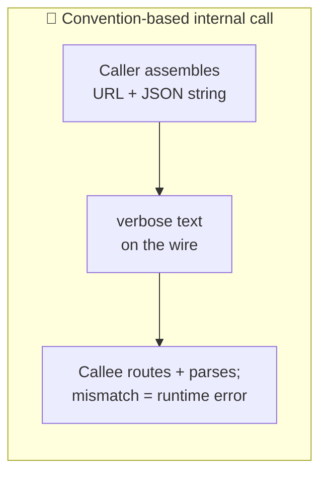
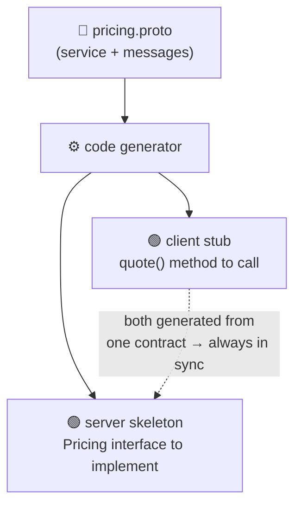
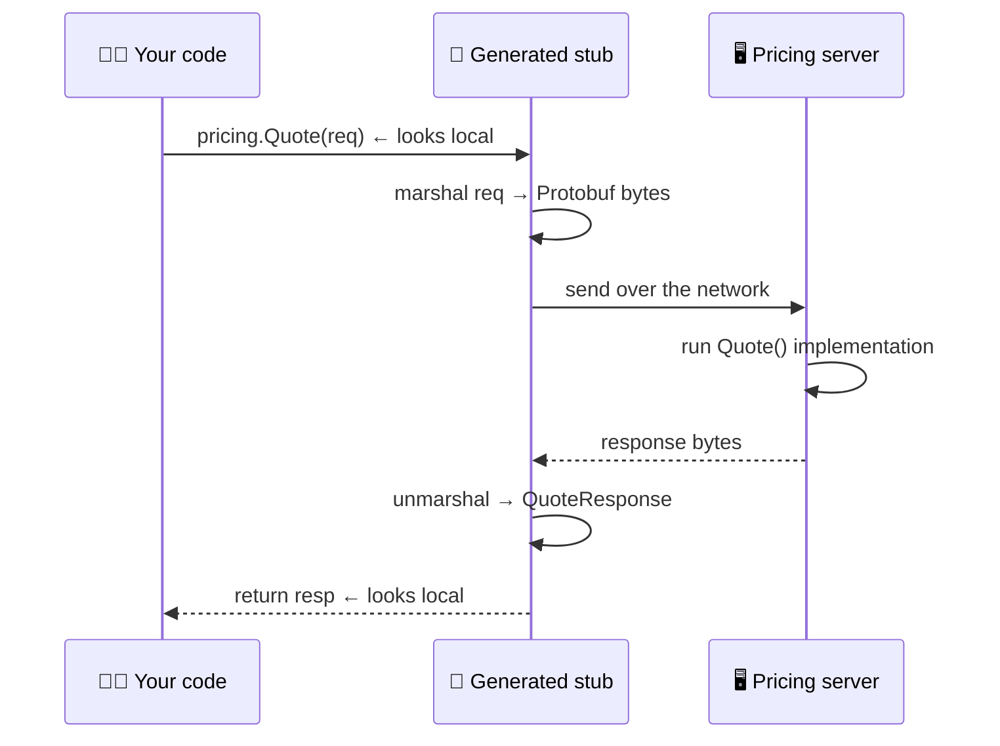

# gRPC

> **Phase:** APIs & Communication Deep Dives → **Topic:** 10 of 15 → **Read time:** ~48 minutes

---

## Before You Begin

**This document builds on two earlier topics and assumes you've read them.** gRPC is not one idea but a *combination* of ideas, and two of its three ingredients already have their own deep-dives in this phase:

- **Protocol Buffers** — the compact, binary, schema-first data format gRPC sends on the wire. Topic 02 taught it in full: the `.proto` schema, the numbered fields, the code generation, why the bytes are unreadable without the schema. This document **does not re-teach that format**; it uses it.
- **The RPC paradigm** — organizing an API around *procedures* (call a named action like a local function) rather than resources or queries. Topic 03 taught that paradigm and its place among the styles, and deliberately **deferred gRPC's actual mechanics** — how the contract generates code, how it runs over its transport — to a later topic. This is that topic.

The third ingredient — **HTTP/2**, the transport underneath — has its own full treatment in the networking material; here it's recalled at working level, only as much as explains why gRPC is fast and how it streams.

So this document is deliberately *coupled*: it recalls Protobuf, RPC, and HTTP/2 by name and spends its length on what's genuinely gRPC's own — the contract-to-code workflow, the four kinds of call, the call semantics a network forces on you, and the costs. Terms it introduces (stub, skeleton, the streaming call types, deadlines, status codes, metadata) are defined here; the three ingredients above are credited to their topics, not re-explained.

gRPC appears in the **Top 30 Must-Know Concepts** foundation series. This is the deep-dive on how it actually works.

Here is the question the document answers:

> **Inside a system, one service calls another thousands of times a second — and doing that with the same HTTP-and-JSON you'd expose to the public web means assembling URLs, shipping verbose text, and checking nothing until runtime. So how do you make a call to another machine feel — and cost — as little as calling a function in your own code, and what do you give up to get there?**

Here's the trap it disarms. gRPC gets filed as "a faster REST" — the same kind of API, tuned for speed, that you'd swap in when JSON gets slow. That framing is wrong twice. It isn't REST (it's a different model entirely — you call a generated function, you don't request a resource), and it isn't merely faster (it makes a different *trade*, buying speed and type-safety and streaming by spending the universality and readability that let REST reach anyone). Teams who believe "gRPC is REST but quick" reach for it on public and browser-facing edges where it simply can't go, and skip it on the internal call paths where it would pay for itself many times over. The point isn't speed; it's fit.

> **The mindset shift:** stop picturing a gRPC call as *an HTTP request you send and parse* and start picturing it as **a function you call that happens to run on another machine.** That's the exact illusion gRPC is engineered to create — and once you hold it, everything else in this document falls into place as the two sides of one bargain. The machinery all serves the illusion: one contract *generates the function* on both the caller's and the callee's side, and an efficient transport makes *thousands* of such calls cheap. And every cost is a place the illusion *leaks*: the function can fail because the network can (so calls need deadlines and status codes), it can't be reached from a browser, and you can't read it on the wire. gRPC is that illusion, bought at that price — and the price is only worth paying when you own both ends of the call.

---

## Table of Contents

1. [The Cost of a Convention-Based Call](#1-the-cost-of-a-convention-based-call)
2. [Contract First — Define the Service, Generate Both Sides](#2-contract-first--define-the-service-generate-both-sides)
3. [The Call Feels Local — What the Stub Hides](#3-the-call-feels-local--what-the-stub-hides)
4. [Four Ways to Call — Unary and Streaming](#4-four-ways-to-call--unary-and-streaming)
5. [HTTP/2 Underneath — Why It's Fast and Can Stream](#5-http2-underneath--why-its-fast-and-can-stream)
6. [Call Semantics — Deadlines, Cancellation, Status, Metadata](#6-call-semantics--deadlines-cancellation-status-metadata)
7. [Where the Illusion Leaks — The Costs](#7-where-the-illusion-leaks--the-costs)
8. [gRPC, REST, and Who's on the Other End](#8-grpc-rest-and-whos-on-the-other-end)
9. [When Not to Reach for gRPC](#9-when-not-to-reach-for-grpc)
10. [Putting It All Together — An Internal Microservices Fan-Out](#10-putting-it-all-together--an-internal-microservices-fan-out)
11. [Final Recap](#11-final-recap)

---

## 1. The Cost of a Convention-Based Call

To see why gRPC exists, look closely at what an ordinary internal API call actually costs — not the network time, but the *design* of the call itself. The everyday way of making one service talk to another is HTTP with JSON, and it's an excellent default. But it was shaped for reaching the whole world, and inside a system that shape is mostly overhead you're paying without benefit.

### A REST Call Is Assembled by Convention

When one service calls another over REST, the "contract" between them isn't really enforced anywhere — it's a set of *conventions* both sides agree to honor by hand:

- The caller **assembles a URL** — `POST /v1/pricing/quote` — as a string, plus a JSON body it builds field by field.
- The callee **matches that URL** to a handler by routing rules, then **parses the JSON** and hopes the fields are the ones it expects.
- Nothing checks that the two agree until the call actually runs. Misspell a field, send a number where a string was wanted, rename an endpoint — and you find out **at runtime**, in production, as a failed request.

For a public API this looseness is a *feature*: anyone can call it from anything, with nothing but an HTTP client and some documentation. But between two services *you* wrote and deploy together, it's a lot of ceremony and a lot of unchecked assumptions to re-establish on every single call.

### Text Is Expensive at Volume

There's a second cost, and at internal scale it's the one that shows up on graphs. JSON is text: field names repeat in full on every message, numbers are written as digit characters, and both sides spend real CPU turning objects into strings and strings back into objects. One call, no problem. But an internal service can make *thousands of calls a second* to its neighbours, and at that volume the verbosity and the parsing tax compound into measurable bandwidth and CPU — spent re-transmitting the string `"amount"` a billion times a day and re-parsing text that never needed to be text between machines that share a schema.



### What You'd Actually Want Between Your Own Services

Strip away the assumptions REST makes about unknown callers, and the wish list for an *internal* call is clear and different:

- **Call it like a function.** Not "assemble a URL and a body" but "invoke a named operation with typed arguments," the way you call code in your own process.
- **Check it at build time.** If the caller and callee disagree about the shape of a call, that should be a *compile error*, not a production incident.
- **Make it small and fast on the wire.** Between machines that both know the schema, don't ship field names as text or re-parse strings — send compact bytes.
- **Allow more than one-shot request/response.** Sometimes a call should stream a sequence of results, or take a stream of inputs — not everything is one-question-one-answer.

That wish list is, almost exactly, the specification for gRPC. It's what you get when you stop designing a call for strangers and start designing it for services you own. The rest of this document is how it grants each wish — and what each granted wish costs.

> 💡 **Key Insight**
>
> An HTTP-and-JSON call is built for **strangers**: the caller assembles a URL and text, the callee matches and parses it by convention, and nothing verifies the two agree until runtime — flexibility that's exactly right when anyone might call from anything. But between services *you* own, that flexibility is unchecked assumptions plus a text tax that compounds into real bandwidth and CPU at thousands of calls a second. What you'd want internally is the opposite: call a remote operation like a **typed local function**, checked at **build time**, sent as **compact bytes**, with room to **stream** — which is precisely the specification gRPC fulfills.

### Quick Recap — The Cost of a Convention-Based Call

- A REST/JSON call is **assembled by convention** — a URL and a JSON body built by hand, matched and parsed on the other side, with agreement checked only at **runtime**.
- That looseness is a **feature for public APIs** (anyone can call from anything) but unchecked ceremony between services you own and deploy together.
- **Text costs at volume**: repeated field names and constant parsing become measurable bandwidth and CPU at thousands of internal calls per second.
- The internal wish list — call it like a **typed function**, checked at **build time**, sent as **compact bytes**, able to **stream** — is essentially the specification for gRPC.

---

## 2. Contract First — Define the Service, Generate Both Sides

The first wish from §1 — a checked, function-like call — is granted by one move that defines gRPC's whole character: you don't write the calling code or the routing by hand at all. You write a **contract**, and a build step generates both sides from it. Everything else follows from that.

### The `.proto` Gains a `service`

Topic 02 introduced the `.proto` file as the place you define Protobuf **messages** — the typed shapes of your data. gRPC adds one thing on top: a **`service`**, a named group of **`rpc`** methods, each declaring the operation's name, its request message, and its response message.

```proto
// messages — the data shapes (this is Protobuf, from Topic 02)
message QuoteRequest  { string sku = 1; int32 quantity = 2; }
message QuoteResponse { int64  price_cents = 1; string currency = 2; }

// service — the operations (this is the gRPC part)
service Pricing {
  rpc Quote(QuoteRequest) returns (QuoteResponse);
}
```

Read that `service` block as an interface: "there is a service called `Pricing`; it has an operation `Quote` that takes a `QuoteRequest` and returns a `QuoteResponse`." It is a complete, precise, machine-readable description of *how to call this service* — the exact operations, and the exact type of every input and output. Note what's absent: no URL, no HTTP verb, no hand-built JSON. The unit is an **operation**, named like a function, which is the RPC paradigm Topic 03 described — here made concrete.

### One Contract Generates Two Sides

The `.proto` file is not documentation; it's *source*. A compiler (the Protobuf/gRPC toolchain) reads it and **generates code in your language for both ends of the call**:

- On the **client** side, it generates a **stub** — an object with a real `Quote(...)` method you call directly, that takes a `QuoteRequest` and returns a `QuoteResponse`. Calling the remote service is calling that method.
- On the **server** side, it generates a **skeleton** (a base interface) — a `Pricing` interface with a `Quote` method for you to *implement* with the actual pricing logic. gRPC handles receiving the call and routing it to your implementation.



### Why This Changes Everything Downstream

Because both sides are generated from the *same* file, they cannot silently disagree. If the server changes `Quote` to require a new field and regenerates, the client's generated stub changes too, and code that doesn't match **fails to compile** — the runtime mismatch of §1 becomes a build-time error, exactly the wish. The contract is a single source of truth that the compiler enforces on everyone.

This is what "contract-first" actually means in practice: the schema isn't written *after* the code to describe it, nor maintained *alongside* the code and hoped to match — the schema is written *first* and the code is *produced from it*. That inversion — contract as the source, code as the output — is the root from which gRPC's type-safety, its tooling, and (as later sections show) its coupling costs all grow.

> 💡 **Key Insight**
>
> gRPC's defining move is **contract-first code generation**: you write a `.proto` **`service`** of typed **`rpc`** operations (atop Protobuf messages from Topic 02), and one toolchain generates *both* a client **stub** to call and a server **skeleton** to implement. Because both ends come from the same file, they can't drift — a mismatch is a **compile error, not a runtime failure**, granting §1's wish for a build-time-checked call. The schema is the *source* and the code is the *output*, and that single inversion is the root of gRPC's safety, its tooling, and the coupling costs that come later.

### Quick Recap — Contract First

- A gRPC `.proto` adds a **`service`** — a set of **`rpc`** operations, each naming its request and response message types (the messages being Protobuf, from Topic 02).
- The `.proto` is **source, not documentation**: a toolchain generates a client **stub** (a method to call) and a server **skeleton** (an interface to implement) from it.
- Because both ends are generated from **one contract**, they can't silently disagree — a mismatch becomes a **build-time error**, the §1 wish granted.
- "Contract-first" means the schema is written **first and code is produced from it** — an inversion that's the root of gRPC's safety, tooling, and later coupling costs.

---

## 3. The Call Feels Local — What the Stub Hides

The generated stub from §2 is where gRPC's central illusion is delivered. From the calling code's point of view, invoking a service on another machine looks *identical* to calling a function in the same process — and that resemblance is not cosmetic; it's the whole design goal, and it's worth seeing exactly what it hides.

### At the Call Site, the Network Disappears

Here is what calling the `Pricing` service actually looks like in the caller's code:

```
resp = pricing.Quote(QuoteRequest(sku="A-100", quantity=3))
print(resp.price_cents)
```

That's it. There is no URL, no HTTP client, no JSON to build or parse, no status code to inspect by hand. You construct a typed request object, call a method, and get a typed response object back — the same shape as calling any local function. The remote service, running on another machine possibly across the data center, is invoked as if it were a library you imported. This is the RPC promise Topic 03 named — "make a remote call feel like a local one" — now visible in a single line.

And because the request and response types are *generated* (§2), your editor autocompletes their fields, your compiler rejects a typo or a wrong type, and a change to the contract that breaks this call site is caught before the code ever runs. The call isn't just concise; it's *checked*.

### What the Stub Does Under the Hood

The single line above is a facade over a sequence of steps the stub performs so you don't have to. Understanding them is understanding both the convenience and, later, its limits:

1. **Marshal** — serialize the `QuoteRequest` object into compact Protobuf bytes (Topic 02's format).
2. **Send** — open or reuse a connection to the `Pricing` server and transmit the bytes as a call to the `Quote` operation.
3. **Wait** — block (or await) while the request crosses the network, the server runs your implementation, and the reply comes back.
4. **Unmarshal** — deserialize the returned bytes into a `QuoteResponse` object and hand it back to your code.



The server side is the mirror image: gRPC receives the bytes, unmarshals them into a `QuoteRequest`, calls the `Quote` method *you* implemented on the generated skeleton, and marshals whatever you return. You write pricing logic; the generated code handles everything between the wire and your function.

### The Value — and the Seed of the Cost

What this buys is significant and worth naming plainly: **no manual serialization, no URL or endpoint wrangling, no drift between what the caller sends and what the callee expects, and full type-checking across a network boundary.** Two services in different languages, generated from the same `.proto`, call each other as if they shared a codebase.

But hold onto step 3 — *wait while it crosses the network*. That's the seam. A real local function call doesn't traverse a network, can't time out, can't find the other side unreachable. A gRPC call can do all three, because it only *looks* local; underneath, it is still a message to another machine. The illusion is powerful and productive, and §6 and §7 are about the places it necessarily leaks. For now, the point is how convincingly, and how usefully, the stub sustains it.

> 💡 **Key Insight**
>
> The generated **stub** delivers gRPC's core illusion: calling a remote service is a single typed line — `pricing.Quote(req)` — with no URL, no JSON, no status code, indistinguishable from a local function call and fully checked by the compiler. Under that one line the stub **marshals** the request to Protobuf, **sends** it, **waits** for the network round trip, and **unmarshals** the reply, while the server runs your implementation of the generated interface. The convenience is real — cross-language calls with no drift and full type-safety — but the "wait for the network" step is the seam where the illusion will leak, because a call that only *looks* local can still time out, fail, and be unreachable.

### Quick Recap — The Call Feels Local

- At the call site, a gRPC call is a **typed method call** — `pricing.Quote(req)` — with no URL, JSON, or status code, looking exactly like a local function and checked by the compiler.
- Under the hood the **stub marshals** the request to Protobuf, **sends**, **waits** for the round trip, and **unmarshals** the reply; the server runs your implementation of the generated skeleton.
- The payoff is **no manual serialization, no caller/callee drift, and type-safety across the network** — even between services in different languages.
- The **"wait for the network" step** is the seam: the call only *looks* local, so it can still time out, fail, or find the other side unreachable — the leaks of §6–§7.

---
