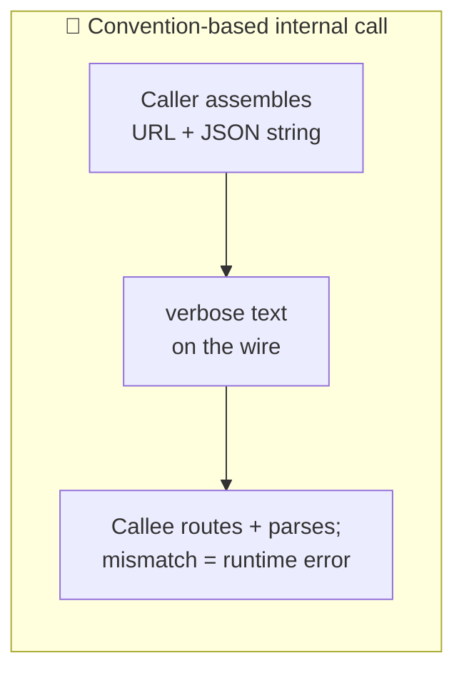
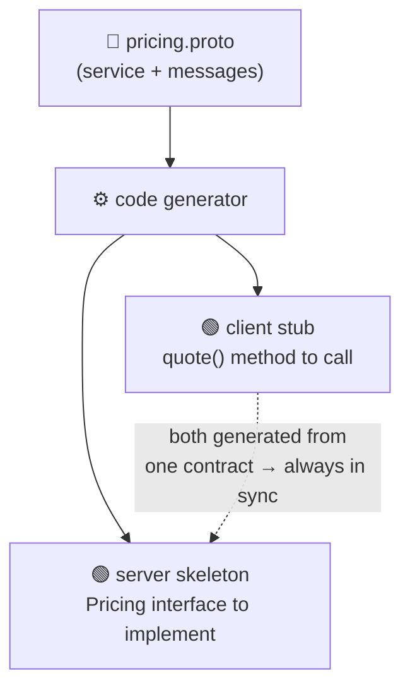
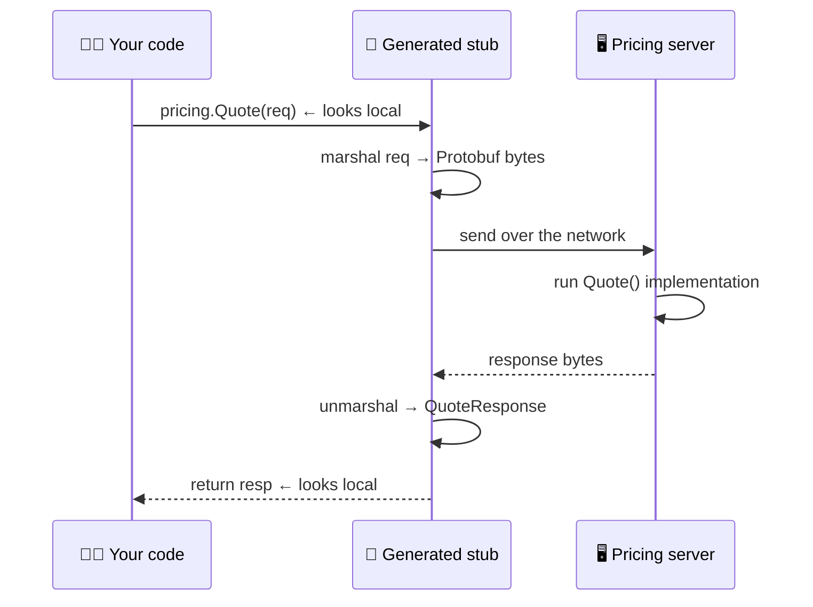
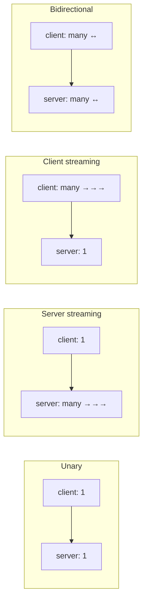
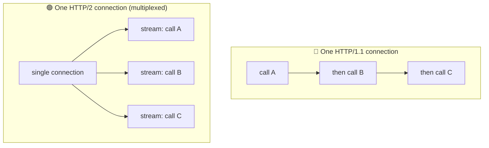
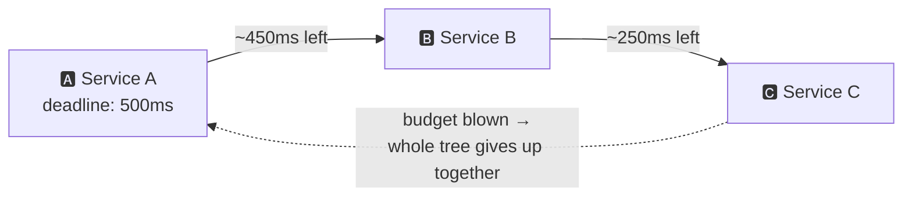
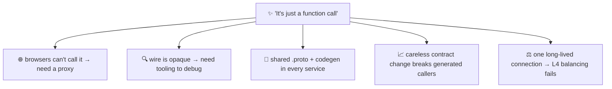
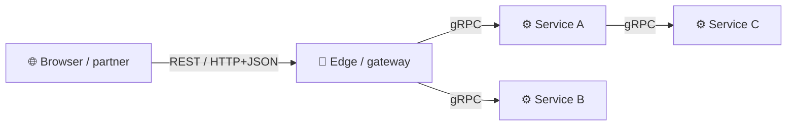

# gRPC

> **Phase:** APIs & Communication Deep Dives → **Topic:** 10 of 15 → **Read time:** ~48 minutes

---

## Before You Begin

**This document builds on two earlier topics and assumes you've read them.** gRPC is not one idea but a *combination* of ideas, and two of its three ingredients already have their own deep-dives in this phase:

- **Protocol Buffers** — the compact, binary, schema-first data format gRPC sends on the wire. Topic 02 taught it in full: the `.proto` schema, the numbered fields, the code generation, why the bytes are unreadable without the schema. This document **does not re-teach that format**; it uses it.
- **The RPC paradigm** — organizing an API around *procedures* (call a named action like a local function) rather than resources or queries. Topic 03 taught that paradigm and its place among the styles, and deliberately **deferred gRPC's actual mechanics** — how the contract generates code, how it runs over its transport — to a later topic. This is that topic.

The third ingredient — **HTTP/2**, the transport underneath — has its own full treatment in the networking material; here it's recalled at working level, only as much as explains why gRPC is fast and how it streams.

So this document is deliberately *coupled*: it recalls Protobuf, RPC, and HTTP/2 by name and spends its length on what's genuinely gRPC's own — the contract-to-code workflow, the four kinds of call, the call semantics a network forces on you, and the costs. Terms it introduces (stub, skeleton, the streaming call types, deadlines, status codes, metadata) are defined here; the three ingredients above are credited to their topics, not re-explained.

gRPC appears in the **Top 30 Must-Know Concepts** foundation series. This is the deep-dive on how it actually works.

Here is the question the document answers:

> **Inside a system, one service calls another thousands of times a second — and doing that with the same HTTP-and-JSON you'd expose to the public web means assembling URLs, shipping verbose text, and checking nothing until runtime. So how do you make a call to another machine feel — and cost — as little as calling a function in your own code, and what do you give up to get there?**

Here's the trap it disarms. gRPC gets filed as "a faster REST" — the same kind of API, tuned for speed, that you'd swap in when JSON gets slow. That framing is wrong twice. It isn't REST (it's a different model entirely — you call a generated function, you don't request a resource), and it isn't merely faster (it makes a different *trade*, buying speed and type-safety and streaming by spending the universality and readability that let REST reach anyone). Teams who believe "gRPC is REST but quick" reach for it on public and browser-facing edges where it simply can't go, and skip it on the internal call paths where it would pay for itself many times over. The point isn't speed; it's fit.

> **The mindset shift:** stop picturing a gRPC call as *an HTTP request you send and parse* and start picturing it as **a function you call that happens to run on another machine.** That's the exact illusion gRPC is engineered to create — and once you hold it, everything else in this document falls into place as the two sides of one bargain. The machinery all serves the illusion: one contract *generates the function* on both the caller's and the callee's side, and an efficient transport makes *thousands* of such calls cheap. And every cost is a place the illusion *leaks*: the function can fail because the network can (so calls need deadlines and status codes), it can't be reached from a browser, and you can't read it on the wire. gRPC is that illusion, bought at that price — and the price is only worth paying when you own both ends of the call.

---

## Table of Contents

1. [The Cost of a Convention-Based Call](#1-the-cost-of-a-convention-based-call)
2. [Contract First — Define the Service, Generate Both Sides](#2-contract-first--define-the-service-generate-both-sides)
3. [The Call Feels Local — What the Stub Hides](#3-the-call-feels-local--what-the-stub-hides)
4. [Four Ways to Call — Unary and Streaming](#4-four-ways-to-call--unary-and-streaming)
5. [HTTP/2 Underneath — Why It's Fast and Can Stream](#5-http2-underneath--why-its-fast-and-can-stream)
6. [Call Semantics — Deadlines, Cancellation, Status, Metadata](#6-call-semantics--deadlines-cancellation-status-metadata)
7. [Where the Illusion Leaks — The Costs](#7-where-the-illusion-leaks--the-costs)
8. [gRPC, REST, and Who's on the Other End](#8-grpc-rest-and-whos-on-the-other-end)
9. [When Not to Reach for gRPC](#9-when-not-to-reach-for-grpc)
10. [Putting It All Together — An Internal Microservices Fan-Out](#10-putting-it-all-together--an-internal-microservices-fan-out)
11. [Final Recap](#11-final-recap)

---

## 1. The Cost of a Convention-Based Call

To see why gRPC exists, look closely at what an ordinary internal API call actually costs — not the network time, but the *design* of the call itself. The everyday way of making one service talk to another is HTTP with JSON, and it's an excellent default. But it was shaped for reaching the whole world, and inside a system that shape is mostly overhead you're paying without benefit.

### A REST Call Is Assembled by Convention

When one service calls another over REST, the "contract" between them isn't really enforced anywhere — it's a set of *conventions* both sides agree to honor by hand:

- The caller **assembles a URL** — `POST /v1/pricing/quote` — as a string, plus a JSON body it builds field by field.
- The callee **matches that URL** to a handler by routing rules, then **parses the JSON** and hopes the fields are the ones it expects.
- Nothing checks that the two agree until the call actually runs. Misspell a field, send a number where a string was wanted, rename an endpoint — and you find out **at runtime**, in production, as a failed request.

For a public API this looseness is a *feature*: anyone can call it from anything, with nothing but an HTTP client and some documentation. But between two services *you* wrote and deploy together, it's a lot of ceremony and a lot of unchecked assumptions to re-establish on every single call.

### Text Is Expensive at Volume

There's a second cost, and at internal scale it's the one that shows up on graphs. JSON is text: field names repeat in full on every message, numbers are written as digit characters, and both sides spend real CPU turning objects into strings and strings back into objects. One call, no problem. But an internal service can make *thousands of calls a second* to its neighbours, and at that volume the verbosity and the parsing tax compound into measurable bandwidth and CPU — spent re-transmitting the string `"amount"` a billion times a day and re-parsing text that never needed to be text between machines that share a schema.



### What You'd Actually Want Between Your Own Services

Strip away the assumptions REST makes about unknown callers, and the wish list for an *internal* call is clear and different:

- **Call it like a function.** Not "assemble a URL and a body" but "invoke a named operation with typed arguments," the way you call code in your own process.
- **Check it at build time.** If the caller and callee disagree about the shape of a call, that should be a *compile error*, not a production incident.
- **Make it small and fast on the wire.** Between machines that both know the schema, don't ship field names as text or re-parse strings — send compact bytes.
- **Allow more than one-shot request/response.** Sometimes a call should stream a sequence of results, or take a stream of inputs — not everything is one-question-one-answer.

That wish list is, almost exactly, the specification for gRPC. It's what you get when you stop designing a call for strangers and start designing it for services you own. The rest of this document is how it grants each wish — and what each granted wish costs.

> 💡 **Key Insight**
>
> An HTTP-and-JSON call is built for **strangers**: the caller assembles a URL and text, the callee matches and parses it by convention, and nothing verifies the two agree until runtime — flexibility that's exactly right when anyone might call from anything. But between services *you* own, that flexibility is unchecked assumptions plus a text tax that compounds into real bandwidth and CPU at thousands of calls a second. What you'd want internally is the opposite: call a remote operation like a **typed local function**, checked at **build time**, sent as **compact bytes**, with room to **stream** — which is precisely the specification gRPC fulfills.

### Quick Recap — The Cost of a Convention-Based Call

- A REST/JSON call is **assembled by convention** — a URL and a JSON body built by hand, matched and parsed on the other side, with agreement checked only at **runtime**.
- That looseness is a **feature for public APIs** (anyone can call from anything) but unchecked ceremony between services you own and deploy together.
- **Text costs at volume**: repeated field names and constant parsing become measurable bandwidth and CPU at thousands of internal calls per second.
- The internal wish list — call it like a **typed function**, checked at **build time**, sent as **compact bytes**, able to **stream** — is essentially the specification for gRPC.

---

## 2. Contract First — Define the Service, Generate Both Sides

The first wish from §1 — a checked, function-like call — is granted by one move that defines gRPC's whole character: you don't write the calling code or the routing by hand at all. You write a **contract**, and a build step generates both sides from it. Everything else follows from that.

### The `.proto` Gains a `service`

Topic 02 introduced the `.proto` file as the place you define Protobuf **messages** — the typed shapes of your data. gRPC adds one thing on top: a **`service`**, a named group of **`rpc`** methods, each declaring the operation's name, its request message, and its response message.

```proto
// messages — the data shapes (this is Protobuf, from Topic 02)
message QuoteRequest  { string sku = 1; int32 quantity = 2; }
message QuoteResponse { int64  price_cents = 1; string currency = 2; }

// service — the operations (this is the gRPC part)
service Pricing {
  rpc Quote(QuoteRequest) returns (QuoteResponse);
}
```

Read that `service` block as an interface: "there is a service called `Pricing`; it has an operation `Quote` that takes a `QuoteRequest` and returns a `QuoteResponse`." It is a complete, precise, machine-readable description of *how to call this service* — the exact operations, and the exact type of every input and output. Note what's absent: no URL, no HTTP verb, no hand-built JSON. The unit is an **operation**, named like a function, which is the RPC paradigm Topic 03 described — here made concrete.

### One Contract Generates Two Sides

The `.proto` file is not documentation; it's *source*. A compiler (the Protobuf/gRPC toolchain) reads it and **generates code in your language for both ends of the call**:

- On the **client** side, it generates a **stub** — an object with a real `Quote(...)` method you call directly, that takes a `QuoteRequest` and returns a `QuoteResponse`. Calling the remote service is calling that method.
- On the **server** side, it generates a **skeleton** (a base interface) — a `Pricing` interface with a `Quote` method for you to *implement* with the actual pricing logic. gRPC handles receiving the call and routing it to your implementation.



### Why This Changes Everything Downstream

Because both sides are generated from the *same* file, they cannot silently disagree. If the server changes `Quote` to require a new field and regenerates, the client's generated stub changes too, and code that doesn't match **fails to compile** — the runtime mismatch of §1 becomes a build-time error, exactly the wish. The contract is a single source of truth that the compiler enforces on everyone.

This is what "contract-first" actually means in practice: the schema isn't written *after* the code to describe it, nor maintained *alongside* the code and hoped to match — the schema is written *first* and the code is *produced from it*. That inversion — contract as the source, code as the output — is the root from which gRPC's type-safety, its tooling, and (as later sections show) its coupling costs all grow.

> 💡 **Key Insight**
>
> gRPC's defining move is **contract-first code generation**: you write a `.proto` **`service`** of typed **`rpc`** operations (atop Protobuf messages from Topic 02), and one toolchain generates *both* a client **stub** to call and a server **skeleton** to implement. Because both ends come from the same file, they can't drift — a mismatch is a **compile error, not a runtime failure**, granting §1's wish for a build-time-checked call. The schema is the *source* and the code is the *output*, and that single inversion is the root of gRPC's safety, its tooling, and the coupling costs that come later.

### Quick Recap — Contract First

- A gRPC `.proto` adds a **`service`** — a set of **`rpc`** operations, each naming its request and response message types (the messages being Protobuf, from Topic 02).
- The `.proto` is **source, not documentation**: a toolchain generates a client **stub** (a method to call) and a server **skeleton** (an interface to implement) from it.
- Because both ends are generated from **one contract**, they can't silently disagree — a mismatch becomes a **build-time error**, the §1 wish granted.
- "Contract-first" means the schema is written **first and code is produced from it** — an inversion that's the root of gRPC's safety, tooling, and later coupling costs.

---

## 3. The Call Feels Local — What the Stub Hides

The generated stub from §2 is where gRPC's central illusion is delivered. From the calling code's point of view, invoking a service on another machine looks *identical* to calling a function in the same process — and that resemblance is not cosmetic; it's the whole design goal, and it's worth seeing exactly what it hides.

### At the Call Site, the Network Disappears

Here is what calling the `Pricing` service actually looks like in the caller's code:

```
resp = pricing.Quote(QuoteRequest(sku="A-100", quantity=3))
print(resp.price_cents)
```

That's it. There is no URL, no HTTP client, no JSON to build or parse, no status code to inspect by hand. You construct a typed request object, call a method, and get a typed response object back — the same shape as calling any local function. The remote service, running on another machine possibly across the data center, is invoked as if it were a library you imported. This is the RPC promise Topic 03 named — "make a remote call feel like a local one" — now visible in a single line.

And because the request and response types are *generated* (§2), your editor autocompletes their fields, your compiler rejects a typo or a wrong type, and a change to the contract that breaks this call site is caught before the code ever runs. The call isn't just concise; it's *checked*.

### What the Stub Does Under the Hood

The single line above is a facade over a sequence of steps the stub performs so you don't have to. Understanding them is understanding both the convenience and, later, its limits:

1. **Marshal** — serialize the `QuoteRequest` object into compact Protobuf bytes (Topic 02's format).
2. **Send** — open or reuse a connection to the `Pricing` server and transmit the bytes as a call to the `Quote` operation.
3. **Wait** — block (or await) while the request crosses the network, the server runs your implementation, and the reply comes back.
4. **Unmarshal** — deserialize the returned bytes into a `QuoteResponse` object and hand it back to your code.



The server side is the mirror image: gRPC receives the bytes, unmarshals them into a `QuoteRequest`, calls the `Quote` method *you* implemented on the generated skeleton, and marshals whatever you return. You write pricing logic; the generated code handles everything between the wire and your function.

### The Value — and the Seed of the Cost

What this buys is significant and worth naming plainly: **no manual serialization, no URL or endpoint wrangling, no drift between what the caller sends and what the callee expects, and full type-checking across a network boundary.** Two services in different languages, generated from the same `.proto`, call each other as if they shared a codebase.

But hold onto step 3 — *wait while it crosses the network*. That's the seam. A real local function call doesn't traverse a network, can't time out, can't find the other side unreachable. A gRPC call can do all three, because it only *looks* local; underneath, it is still a message to another machine. The illusion is powerful and productive, and §6 and §7 are about the places it necessarily leaks. For now, the point is how convincingly, and how usefully, the stub sustains it.

> 💡 **Key Insight**
>
> The generated **stub** delivers gRPC's core illusion: calling a remote service is a single typed line — `pricing.Quote(req)` — with no URL, no JSON, no status code, indistinguishable from a local function call and fully checked by the compiler. Under that one line the stub **marshals** the request to Protobuf, **sends** it, **waits** for the network round trip, and **unmarshals** the reply, while the server runs your implementation of the generated interface. The convenience is real — cross-language calls with no drift and full type-safety — but the "wait for the network" step is the seam where the illusion will leak, because a call that only *looks* local can still time out, fail, and be unreachable.

### Quick Recap — The Call Feels Local

- At the call site, a gRPC call is a **typed method call** — `pricing.Quote(req)` — with no URL, JSON, or status code, looking exactly like a local function and checked by the compiler.
- Under the hood the **stub marshals** the request to Protobuf, **sends**, **waits** for the round trip, and **unmarshals** the reply; the server runs your implementation of the generated skeleton.
- The payoff is **no manual serialization, no caller/callee drift, and type-safety across the network** — even between services in different languages.
- The **"wait for the network" step** is the seam: the call only *looks* local, so it can still time out, fail, or find the other side unreachable — the leaks of §6–§7.

---

## 4. Four Ways to Call — Unary and Streaming

The last item on §1's wish list was "allow more than one-shot request/response," and it's the one that most distinguishes gRPC from an ordinary API. A REST call is fundamentally one request, one response. gRPC offers **four** call shapes, because the transport underneath (§5) can hold a call open and let messages flow while it's open. You choose the shape per `rpc` method, right in the contract.

### The Four Shapes

- **Unary** — one request, one response. The ordinary call, exactly like §3's `Quote`: ask once, get one answer. The overwhelming majority of calls are unary, and it's the right default.
- **Server streaming** — one request, *many* responses. The client asks once, and the server sends back a *sequence* of messages over time before finishing. Good for a large result delivered in chunks, or a feed of updates in response to a single subscription.
- **Client streaming** — *many* requests, one response. The client sends a sequence of messages and the server replies once at the end. Good for uploading a large input in pieces, or aggregating a stream of data points into a single summary.
- **Bidirectional streaming** — *many* requests and *many* responses, independently, over one open call. Both sides send whenever they have something, in any interleaving, until the call ends. Good for genuinely interactive, long-lived exchanges between two services.

In the contract, streaming is declared with the `stream` keyword on the request and/or response type:

```proto
service Analytics {
  rpc GetReport(ReportRequest) returns (ReportResponse);                 // unary
  rpc TailEvents(TailRequest)  returns (stream Event);                   // server streaming
  rpc UploadRows(stream Row)   returns (UploadSummary);                  // client streaming
  rpc LiveSync(stream Change)  returns (stream Change);                  // bidirectional
}
```



### Streaming Is Part of the Contract, Not a Bolt-On

The important thing is that these aren't four separate features with four separate APIs — they're four shapes of the *same* generated-stub mechanism from §3. A server-streaming method generates a stub call that hands you an iterable of responses instead of a single one; a client-streaming method generates one you push messages into. The same contract-first, typed, code-generated model (§2) covers all four, so streaming keeps every benefit of §3 — it's type-checked, marshalled to Protobuf, and called like local code that happens to yield or accept a sequence.

This is a capability an ordinary request/response API simply doesn't have natively, and it exists because gRPC's transport was chosen to support it. That transport is the next section — and it's also the reason unary calls are so cheap in the first place.

> 💡 **Key Insight**
>
> gRPC offers **four call shapes**, chosen per method in the contract: **unary** (1→1, the everyday default), **server streaming** (1→many, a sequence of responses), **client streaming** (many→1, a sequence of inputs summarized), and **bidirectional** (many↔many, interactive and long-lived). They aren't bolt-ons — all four are the *same* generated-stub, contract-first, Protobuf-typed mechanism from §3, just yielding or accepting sequences instead of single values. This range — impossible in plain one-shot request/response — exists because the transport underneath (§5) can hold a call open, which is the next section.

### Quick Recap — Four Ways to Call

- gRPC has **four call shapes**, declared per `rpc` method: **unary** (1→1), **server streaming** (1→many), **client streaming** (many→1), and **bidirectional** (many↔many).
- **Unary is the default** and the vast majority of calls; the streaming shapes fit large or chunked results, piecewise uploads, and interactive long-lived exchanges.
- Streaming is declared with `stream` in the contract and is the **same generated-stub mechanism** as a unary call — still typed, still Protobuf, still called like local code.
- This range is impossible in one-shot request/response and exists because gRPC's transport (§5) can **hold a call open** while messages flow.

---

## 5. HTTP/2 Underneath — Why It's Fast and Can Stream

Two claims from earlier sections have gone unexplained: that gRPC makes high call *volume* cheap (§1), and that it can *stream* in four shapes (§4). Both come from the transport gRPC runs on — **HTTP/2** — and specifically from one property of it. HTTP/2 is its own deep topic in the networking material; here you need only the working idea and why it matters to gRPC.

### The One Property That Matters: Multiplexing

Older HTTP (HTTP/1.1) has a limitation: on a single connection, requests are effectively handled one at a time — a request must wait for the previous response before its own can proceed, so a slow response holds up everything behind it. To do many things at once, clients open *many* connections, each with its own setup cost.

HTTP/2 removes this with **multiplexing**: a single connection carries **many independent calls at the same time**, interleaved, none waiting for the others. Each call is an independent **stream** within the one connection; a slow call doesn't block the fast calls sharing the pipe. One connection, many concurrent conversations.



### Why This Makes gRPC Fast at Volume

Recall §1's problem: a service making thousands of calls a second to its neighbours. On a one-at-a-time transport that means either serializing those calls (slow) or maintaining a large pool of connections (expensive — each connection is memory and setup on both ends). HTTP/2's multiplexing collapses that: a service can hold **one long-lived connection** to each neighbour and push thousands of concurrent calls through it, no per-call connection setup, no head-of-line stalls between independent calls. The connection is established once and reused continuously. Combine that with Protobuf's compact bytes (Topic 02) — small payloads *and* a cheap way to send lots of them at once — and you have gRPC's performance, from the two ingredients working together.

It's worth being precise about the source, because Topic 03 flagged the common error of crediting gRPC's speed to the RPC *paradigm*. It isn't the paradigm. The speed comes from **transport and format** — HTTP/2's multiplexing plus Protobuf's compact binary encoding. The procedure-call model is about how the API is *shaped*; the performance is a separate axis that gRPC happens to bundle with it.

### Why This Enables Streaming

Multiplexing is also exactly what makes §4's streaming possible. Because an HTTP/2 stream is a call that stays open with messages flowing in both directions, gRPC maps each of its call shapes directly onto it: a unary call is a stream with one message each way; a server-streaming call is a stream where the server keeps sending; a bidirectional call is a stream both sides write to freely. Streaming isn't something gRPC bolted on beside HTTP/2 — it's HTTP/2's open, bidirectional streams surfaced as typed, generated method calls. The transport had the capability; gRPC gave it a contract and a function-call face.

> 💡 **Key Insight**
>
> gRPC runs on **HTTP/2**, and the property that matters is **multiplexing**: one connection carries many independent calls at once, each an interleaved stream, none blocking the others. That's what makes high volume cheap — a service holds **one long-lived, reused connection** per neighbour and pushes thousands of concurrent calls through it, no per-call setup, no cross-call stalls — and, paired with Protobuf's compact bytes (Topic 02), it's the whole source of gRPC's speed. (Not the RPC paradigm — as Topic 03 warned, speed is a *transport-and-format* property.) The same open, bidirectional streams are exactly what gRPC surfaces as its four typed call shapes (§4).

### Quick Recap — HTTP/2 Underneath

- gRPC runs on **HTTP/2**, whose key property is **multiplexing**: one connection carries many independent calls concurrently, each a stream, none blocking the others.
- That makes volume cheap — a service keeps **one long-lived connection** per neighbour and sends thousands of concurrent calls through it, without per-call connection setup or head-of-line stalls.
- Paired with **Protobuf's compact bytes** (Topic 02), multiplexing is the real source of gRPC's speed — which comes from **transport and format**, not the RPC paradigm (as Topic 03 warned).
- HTTP/2's open, bidirectional **streams** are exactly what gRPC surfaces as its four typed call shapes (§4) — streaming is the transport's capability given a contract.

---

## 6. Call Semantics — Deadlines, Cancellation, Status, Metadata

Everything so far has sold the illusion (§3): a gRPC call looks like a local function call. This section is the first place gRPC itself admits the illusion is only that. A local function returns or throws, promptly, always. A call across a network can hang, be abandoned, or fail in ways that have nothing to do with your logic — so gRPC gives every call a set of built-in semantics for exactly those situations. Using them well is the difference between a robust service and one that mysteriously hangs.

### Deadlines — Every Call Should Have One

A local function call doesn't need a timeout; a remote one always does, because the other side might never answer. gRPC builds this in as a **deadline**: the caller sets, per call, "I will wait at most *this long* for a result." If the deadline passes before the response arrives, the call fails immediately with a specific status (below), rather than blocking forever.

The feature that makes deadlines powerful in a real system is **propagation across a call chain**. When service A calls B with a 500 ms deadline, and B must call C to answer, B passes the *remaining* time down to C. If A's 500 ms is already half gone, C is told it has ~250 ms. The whole *tree* of calls behind one request shares a single shrinking budget, so the moment the top-level deadline is blown, every downstream call still in flight gives up too — instead of B and C grinding on to produce an answer A stopped waiting for. Without propagated deadlines, a slow leaf service can pin resources all the way up the chain long after the work became useless.



### Cancellation — Stopping Work No One Wants

Closely related: a caller can **cancel** an in-flight call (the user navigated away, a parallel call already failed the request, the deadline fired). Cancellation propagates to the server, signalling it to stop working and release resources rather than finishing a computation whose result will be discarded. In a streaming call (§4), either side can end the stream. This matters most under load, where wasted work on abandoned calls is exactly what you can't afford.

### Status Codes — gRPC's Own Vocabulary

When a call ends, it carries a **status code** saying how it went — and gRPC defines its *own* set, distinct from HTTP's. Every call returns `OK` on success or one of a fixed set of error codes, including:

| Status | Meaning |
|---|---|
| `OK` | Success |
| `DEADLINE_EXCEEDED` | The deadline passed before completion |
| `UNAVAILABLE` | The server couldn't be reached (often retriable) |
| `NOT_FOUND` / `ALREADY_EXISTS` | Domain outcomes, like their REST cousins |
| `INVALID_ARGUMENT` | The caller sent something wrong |
| `PERMISSION_DENIED` / `UNAUTHENTICATED` | Authorization outcomes |

Because the set is small and uniform, generic machinery — retry logic, monitoring, tracing — can act on outcomes consistently across every service without parsing bespoke error bodies. A caller can, for instance, safely retry `UNAVAILABLE` and never retry `INVALID_ARGUMENT`, as a general rule.

### Metadata — Key-Value Headers Alongside the Call

Finally, a call can carry **metadata**: key-value pairs sent alongside the request and response messages, separate from the typed body. Metadata is where cross-cutting concerns ride — an authentication token, a tracing/correlation id, other context — the gRPC counterpart to HTTP headers. It keeps the message contract (§2) about the *domain data* while auth, tracing, and similar travel beside it. (How auth tokens and mutual TLS actually secure a gRPC call belongs to the security material; here it's enough that metadata is the channel they use.)

> 💡 **Key Insight**
>
> A gRPC call only *looks* local (§3); these semantics are gRPC admitting it isn't. **Deadlines** cap how long a caller waits and, crucially, **propagate down a call chain** so a whole request tree shares one shrinking budget and abandons together. **Cancellation** stops work whose result is no longer wanted. **Status codes** — gRPC's own small, uniform set (`OK`, `DEADLINE_EXCEEDED`, `UNAVAILABLE`, …) — let generic retry, monitoring, and tracing act on every call consistently. And **metadata** carries cross-cutting concerns like auth and tracing beside the typed body. A local call needs none of these; a networked one needs all of them.

### Quick Recap — Call Semantics

- **Deadlines** cap how long a caller waits per call and **propagate across a chain** — the whole request tree shares one shrinking budget and gives up together, freeing resources on a blown deadline.
- **Cancellation** lets a caller (or a fired deadline) tell the server to stop unwanted work and release resources — vital under load.
- gRPC has its **own status-code set** (`OK`, `DEADLINE_EXCEEDED`, `UNAVAILABLE`, `INVALID_ARGUMENT`, …), small and uniform so generic retry/monitoring/tracing act consistently across services.
- **Metadata** carries cross-cutting concerns (auth tokens, tracing ids) as key-value pairs beside the typed message, keeping the contract about domain data — the machinery a local call never needs but a remote one must.

---

## 7. Where the Illusion Leaks — The Costs

gRPC's power is the illusion that a remote call is a local one (§3), bought with a binary, schema-bound, HTTP/2 protocol (§2, §5). This section is the bill. None of these is a defect — each is the *direct consequence* of a choice that bought something earlier, which is why they can't simply be fixed away. They're the price of the illusion, and knowing them is what tells you where gRPC belongs (§8–§9).

### Browsers Can't Speak It Directly

The most consequential limit: **a web browser cannot make a gRPC call directly.** gRPC needs precise control over HTTP/2 framing and sends raw binary, and browsers don't expose the low-level control it requires. So a browser-facing endpoint can't be plain gRPC — it needs a **proxy** that translates between something the browser *can* speak and gRPC behind it (the variant built for this, grpc-web, still relies on such a proxy). This single fact is why gRPC is an *internal* technology: the moment the caller is a browser, gRPC alone can't reach it. It bought binary-HTTP/2 speed and spent the universal reach that lets anything call a REST endpoint.

### The Wire Is Unreadable

Protobuf's compactness (Topic 02) comes from dropping field names and text encoding — which also means **you cannot read a gRPC call by looking at it.** With REST and JSON you can eyeball a request in logs, replay it with a generic HTTP tool, and see exactly what was sent. A gRPC call on the wire is opaque bytes, meaningless without the `.proto` schema and tooling to decode them. Debugging, ad-hoc inspection, and casual "just curl it" testing all get harder and require gRPC-aware tools. The size win and the readability loss are the same coin.

### You're Coupled to the Schema and the Toolchain

Contract-first code generation (§2) is a benefit and a commitment. Every service in the call graph must **share the `.proto`, run the code generator, and rebuild** when the contract changes. That's a real toolchain in every language you use — a build-time dependency REST's "just send JSON" never imposes. And the tight coupling that catches mismatches at compile time (§2) is still *coupling*: caller and callee are bound to one contract, which is an asset when you own both and a burden when you don't.

### The Contract Must Be Versioned With Discipline

Because callers are generated from the contract, **changing it carelessly breaks them.** Protobuf's numbered fields (Topic 02) make *compatible* evolution possible — add new fields without disturbing old readers — but only if you follow the rules: never reuse or renumber a field, add rather than repurpose, and never remove something callers still depend on. Evolving a gRPC contract across independently-deployed services is a discipline (with its own dedicated topic later in this phase); get it wrong and a schema change ripples out as broken builds or, worse, silently misread data.

### Load-Balancing Long-Lived Connections Is Its Own Problem

gRPC's speed comes partly from **one long-lived, multiplexed connection** per neighbour (§5) — but that fights the ordinary way we balance load. A simple connection-level (L4) balancer distributes *connections*, and since a gRPC client holds *one* connection carrying all its calls, every call rides to whichever single backend that connection landed on — no balancing at all. Spreading gRPC calls across backends needs a balancer that understands individual calls/streams (L7), or client-side load balancing. The long-lived connection that made calls cheap is exactly what makes naïve load-balancing ineffective.



> ⚠️ **Every gRPC cost is the flip side of a benefit, which is why none can be fixed away.** It bought binary-HTTP/2 speed and spent **universal reach** — browsers can't call it without a proxy. It bought compactness and spent **readability** — the wire is opaque without the schema. It bought compile-time safety and spent **decoupling** — every service shares the `.proto` and its toolchain, and the contract must be versioned with discipline or generated callers break. And the long-lived multiplexed connection that made calls cheap **defeats naïve (L4) load balancing**, demanding call-aware routing. These aren't bugs to route around; they're the shape of the trade, and they're exactly why gRPC is an internal tool (§8).

### Quick Recap — Where the Illusion Leaks

- **Browsers can't call gRPC directly** (it needs low-level HTTP/2 control and sends binary) — a browser-facing edge needs a translating **proxy**, which is why gRPC is internal.
- **The wire is unreadable** without the schema and tooling — the flip side of Protobuf's compactness, making debugging and ad-hoc testing harder.
- **Schema + toolchain coupling**: every service shares the `.proto`, runs code generation, and must **version the contract with discipline** or break generated callers.
- **Long-lived multiplexed connections defeat naïve (L4) load balancing** — all a client's calls ride one connection to one backend, so gRPC needs call-aware (L7) or client-side balancing.

---

## 8. gRPC, REST, and Who's on the Other End

With the benefits (§2–§6) and the costs (§7) both on the table, the choice between gRPC and an ordinary REST/HTTP+JSON API stops being a matter of taste and becomes almost mechanical. The two aren't rivals competing for the same job; they're optimized for *opposite* situations, and the deciding question is simple: **who is on the other end of the call?**

### The Costs of One Are the Strengths of the Other

Lay gRPC's costs beside REST's and notice they line up as exact opposites:

| | gRPC | REST / HTTP + JSON |
|---|---|---|
| Reach | Internal only (browsers need a proxy) | **Universal** — any client, any language, browsers |
| Wire | Compact binary, unreadable | **Human-readable** text |
| Contract | Strict, generated, compile-checked | Loose, by convention, documented |
| Coupling | Tight (shared `.proto` + toolchain) | **Loose** — just an HTTP client |
| Speed at volume | **Very fast** (HTTP/2 + Protobuf) | Slower (text, parsing, more connections) |
| Streaming | **Four call shapes** built in | One-shot request/response |

Every row where gRPC wins, REST loses, and vice versa. gRPC's opacity, coupling, and browser-unreachability are precisely the price of its speed and safety; REST's universality and readability are precisely the price of its verbosity and looseness. There is no row where one dominates on every axis — which is the clearest possible sign that they're built for different callers.

### The Deciding Question: Own Both Ends, or Not?

That table collapses to a single decision. **Do you own both ends of the call?**

- **You own both ends** — an internal service calling another internal service, both written and deployed by your team(s), at high volume, where speed and a strict contract are assets and browser reach is irrelevant. This is gRPC's home. The coupling is fine because you control both sides; the opacity is manageable because you have the tooling; the speed compounds because the volume is high.
- **You don't own the other end** — a public API, a browser front-end, a third-party integration, where callers are strangers who need to reach you from anything with minimal ceremony. This is REST's home. Universality and readability are worth far more than the speed you'd gain, and gRPC's coupling and browser problem are disqualifying.

This is the "resources face outward, procedures face inward" split the architectural-styles topic named — here explained by the mechanics: gRPC's every trade *assumes* you control both sides, and every one of those trades becomes a liability the moment you don't.

### They Coexist — gRPC Inside, REST at the Edge

The two aren't a system-wide either/or; mature architectures use **both, by layer.** A public **edge** — often an API gateway (the next topic) — speaks REST (or GraphQL) to the outside world: browsers, mobile apps, partners. Behind that edge, the internal services talk to *each other* over gRPC. The edge translates the universal, public-facing request into fast internal gRPC calls and translates the results back. So a single user action can arrive as a readable REST request and fan out into a dozen binary gRPC calls no browser ever sees. Choosing gRPC internally doesn't cost you public reach — it just moves the boundary to where it belongs.



> 💡 **Key Insight**
>
> gRPC and REST aren't rivals — their scorecards are **mirror images**: every strength of one (gRPC's speed, strict contract, streaming; REST's universality, readability, loose coupling) is the other's weakness. So the choice collapses to one question — **do you own both ends?** Own both (internal, high-volume, speed matters) → gRPC, whose every trade *assumes* you control both sides. Don't (public, browser, third-party) → REST, because universality outweighs speed and gRPC's coupling and browser-unreachability become disqualifying. And they **coexist by layer**: REST at the public edge, gRPC between the internal services behind it.

### Quick Recap — gRPC, REST, and Who's on the Other End

- gRPC's costs and REST's costs are **exact opposites** — reach, readability, coupling, speed, streaming — so neither dominates; they're built for different callers.
- The decision collapses to one question: **do you own both ends?** Own both (internal, high-volume) → gRPC; strangers on the other end (public, browser, third-party) → REST.
- This is the mechanical explanation of "**procedures face inward, resources face outward**": gRPC's every trade assumes you control both sides, and becomes a liability when you don't.
- They **coexist by layer** — a REST (or gateway) edge faces the world, and internal services speak gRPC behind it, translating one user request into many fast internal calls.

---
