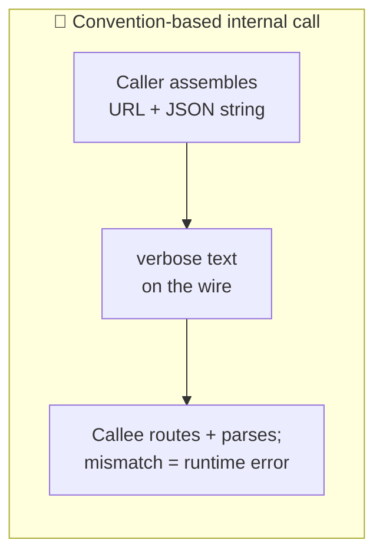

# gRPC

> **Phase:** APIs & Communication Deep Dives → **Topic:** 10 of 15 → **Read time:** ~48 minutes

---

## Before You Begin

**This document builds on two earlier topics and assumes you've read them.** gRPC is not one idea but a *combination* of ideas, and two of its three ingredients already have their own deep-dives in this phase:

- **Protocol Buffers** — the compact, binary, schema-first data format gRPC sends on the wire. Topic 02 taught it in full: the `.proto` schema, the numbered fields, the code generation, why the bytes are unreadable without the schema. This document **does not re-teach that format**; it uses it.
- **The RPC paradigm** — organizing an API around *procedures* (call a named action like a local function) rather than resources or queries. Topic 03 taught that paradigm and its place among the styles, and deliberately **deferred gRPC's actual mechanics** — how the contract generates code, how it runs over its transport — to a later topic. This is that topic.

The third ingredient — **HTTP/2**, the transport underneath — has its own full treatment in the networking material; here it's recalled at working level, only as much as explains why gRPC is fast and how it streams.

So this document is deliberately *coupled*: it recalls Protobuf, RPC, and HTTP/2 by name and spends its length on what's genuinely gRPC's own — the contract-to-code workflow, the four kinds of call, the call semantics a network forces on you, and the costs. Terms it introduces (stub, skeleton, the streaming call types, deadlines, status codes, metadata) are defined here; the three ingredients above are credited to their topics, not re-explained.

gRPC appears in the **Top 30 Must-Know Concepts** foundation series. This is the deep-dive on how it actually works.

Here is the question the document answers:

> **Inside a system, one service calls another thousands of times a second — and doing that with the same HTTP-and-JSON you'd expose to the public web means assembling URLs, shipping verbose text, and checking nothing until runtime. So how do you make a call to another machine feel — and cost — as little as calling a function in your own code, and what do you give up to get there?**

Here's the trap it disarms. gRPC gets filed as "a faster REST" — the same kind of API, tuned for speed, that you'd swap in when JSON gets slow. That framing is wrong twice. It isn't REST (it's a different model entirely — you call a generated function, you don't request a resource), and it isn't merely faster (it makes a different *trade*, buying speed and type-safety and streaming by spending the universality and readability that let REST reach anyone). Teams who believe "gRPC is REST but quick" reach for it on public and browser-facing edges where it simply can't go, and skip it on the internal call paths where it would pay for itself many times over. The point isn't speed; it's fit.

> **The mindset shift:** stop picturing a gRPC call as *an HTTP request you send and parse* and start picturing it as **a function you call that happens to run on another machine.** That's the exact illusion gRPC is engineered to create — and once you hold it, everything else in this document falls into place as the two sides of one bargain. The machinery all serves the illusion: one contract *generates the function* on both the caller's and the callee's side, and an efficient transport makes *thousands* of such calls cheap. And every cost is a place the illusion *leaks*: the function can fail because the network can (so calls need deadlines and status codes), it can't be reached from a browser, and you can't read it on the wire. gRPC is that illusion, bought at that price — and the price is only worth paying when you own both ends of the call.

---

## Table of Contents

1. [The Cost of a Convention-Based Call](#1-the-cost-of-a-convention-based-call)
2. [Contract First — Define the Service, Generate Both Sides](#2-contract-first--define-the-service-generate-both-sides)
3. [The Call Feels Local — What the Stub Hides](#3-the-call-feels-local--what-the-stub-hides)
4. [Four Ways to Call — Unary and Streaming](#4-four-ways-to-call--unary-and-streaming)
5. [HTTP/2 Underneath — Why It's Fast and Can Stream](#5-http2-underneath--why-its-fast-and-can-stream)
6. [Call Semantics — Deadlines, Cancellation, Status, Metadata](#6-call-semantics--deadlines-cancellation-status-metadata)
7. [Where the Illusion Leaks — The Costs](#7-where-the-illusion-leaks--the-costs)
8. [gRPC, REST, and Who's on the Other End](#8-grpc-rest-and-whos-on-the-other-end)
9. [When Not to Reach for gRPC](#9-when-not-to-reach-for-grpc)
10. [Putting It All Together — An Internal Microservices Fan-Out](#10-putting-it-all-together--an-internal-microservices-fan-out)
11. [Final Recap](#11-final-recap)

---

## 1. The Cost of a Convention-Based Call

To see why gRPC exists, look closely at what an ordinary internal API call actually costs — not the network time, but the *design* of the call itself. The everyday way of making one service talk to another is HTTP with JSON, and it's an excellent default. But it was shaped for reaching the whole world, and inside a system that shape is mostly overhead you're paying without benefit.

### A REST Call Is Assembled by Convention

When one service calls another over REST, the "contract" between them isn't really enforced anywhere — it's a set of *conventions* both sides agree to honor by hand:

- The caller **assembles a URL** — `POST /v1/pricing/quote` — as a string, plus a JSON body it builds field by field.
- The callee **matches that URL** to a handler by routing rules, then **parses the JSON** and hopes the fields are the ones it expects.
- Nothing checks that the two agree until the call actually runs. Misspell a field, send a number where a string was wanted, rename an endpoint — and you find out **at runtime**, in production, as a failed request.

For a public API this looseness is a *feature*: anyone can call it from anything, with nothing but an HTTP client and some documentation. But between two services *you* wrote and deploy together, it's a lot of ceremony and a lot of unchecked assumptions to re-establish on every single call.

### Text Is Expensive at Volume

There's a second cost, and at internal scale it's the one that shows up on graphs. JSON is text: field names repeat in full on every message, numbers are written as digit characters, and both sides spend real CPU turning objects into strings and strings back into objects. One call, no problem. But an internal service can make *thousands of calls a second* to its neighbours, and at that volume the verbosity and the parsing tax compound into measurable bandwidth and CPU — spent re-transmitting the string `"amount"` a billion times a day and re-parsing text that never needed to be text between machines that share a schema.

### What You'd Actually Want Between Your Own Services

Strip away the assumptions REST makes about unknown callers, and the wish list for an *internal* call is clear and different:

- **Call it like a function.** Not "assemble a URL and a body" but "invoke a named operation with typed arguments," the way you call code in your own process.
- **Check it at build time.** If the caller and callee disagree about the shape of a call, that should be a *compile error*, not a production incident.
- **Make it small and fast on the wire.** Between machines that both know the schema, don't ship field names as text or re-parse strings — send compact bytes.
- **Allow more than one-shot request/response.** Sometimes a call should stream a sequence of results, or take a stream of inputs — not everything is one-question-one-answer.

That wish list is, almost exactly, the specification for gRPC. It's what you get when you stop designing a call for strangers and start designing it for services you own. The rest of this document is how it grants each wish — and what each granted wish costs.

> 💡 **Key Insight**
>
> An HTTP-and-JSON call is built for **strangers**: the caller assembles a URL and text, the callee matches and parses it by convention, and nothing verifies the two agree until runtime — flexibility that's exactly right when anyone might call from anything. But between services *you* own, that flexibility is unchecked assumptions plus a text tax that compounds into real bandwidth and CPU at thousands of calls a second. What you'd want internally is the opposite: call a remote operation like a **typed local function**, checked at **build time**, sent as **compact bytes**, with room to **stream** — which is precisely the specification gRPC fulfills.

### Quick Recap — The Cost of a Convention-Based Call

- A REST/JSON call is **assembled by convention** — a URL and a JSON body built by hand, matched and parsed on the other side, with agreement checked only at **runtime**.
- That looseness is a **feature for public APIs** (anyone can call from anything) but unchecked ceremony between services you own and deploy together.
- **Text costs at volume**: repeated field names and constant parsing become measurable bandwidth and CPU at thousands of internal calls per second.
- The internal wish list — call it like a **typed function**, checked at **build time**, sent as **compact bytes**, able to **stream** — is essentially the specification for gRPC.

---
